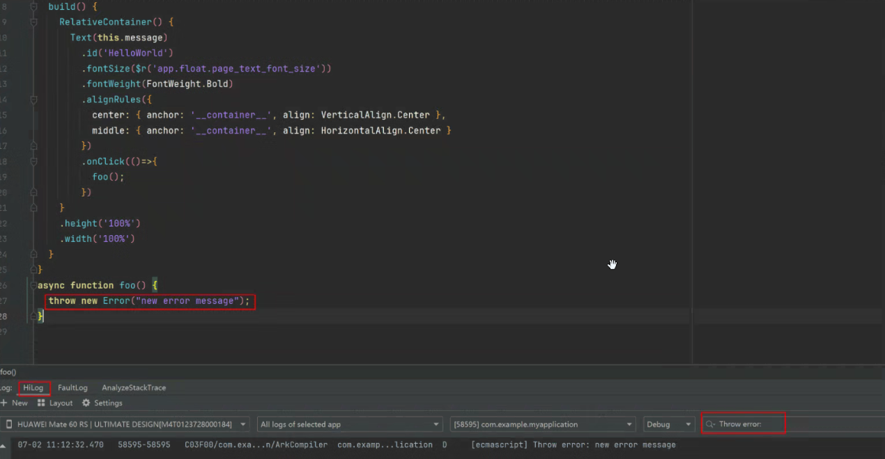

## 正则运算与预期输出结果不一致场景

如果使用正则运算时结果与期望不符，请检查以下场景。

### 正则运算对于\b处理与预期不一致

```
let str = '\u2642';
let res = str.replace(/\b/g, '/');
console.info('res = ' + res);
// 期望输出: res = ♂
// 实际输出: res = /♂/
```


<div class="source-link-wrapper"><a href="https://gitcode.com/HarmonyOS_Samples/guide-snippets/blob/HarmonyOS-feature-20260402/ArkTS/ArkTSRuntime/ArktsRuntimeFag/entry/src/main/ets/pages/Scene.ets#L23-L29" target="_blank" rel="noopener noreferrer" class="source-link"><svg class="source-link-icon" width="14" height="14" viewBox="0 0 24 24" fill="none" stroke="currentColor" strokeWidth="2" strokeLinecap="round" strokeLinejoin="round">\<path d="M18 13v6a2 2 0 0 1-2 2H5a2 2 0 0 1-2-2V8a2 2 0 0 1 2-2h6" /\>\<polyline points="15 3 21 3 21 9" /\>\<line x1="10" y1="14" x2="21" y2="3" /\></svg> 查看源码：Scene.ets</a></div>


规避方案：暂无。


正则匹配\b（单词边界）遇到某些ASCII编码之外的字符时，会将其当成ASCII字符来处理，从而将不是单词边界匹配识别成单词边界。

### 正则运算对于先行断言((?=pattern)或(?!pattern)) 嵌套在后行断言((?<=pattern)或(?<!pattern))内部的场景与预期不一致

```
console.info(`res:${'abcdef'.match(/(?<=ab(?=c)cd)ef/)}`);
// 期望输出: res:ef
// 实际输出: res:null
```


<div class="source-link-wrapper"><a href="https://gitcode.com/HarmonyOS_Samples/guide-snippets/blob/HarmonyOS-feature-20260402/ArkTS/ArkTSRuntime/ArktsRuntimeFag/entry/src/main/ets/pages/Scene.ets#L39-L43" target="_blank" rel="noopener noreferrer" class="source-link"><svg class="source-link-icon" width="14" height="14" viewBox="0 0 24 24" fill="none" stroke="currentColor" strokeWidth="2" strokeLinecap="round" strokeLinejoin="round">\<path d="M18 13v6a2 2 0 0 1-2 2H5a2 2 0 0 1-2-2V8a2 2 0 0 1 2-2h6" /\>\<polyline points="15 3 21 3 21 9" /\>\<line x1="10" y1="14" x2="21" y2="3" /\></svg> 查看源码：Scene.ets</a></div>


规避方案：使用/(?<=abcd)ef/代替/(?<=ab(?=c)cd)ef/。

### 正则运算对于大小写的处理与预期不一致

```
let res = /\u{10400}/ui.test('\u{10428}');
console.info('res = ' + res);
// 期望输出: res = true
// 实际输出: res = false
```


<div class="source-link-wrapper"><a href="https://gitcode.com/HarmonyOS_Samples/guide-snippets/blob/HarmonyOS-feature-20260402/ArkTS/ArkTSRuntime/ArktsRuntimeFag/entry/src/main/ets/pages/Scene.ets#L53-L58" target="_blank" rel="noopener noreferrer" class="source-link"><svg class="source-link-icon" width="14" height="14" viewBox="0 0 24 24" fill="none" stroke="currentColor" strokeWidth="2" strokeLinecap="round" strokeLinejoin="round">\<path d="M18 13v6a2 2 0 0 1-2 2H5a2 2 0 0 1-2-2V8a2 2 0 0 1 2-2h6" /\>\<polyline points="15 3 21 3 21 9" /\>\<line x1="10" y1="14" x2="21" y2="3" /\></svg> 查看源码：Scene.ets</a></div>


规避方案：暂无。

### 正则运算/()/ug匹配时lastIndex与预期不一致

```
let L = '\ud800';
let T = '\udc00';
let u = /()/ug;
u.lastIndex = 1;
u.exec(L + T + L + T);
console.info('u.lastIndex = ' + u.lastIndex);
// 期望输出: u.lastIndex = 0
// 实际输出: u.lastIndex = 1
```


<div class="source-link-wrapper"><a href="https://gitcode.com/HarmonyOS_Samples/guide-snippets/blob/HarmonyOS-feature-20260402/ArkTS/ArkTSRuntime/ArktsRuntimeFag/entry/src/main/ets/pages/Scene.ets#L68-L77" target="_blank" rel="noopener noreferrer" class="source-link"><svg class="source-link-icon" width="14" height="14" viewBox="0 0 24 24" fill="none" stroke="currentColor" strokeWidth="2" strokeLinecap="round" strokeLinejoin="round">\<path d="M18 13v6a2 2 0 0 1-2 2H5a2 2 0 0 1-2-2V8a2 2 0 0 1 2-2h6" /\>\<polyline points="15 3 21 3 21 9" /\>\<line x1="10" y1="14" x2="21" y2="3" /\></svg> 查看源码：Scene.ets</a></div>


规避方案：暂无。

### 正则运算[]内部使用'-'与预期不一致

```
let str = 'a-b';
let reg = /[+-\s]/;
console.info('reg.exec(str) = ' + reg.exec(str));
// 期望输出: reg.exec(str) = -
// 实际输出: reg.exec(str) = null
```


<div class="source-link-wrapper"><a href="https://gitcode.com/HarmonyOS_Samples/guide-snippets/blob/HarmonyOS-feature-20260402/ArkTS/ArkTSRuntime/ArktsRuntimeFag/entry/src/main/ets/pages/Scene.ets#L87-L93" target="_blank" rel="noopener noreferrer" class="source-link"><svg class="source-link-icon" width="14" height="14" viewBox="0 0 24 24" fill="none" stroke="currentColor" strokeWidth="2" strokeLinecap="round" strokeLinejoin="round">\<path d="M18 13v6a2 2 0 0 1-2 2H5a2 2 0 0 1-2-2V8a2 2 0 0 1 2-2h6" /\>\<polyline points="15 3 21 3 21 9" /\>\<line x1="10" y1="14" x2="21" y2="3" /\></svg> 查看源码：Scene.ets</a></div>


规避方案：使用转义后的"-"。

```
let str = 'a-b';
let reg = /[+\-\s]/;
console.info('reg.exec(str) = ' + reg.exec(str));
```


<div class="source-link-wrapper"><a href="https://gitcode.com/HarmonyOS_Samples/guide-snippets/blob/HarmonyOS-feature-20260402/ArkTS/ArkTSRuntime/ArktsRuntimeFag/entry/src/main/ets/pages/Scene.ets#L99-L103" target="_blank" rel="noopener noreferrer" class="source-link"><svg class="source-link-icon" width="14" height="14" viewBox="0 0 24 24" fill="none" stroke="currentColor" strokeWidth="2" strokeLinecap="round" strokeLinejoin="round">\<path d="M18 13v6a2 2 0 0 1-2 2H5a2 2 0 0 1-2-2V8a2 2 0 0 1 2-2h6" /\>\<polyline points="15 3 21 3 21 9" /\>\<line x1="10" y1="14" x2="21" y2="3" /\></svg> 查看源码：Scene.ets</a></div>


### 正则运算具名捕获组获取与预期不一致

```
let reg = new RegExp('(a)(?<b>b)');
let res = reg.exec('ab');
console.info('JSON.stringify(res?.groups) = ' + JSON.stringify(res?.groups));
// 期望输出: JSON.stringify(res?.groups) = {'b':'b'}
// 实际输出: JSON.stringify(res?.groups) = {'b':'a'}
```


<div class="source-link-wrapper"><a href="https://gitcode.com/HarmonyOS_Samples/guide-snippets/blob/HarmonyOS-feature-20260402/ArkTS/ArkTSRuntime/ArktsRuntimeFag/entry/src/main/ets/pages/Scene.ets#L115-L121" target="_blank" rel="noopener noreferrer" class="source-link"><svg class="source-link-icon" width="14" height="14" viewBox="0 0 24 24" fill="none" stroke="currentColor" strokeWidth="2" strokeLinecap="round" strokeLinejoin="round">\<path d="M18 13v6a2 2 0 0 1-2 2H5a2 2 0 0 1-2-2V8a2 2 0 0 1 2-2h6" /\>\<polyline points="15 3 21 3 21 9" /\>\<line x1="10" y1="14" x2="21" y2="3" /\></svg> 查看源码：Scene.ets</a></div>


规避方案：计算具名捕获组位置获取具名捕获组匹配的内容。

```
let reg = new RegExp('(a)(?<b>b)');
let res = reg.exec('ab') as Array<string>;
console.info('JSON.stringify(res?.groups) = {\'b\':' + JSON.stringify(res[2]) + '}');
```


<div class="source-link-wrapper"><a href="https://gitcode.com/HarmonyOS_Samples/guide-snippets/blob/HarmonyOS-feature-20260402/ArkTS/ArkTSRuntime/ArktsRuntimeFag/entry/src/main/ets/pages/Scene.ets#L131-L135" target="_blank" rel="noopener noreferrer" class="source-link"><svg class="source-link-icon" width="14" height="14" viewBox="0 0 24 24" fill="none" stroke="currentColor" strokeWidth="2" strokeLinecap="round" strokeLinejoin="round">\<path d="M18 13v6a2 2 0 0 1-2 2H5a2 2 0 0 1-2-2V8a2 2 0 0 1 2-2h6" /\>\<polyline points="15 3 21 3 21 9" /\>\<line x1="10" y1="14" x2="21" y2="3" /\></svg> 查看源码：Scene.ets</a></div>


### 正则匹配使用'|'与预期不一致

在使用正则匹配时，如果'|'前是一个空匹配，会导致'|'后的匹配不成功。

```
let reg = /a(?:|x)$/;
let res = reg.exec('ax');
console.info('JSON.stringify(res) = ' + JSON.stringify(res));
// 期望输出: JSON.stringify(res) = ['ax']
// 实际输出: JSON.stringify(res) = null
```


<div class="source-link-wrapper"><a href="https://gitcode.com/HarmonyOS_Samples/guide-snippets/blob/HarmonyOS-feature-20260402/ArkTS/ArkTSRuntime/ArktsRuntimeFag/entry/src/main/ets/pages/Scene.ets#L145-L151" target="_blank" rel="noopener noreferrer" class="source-link"><svg class="source-link-icon" width="14" height="14" viewBox="0 0 24 24" fill="none" stroke="currentColor" strokeWidth="2" strokeLinecap="round" strokeLinejoin="round">\<path d="M18 13v6a2 2 0 0 1-2 2H5a2 2 0 0 1-2-2V8a2 2 0 0 1 2-2h6" /\>\<polyline points="15 3 21 3 21 9" /\>\<line x1="10" y1="14" x2="21" y2="3" /\></svg> 查看源码：Scene.ets</a></div>


规避方案：使用reg2或reg3替换reg1。

```
let reg1 = /a(?:|x)$/;
let reg2 = /a(?:x)?$/;
let reg3 = /a(?:x){0,1}$/;
```


<div class="source-link-wrapper"><a href="https://gitcode.com/HarmonyOS_Samples/guide-snippets/blob/HarmonyOS-feature-20260402/ArkTS/ArkTSRuntime/ArktsRuntimeFag/entry/src/main/ets/pages/Scene.ets#L154-L158" target="_blank" rel="noopener noreferrer" class="source-link"><svg class="source-link-icon" width="14" height="14" viewBox="0 0 24 24" fill="none" stroke="currentColor" strokeWidth="2" strokeLinecap="round" strokeLinejoin="round">\<path d="M18 13v6a2 2 0 0 1-2 2H5a2 2 0 0 1-2-2V8a2 2 0 0 1 2-2h6" /\>\<polyline points="15 3 21 3 21 9" /\>\<line x1="10" y1="14" x2="21" y2="3" /\></svg> 查看源码：Scene.ets</a></div>


### TypedArray.prototype.map触发内联缓存优化后，在回调中将数值number转为浮点数number与期望不一致

```
for(let i = 0; i < 1000; i++) {} // 触发内联缓存优化

let arr = new Int32Array([1, 2, 3, 4, 5]);
let result = arr.map(val => {
  let res = (Math.pow(val, 1)) * 100;
  return res;
})

console.info('result[0]:', result[0]);
// 期望输出: result[0]:100
// 实际输出: result[0]:104
```


<div class="source-link-wrapper"><a href="https://gitcode.com/HarmonyOS_Samples/guide-snippets/blob/HarmonyOS-feature-20260402/ArkTS/ArkTSRuntime/ArktsRuntimeFag/entry/src/main/ets/pages/Additional.ets#L20-L32" target="_blank" rel="noopener noreferrer" class="source-link"><svg class="source-link-icon" width="14" height="14" viewBox="0 0 24 24" fill="none" stroke="currentColor" strokeWidth="2" strokeLinecap="round" strokeLinejoin="round">\<path d="M18 13v6a2 2 0 0 1-2 2H5a2 2 0 0 1-2-2V8a2 2 0 0 1 2-2h6" /\>\<polyline points="15 3 21 3 21 9" /\>\<line x1="10" y1="14" x2="21" y2="3" /\></svg> 查看源码：Additional.ets</a></div>


规避方案：使用Array.from将TypedArray先转换为普通Array，再处理number。

```
let arr = new Int32Array([1, 2, 3, 4, 5]);

let normalArr = Array.from(arr);
let result = normalArr.map(val => {
  let res = (Math.pow(val, 1)) * 100;
  return res;
});

console.info('result[0]:', result[0]);
// 输出: result[0]:100
```


<div class="source-link-wrapper"><a href="https://gitcode.com/HarmonyOS_Samples/guide-snippets/blob/HarmonyOS-feature-20260402/ArkTS/ArkTSRuntime/ArktsRuntimeFag/entry/src/main/ets/pages/Additional.ets#L42-L53" target="_blank" rel="noopener noreferrer" class="source-link"><svg class="source-link-icon" width="14" height="14" viewBox="0 0 24 24" fill="none" stroke="currentColor" strokeWidth="2" strokeLinecap="round" strokeLinejoin="round">\<path d="M18 13v6a2 2 0 0 1-2 2H5a2 2 0 0 1-2-2V8a2 2 0 0 1 2-2h6" /\>\<polyline points="15 3 21 3 21 9" /\>\<line x1="10" y1="14" x2="21" y2="3" /\></svg> 查看源码：Additional.ets</a></div>


### Number.parseFloat解析浮点数number类型非规格化数值与期望不一致

parseFloat接口不支持对非规格化数进行解析。当输入字符串表示一个浮点数number类型的非规格化数，一律输出0。

```
let result = parseFloat('5e-324');
console.info('testcase: ', result);
// 期望输出: testcase: 5e-324
// 实际输出: testcase: 0
```


<div class="source-link-wrapper"><a href="https://gitcode.com/HarmonyOS_Samples/guide-snippets/blob/HarmonyOS-feature-20260402/ArkTS/ArkTSRuntime/ArktsRuntimeFag/entry/src/main/ets/pages/Additional.ets#L63-L68" target="_blank" rel="noopener noreferrer" class="source-link"><svg class="source-link-icon" width="14" height="14" viewBox="0 0 24 24" fill="none" stroke="currentColor" strokeWidth="2" strokeLinecap="round" strokeLinejoin="round">\<path d="M18 13v6a2 2 0 0 1-2 2H5a2 2 0 0 1-2-2V8a2 2 0 0 1 2-2h6" /\>\<polyline points="15 3 21 3 21 9" /\>\<line x1="10" y1="14" x2="21" y2="3" /\></svg> 查看源码：Additional.ets</a></div>


规避方案：暂无，开发者应避免使用parseFloat接口对非规格化数进行解析。

### Set constructor入参为多维数组的解析与期望不一致

```
const arr1: number[] = [1, 2];
const arr2: number[] = [3, 4];
const set = new Set<number[]>([arr1, arr2]);
let result = JSON.stringify(Array.from(set));
console.info('res: ', result);
// 期望输出: res: [[1,2],[3,4]]
// 实际输出: res: [2,4]
```


<div class="source-link-wrapper"><a href="https://gitcode.com/HarmonyOS_Samples/guide-snippets/blob/HarmonyOS-feature-20260402/ArkTS/ArkTSRuntime/ArktsRuntimeFag/entry/src/main/ets/pages/Additional.ets#L78-L86" target="_blank" rel="noopener noreferrer" class="source-link"><svg class="source-link-icon" width="14" height="14" viewBox="0 0 24 24" fill="none" stroke="currentColor" strokeWidth="2" strokeLinecap="round" strokeLinejoin="round">\<path d="M18 13v6a2 2 0 0 1-2 2H5a2 2 0 0 1-2-2V8a2 2 0 0 1 2-2h6" /\>\<polyline points="15 3 21 3 21 9" /\>\<line x1="10" y1="14" x2="21" y2="3" /\></svg> 查看源码：Additional.ets</a></div>


规避方案：暂无，开发者应避免构造set时入参为多维数组。

### Object.entries处理Uint8Array与Uint16Array数组结果与期望不一致

```
// TestArray.js
const typedArr = new Uint8Array([10, 20, 30]);
try {
  const result = Object.entries(typedArr);
  console.info('no error throw');
} catch(e) {
  console.info(e);
}
// 期望输出：no error throw
// 实际输出: RangeError: object entries is not supported IsJSUint8Array or IsJSUint16Array
```


<div class="source-link-wrapper"><a href="https://gitcode.com/HarmonyOS_Samples/guide-snippets/blob/HarmonyOS-feature-20260402/ArkTS/ArkTSRuntime/ArktsRuntimeFag/entry/src/main/ets/pages/TestArray.js#L49-L60" target="_blank" rel="noopener noreferrer" class="source-link"><svg class="source-link-icon" width="14" height="14" viewBox="0 0 24 24" fill="none" stroke="currentColor" strokeWidth="2" strokeLinecap="round" strokeLinejoin="round">\<path d="M18 13v6a2 2 0 0 1-2 2H5a2 2 0 0 1-2-2V8a2 2 0 0 1 2-2h6" /\>\<polyline points="15 3 21 3 21 9" /\>\<line x1="10" y1="14" x2="21" y2="3" /\></svg> 查看源码：TestArray.js</a></div>


```
// TestArrayExt.js
const typedArr = new Uint16Array([10, 20, 30]);
try {
   const result = Object.entries(typedArr);
   console.info('no error throw');
} catch (e) {
   console.info(e);
}
// 期望输出：no error throw
// 实际输出: RangeError: object entries is not supported IsJSUint8Array or IsJSUint16Array
```


<div class="source-link-wrapper"><a href="https://gitcode.com/HarmonyOS_Samples/guide-snippets/blob/HarmonyOS-feature-20260402/ArkTS/ArkTSRuntime/ArktsRuntimeFag/entry/src/main/ets/pages/TestArrayExt.js#L16-L27" target="_blank" rel="noopener noreferrer" class="source-link"><svg class="source-link-icon" width="14" height="14" viewBox="0 0 24 24" fill="none" stroke="currentColor" strokeWidth="2" strokeLinecap="round" strokeLinejoin="round">\<path d="M18 13v6a2 2 0 0 1-2 2H5a2 2 0 0 1-2-2V8a2 2 0 0 1 2-2h6" /\>\<polyline points="15 3 21 3 21 9" /\>\<line x1="10" y1="14" x2="21" y2="3" /\></svg> 查看源码：TestArrayExt.js</a></div>


规避方案：使用Array.from将TypedArray先转换为普通Array，再使用Object.entries。

```
// TestArray.js
const typedArr = new Uint8Array([10, 20, 30]);
try {
  const normalArr1 = Array.from(typedArr);
  const result = Object.entries(normalArr1);
  console.info('no error throw');
} catch(e) {
  console.info(e);
}
// 输出：no error throw
```


<div class="source-link-wrapper"><a href="https://gitcode.com/HarmonyOS_Samples/guide-snippets/blob/HarmonyOS-feature-20260402/ArkTS/ArkTSRuntime/ArktsRuntimeFag/entry/src/main/ets/pages/TestArray.js#L62-L73" target="_blank" rel="noopener noreferrer" class="source-link"><svg class="source-link-icon" width="14" height="14" viewBox="0 0 24 24" fill="none" stroke="currentColor" strokeWidth="2" strokeLinecap="round" strokeLinejoin="round">\<path d="M18 13v6a2 2 0 0 1-2 2H5a2 2 0 0 1-2-2V8a2 2 0 0 1 2-2h6" /\>\<polyline points="15 3 21 3 21 9" /\>\<line x1="10" y1="14" x2="21" y2="3" /\></svg> 查看源码：TestArray.js</a></div>


### 字符串 replace 接口对于第一个参数为空字符串的场景与预期不一致

在使用字符串replace接口时，如果第一个参数是空字符串，则直接返回原始字符串。

```
let str = 'dddd';
let res = str.replace('', 'abc');
console.info('res = ' + res);
// 期望输出: res = abcdddd
// 实际输出: res = dddd
```


<div class="source-link-wrapper"><a href="https://gitcode.com/HarmonyOS_Samples/guide-snippets/blob/HarmonyOS-feature-20260402/ArkTS/ArkTSRuntime/ArktsRuntimeFag/entry/src/main/ets/pages/Scene.ets#L176-L182" target="_blank" rel="noopener noreferrer" class="source-link"><svg class="source-link-icon" width="14" height="14" viewBox="0 0 24 24" fill="none" stroke="currentColor" strokeWidth="2" strokeLinecap="round" strokeLinejoin="round">\<path d="M18 13v6a2 2 0 0 1-2 2H5a2 2 0 0 1-2-2V8a2 2 0 0 1 2-2h6" /\>\<polyline points="15 3 21 3 21 9" /\>\<line x1="10" y1="14" x2="21" y2="3" /\></svg> 查看源码：Scene.ets</a></div>


规避方案：使用正则表达式 /^/ 表示字符串起始符，作为第一个参数。

```
let str = 'dddd';
let res = str.replace(/^/, 'abc');
```


<div class="source-link-wrapper"><a href="https://gitcode.com/HarmonyOS_Samples/guide-snippets/blob/HarmonyOS-feature-20260402/ArkTS/ArkTSRuntime/ArktsRuntimeFag/entry/src/main/ets/pages/Scene.ets#L187-L190" target="_blank" rel="noopener noreferrer" class="source-link"><svg class="source-link-icon" width="14" height="14" viewBox="0 0 24 24" fill="none" stroke="currentColor" strokeWidth="2" strokeLinecap="round" strokeLinejoin="round">\<path d="M18 13v6a2 2 0 0 1-2 2H5a2 2 0 0 1-2-2V8a2 2 0 0 1 2-2h6" /\>\<polyline points="15 3 21 3 21 9" /\>\<line x1="10" y1="14" x2="21" y2="3" /\></svg> 查看源码：Scene.ets</a></div>


## Async函数内部异常的处理机制

**场景**

如果在Async函数内部产生了异常，且没有使用catch捕获该异常，在ArkTS中不会导致进程退出。其本质是Async函数返回了一个rejected状态的Promise对象，没有被处理，使得Promise的rejected状态没有被捕获。Async函数内部的异常会变成 unhandledRejection，表现为异常未抛出。

**Async函数内部异常的捕获方式**

1. 使用[errorManager.on()](https://developer.huawei.com/consumer/cn/doc/harmonyos-references/js-apis-app-ability-errormanager#errormanageronerror)捕获到Async函数产生的unhandledrejection事件，再通过编写errorManager.on()注册的回调函数，来进行异常处理操作。

   ```
   import { errorManager } from '@kit.AbilityKit';
     // ...
     errorManager.on('unhandledRejection', (a:ESObject, b:Promise<ESObject>) => {
       console.info('Async test', a);
       // ...
     })
   ```

   

<div class="source-link-wrapper"><a href="https://gitcode.com/HarmonyOS_Samples/guide-snippets/blob/HarmonyOS-feature-20260402/ArkTS/ArkTSRuntime/ArktsRuntimeFag/entry/src/main/ets/pages/Scene.ets#L16-L213" target="_blank" rel="noopener noreferrer" class="source-link"><svg class="source-link-icon" width="14" height="14" viewBox="0 0 24 24" fill="none" stroke="currentColor" strokeWidth="2" strokeLinecap="round" strokeLinejoin="round">\<path d="M18 13v6a2 2 0 0 1-2 2H5a2 2 0 0 1-2-2V8a2 2 0 0 1 2-2h6" /\>\<polyline points="15 3 21 3 21 9" /\>\<line x1="10" y1="14" x2="21" y2="3" /\></svg> 查看源码：Scene.ets</a></div>

2. 在Async函数内部，针对可能发生异常的代码块添加try-catch逻辑，直接捕获可能出现的异常。


注意必须在Async函数内部，外部无法捕获Async函数内部的异常，外部只能通过errorManager.on()监听。

**查看Async函数内部是否有异常的方式**

若开发者仅需要查看Async函数内部是否产生异常，首先需要在DevEco Studio终端执行以下hilog命令开启debug级别日志打印：

```
   hilog -b D
```

然后点击DevEco Studio下方HiLog选项卡，输入过滤条件“Throw error:”，即可查看到Async函数内产生的异常信息。



## Array.flatMap()接口常见问题

Array.flatMap()接口在处理包含Proxy的Array时，未正确展平嵌套的Proxy Array，导致返回结果与预期不一致。

### ArkTS使用场景

```
let arr1 = [0, 1];
let arr2 = [2, 3];
const emptyHandler = {} as ProxyHandler<number[]>;
let proxy1 = new Proxy(arr1, emptyHandler);
let proxy2 = new Proxy(arr2, emptyHandler);
let arr3 = [proxy1, proxy2];
let res = arr3.flatMap(x => x);

console.info('res length:', res.length.toString());
// 期望输出: res length: 4
// 实际输出: res length: 2
console.info('res[0] is: ', res[0].toString());
// 期望输出: res[0] is: 0
// 实际输出: res[0] is: 0,1
```


<div class="source-link-wrapper"><a href="https://gitcode.com/HarmonyOS_Samples/guide-snippets/blob/HarmonyOS-feature-20260402/ArkTS/ArkTSRuntime/ArktsRuntimeFag/entry/src/main/ets/pages/Scene.ets#L223-L238" target="_blank" rel="noopener noreferrer" class="source-link"><svg class="source-link-icon" width="14" height="14" viewBox="0 0 24 24" fill="none" stroke="currentColor" strokeWidth="2" strokeLinecap="round" strokeLinejoin="round">\<path d="M18 13v6a2 2 0 0 1-2 2H5a2 2 0 0 1-2-2V8a2 2 0 0 1 2-2h6" /\>\<polyline points="15 3 21 3 21 9" /\>\<line x1="10" y1="14" x2="21" y2="3" /\></svg> 查看源码：Scene.ets</a></div>


### ArkUI使用场景

ArkUI状态管理框架会为使用状态变量装饰器（如@State、@Trace、@Local）装饰的Array添加一层代理，用于观测API调用产生的变化。如果状态装饰器与Array组合，并且调用Array.flatMap，会出现如下问题。

以状态管理V2为例：

```
@Entry
@ComponentV2
struct Index {
  @Local p: number[] = [0, 1];
  @Local q: number[] = [2, 3];
  c: number[][] = [this.p, this.q];
  d: number[] = [];

  aboutToAppear(): void {
    this.d = this.c.flatMap(it => it);
  }

  build() {
    Column() {
      Text(`${this.d[0]}`); // 预期显示：0; 实际显示：0,1
    }
  }
}
```


<div class="source-link-wrapper"><a href="https://gitcode.com/HarmonyOS_Samples/guide-snippets/blob/HarmonyOS-feature-20260402/ArkTS/ArkTSRuntime/ArktsRuntimeFag/entry/src/main/ets/pages/Local.ets#L16-L35" target="_blank" rel="noopener noreferrer" class="source-link"><svg class="source-link-icon" width="14" height="14" viewBox="0 0 24 24" fill="none" stroke="currentColor" strokeWidth="2" strokeLinecap="round" strokeLinejoin="round">\<path d="M18 13v6a2 2 0 0 1-2 2H5a2 2 0 0 1-2-2V8a2 2 0 0 1 2-2h6" /\>\<polyline points="15 3 21 3 21 9" /\>\<line x1="10" y1="14" x2="21" y2="3" /\></svg> 查看源码：Local.ets</a></div>


### Array.flatMap规避方案

避免使用Array.flatMap()接口，改为调用Array.map()接口后再调用深度为1的Array.flat()接口。以上文ArkTS使用场景为例：

```
// 使用规避方案前
let res = arr3.flatMap(x => x);
// ...
// 使用规避方案后
let res = arr3.map(x => x).flat();
```


<div class="source-link-wrapper"><a href="https://gitcode.com/HarmonyOS_Samples/guide-snippets/blob/HarmonyOS-feature-20260402/ArkTS/ArkTSRuntime/ArktsRuntimeFag/entry/src/main/ets/pages/Scene.ets#L243-L257" target="_blank" rel="noopener noreferrer" class="source-link"><svg class="source-link-icon" width="14" height="14" viewBox="0 0 24 24" fill="none" stroke="currentColor" strokeWidth="2" strokeLinecap="round" strokeLinejoin="round">\<path d="M18 13v6a2 2 0 0 1-2 2H5a2 2 0 0 1-2-2V8a2 2 0 0 1 2-2h6" /\>\<polyline points="15 3 21 3 21 9" /\>\<line x1="10" y1="14" x2="21" y2="3" /\></svg> 查看源码：Scene.ets</a></div>


### Proxy的handler对象中key类型与EcmaScript规范定义不一致

在Proxy对象的handler函数中，对于数字类型的key，ArkTS当前实现是采用保持数字类型不变，但是按照EcmaScript规范，应当转为string类型。

```
// TestArray.js
{
  let handler = {
    get(target, key) {
      console.info('get', key, typeof key);
      return Reflect.get(target, key);
    },
    set(target, key, value) {
      console.info('set', key, typeof key);
      return Reflect.set(target, key, value);
    },
    deleteProperty(target, key) {
      console.info('delete', key, typeof key);
      return Reflect.deleteProperty(target, key);
    },
    has(target, key) {
      console.info('has', key, typeof key);
      return Reflect.has(target, key);
    }
  }
  let obj = {};
  let px = new Proxy(obj, handler);
  px[1];
  // 实际输出：get 1 number
  px[2] = 2;
  // 实际输出：set 2 number
  3 in px;
  // 实际输出：has 3 number
  delete px[2];
  // 实际输出：delete 2 number
}
```


<div class="source-link-wrapper"><a href="https://gitcode.com/HarmonyOS_Samples/guide-snippets/blob/HarmonyOS-feature-20260402/ArkTS/ArkTSRuntime/ArktsRuntimeFag/entry/src/main/ets/pages/TestArray.js#L75-L107" target="_blank" rel="noopener noreferrer" class="source-link"><svg class="source-link-icon" width="14" height="14" viewBox="0 0 24 24" fill="none" stroke="currentColor" strokeWidth="2" strokeLinecap="round" strokeLinejoin="round">\<path d="M18 13v6a2 2 0 0 1-2 2H5a2 2 0 0 1-2-2V8a2 2 0 0 1 2-2h6" /\>\<polyline points="15 3 21 3 21 9" /\>\<line x1="10" y1="14" x2="21" y2="3" /\></svg> 查看源码：TestArray.js</a></div>


规避方案：若业务逻辑依赖于key必须为string类型，可在handler函数内部对数字类型的key进行显式转换。示例如下：

```
// TestArray.js
{
  let handler = {
    get(target, key) {
      if (typeof key === 'number') {
        key = String(key);
      }
      console.info('get', key, typeof key);
      return Reflect.get(target, key);
    },
    set(target, key, value) {
      if (typeof key === 'number') {
        key = String(key);
      }
      console.info('set', key, typeof key);
      return Reflect.set(target, key, value);
    },
    deleteProperty(target, key) {
      if (typeof key === 'number') {
        key = String(key);
      }
      console.info('delete', key, typeof key);
      return Reflect.deleteProperty(target, key);
    },
    has(target, key) {
      if (typeof key === 'number') {
        key = String(key);
      }
      console.info('has', key, typeof key);
      return Reflect.has(target, key);
    }
  }
  let obj = {};
  let px = new Proxy(obj, handler);
  px[1];
  // 实际输出：get 1 string
  px[2] = 2;
  // 实际输出：set 2 string
  3 in px;
  // 实际输出：has 3 string
  delete px[2];
  // 实际输出：delete 2 string
}
```


<div class="source-link-wrapper"><a href="https://gitcode.com/HarmonyOS_Samples/guide-snippets/blob/HarmonyOS-feature-20260402/ArkTS/ArkTSRuntime/ArktsRuntimeFag/entry/src/main/ets/pages/TestArray.js#L109-L153" target="_blank" rel="noopener noreferrer" class="source-link"><svg class="source-link-icon" width="14" height="14" viewBox="0 0 24 24" fill="none" stroke="currentColor" strokeWidth="2" strokeLinecap="round" strokeLinejoin="round">\<path d="M18 13v6a2 2 0 0 1-2 2H5a2 2 0 0 1-2-2V8a2 2 0 0 1 2-2h6" /\>\<polyline points="15 3 21 3 21 9" /\>\<line x1="10" y1="14" x2="21" y2="3" /\></svg> 查看源码：TestArray.js</a></div>


上述demo中部分语法，如 "3 in px", "delete px[2]", "Reflect.deleteProperty"，在ets文件中不可用。

### JSON.stringify的replacer函数中数组索引的key类型与EcmaScript规范定义不一致

JSON.stringify的replacer函数中，对于数组索引key的类型，ArkTS当前实现是采用保持数字类型不变，但是按照EcmaScript规范，应当转为string类型。

```
// TestArray.js
{
  let arr = [10, 20, 30, 40];
  function replacer(key, value) {
    if (key === '2') {
        return value * 2;
    }
    return value;
  }
  console.info(JSON.stringify(arr, replacer));
  // 实际输出：[10,20,30,40]
}
```


<div class="source-link-wrapper"><a href="https://gitcode.com/HarmonyOS_Samples/guide-snippets/blob/HarmonyOS-feature-20260402/ArkTS/ArkTSRuntime/ArktsRuntimeFag/entry/src/main/ets/pages/TestArray.js#L16-L29" target="_blank" rel="noopener noreferrer" class="source-link"><svg class="source-link-icon" width="14" height="14" viewBox="0 0 24 24" fill="none" stroke="currentColor" strokeWidth="2" strokeLinecap="round" strokeLinejoin="round">\<path d="M18 13v6a2 2 0 0 1-2 2H5a2 2 0 0 1-2-2V8a2 2 0 0 1 2-2h6" /\>\<polyline points="15 3 21 3 21 9" /\>\<line x1="10" y1="14" x2="21" y2="3" /\></svg> 查看源码：TestArray.js</a></div>


规避方案：若业务逻辑依赖于key必须为string类型，可在replacer函数内部对数字类型的key进行显式转换。示例如下：

```
// TestArray.js
{
  let arr = [10, 20, 30, 40];
  function replacer(key, value) {
    if (typeof key === 'number') {
      key = String(key);
    }
    if (key === '2') {
        return value * 2;
    }
    return value;
  }
  console.info(JSON.stringify(arr, replacer));
  // 实际输出：[10,20,60,40]
}
```


<div class="source-link-wrapper"><a href="https://gitcode.com/HarmonyOS_Samples/guide-snippets/blob/HarmonyOS-feature-20260402/ArkTS/ArkTSRuntime/ArktsRuntimeFag/entry/src/main/ets/pages/TestArray.js#L31-L47" target="_blank" rel="noopener noreferrer" class="source-link"><svg class="source-link-icon" width="14" height="14" viewBox="0 0 24 24" fill="none" stroke="currentColor" strokeWidth="2" strokeLinecap="round" strokeLinejoin="round">\<path d="M18 13v6a2 2 0 0 1-2 2H5a2 2 0 0 1-2-2V8a2 2 0 0 1 2-2h6" /\>\<polyline points="15 3 21 3 21 9" /\>\<line x1="10" y1="14" x2="21" y2="3" /\></svg> 查看源码：TestArray.js</a></div>
