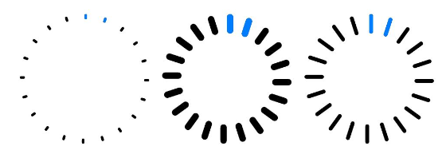
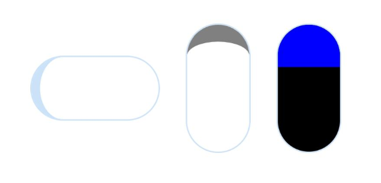

Progress是进度条显示组件，显示内容通常为目标操作的当前进度。具体用法请参考[Progress](https://developer.huawei.com/consumer/cn/doc/harmonyos-references/ts-basic-components-progress)。

## 创建进度条

Progress通过调用接口来创建，接口调用方式如下：

```
Progress(options: {value: number, total?: number, type?: ProgressType})
```

其中，value用于设置初始进度值，total用于设置进度总长度，type用于设置Progress样式。

```
Progress({ value: 24, total: 100, type: ProgressType.Linear }) // 创建一个进度总长为100，初始进度值为24的线性进度条
```


## 设置进度条样式

Progress有5种可选类型，通过[ProgressType](https://developer.huawei.com/consumer/cn/doc/harmonyos-references/ts-basic-components-progress#progresstype8枚举说明)可以设置进度条样式。ProgressType类型包括：ProgressType.Linear（线性样式）、 ProgressType.Ring（环形无刻度样式）、ProgressType.ScaleRing（环形有刻度样式）、ProgressType.Eclipse（圆形样式）和ProgressType.Capsule（胶囊样式）。

* 线性样式进度条（默认类型）

  

  从API version 9开始，组件高度大于宽度时，自适应垂直显示；组件高度等于宽度时，保持水平显示。

  ```
  Progress({ value: 20, total: 100, type: ProgressType.Linear }).width(200).height(50)
  Progress({ value: 20, total: 100, type: ProgressType.Linear }).width(50).height(200)
  ```

  

<div class="source-link-wrapper"><a href="https://gitcode.com/HarmonyOS_Samples/guide-snippets/blob/HarmonyOS-feature-20260402/ArkUISample/InfoComponent/ProgressProject/entry/src/main/ets/pages/Index.ets#L38-L41" target="_blank" rel="noopener noreferrer" class="source-link"><svg class="source-link-icon" width="14" height="14" viewBox="0 0 24 24" fill="none" stroke="currentColor" strokeWidth="2" strokeLinecap="round" strokeLinejoin="round">\<path d="M18 13v6a2 2 0 0 1-2 2H5a2 2 0 0 1-2-2V8a2 2 0 0 1 2-2h6" /\>\<polyline points="15 3 21 3 21 9" /\>\<line x1="10" y1="14" x2="21" y2="3" /\></svg> 查看源码：Index.ets</a></div>


  
* 环形无刻度样式进度条

  ```
  // 从左往右，1号环形进度条，默认前景色为蓝色渐变，默认strokeWidth进度条宽度为2.0vp
  Progress({ value: 40, total: 150, type: ProgressType.Ring }).width(100).height(100)
  // 从左往右，2号环形进度条
  Progress({ value: 40, total: 150, type: ProgressType.Ring }).width(100).height(100)
    .color(Color.Grey)    // 进度条前景色为灰色
    .style({ strokeWidth: 15})    // 设置strokeWidth进度条宽度为15.0vp
  ```

  

<div class="source-link-wrapper"><a href="https://gitcode.com/HarmonyOS_Samples/guide-snippets/blob/HarmonyOS-feature-20260402/ArkUISample/InfoComponent/ProgressProject/entry/src/main/ets/pages/Index.ets#L46-L53" target="_blank" rel="noopener noreferrer" class="source-link"><svg class="source-link-icon" width="14" height="14" viewBox="0 0 24 24" fill="none" stroke="currentColor" strokeWidth="2" strokeLinecap="round" strokeLinejoin="round">\<path d="M18 13v6a2 2 0 0 1-2 2H5a2 2 0 0 1-2-2V8a2 2 0 0 1 2-2h6" /\>\<polyline points="15 3 21 3 21 9" /\>\<line x1="10" y1="14" x2="21" y2="3" /\></svg> 查看源码：Index.ets</a></div>


  
* 环形有刻度样式进度条

  ```
  Progress({ value: 20, total: 150, type: ProgressType.ScaleRing }).width(100).height(100)
    .backgroundColor(Color.Black)
    .style({ scaleCount: 20, scaleWidth: 5 })    // 设置环形有刻度进度条总刻度数为20，刻度宽度为5vp
  Progress({ value: 20, total: 150, type: ProgressType.ScaleRing }).width(100).height(100)
    .backgroundColor(Color.Black)
    .style({ strokeWidth: 15, scaleCount: 20, scaleWidth: 5 })    // 设置环形有刻度进度条宽度15，总刻度数为20，刻度宽度为5vp
  Progress({ value: 20, total: 150, type: ProgressType.ScaleRing }).width(100).height(100)
    .backgroundColor(Color.Black)
    .style({ strokeWidth: 15, scaleCount: 20, scaleWidth: 3 })    // 设置环形有刻度进度条宽度15，总刻度数为20，刻度宽度为3vp
  ```

  

<div class="source-link-wrapper"><a href="https://gitcode.com/HarmonyOS_Samples/guide-snippets/blob/HarmonyOS-feature-20260402/ArkUISample/InfoComponent/ProgressProject/entry/src/main/ets/pages/Index.ets#L59-L69" target="_blank" rel="noopener noreferrer" class="source-link"><svg class="source-link-icon" width="14" height="14" viewBox="0 0 24 24" fill="none" stroke="currentColor" strokeWidth="2" strokeLinecap="round" strokeLinejoin="round">\<path d="M18 13v6a2 2 0 0 1-2 2H5a2 2 0 0 1-2-2V8a2 2 0 0 1 2-2h6" /\>\<polyline points="15 3 21 3 21 9" /\>\<line x1="10" y1="14" x2="21" y2="3" /\></svg> 查看源码：Index.ets</a></div>


  
* 圆形样式进度条

  ```
  // 从左往右，1号圆形进度条，默认前景色为蓝色
  Progress({ value: 10, total: 150, type: ProgressType.Eclipse }).width(100).height(100)
  // 从左往右，2号圆形进度条，指定前景色为灰色
  Progress({ value: 20, total: 150, type: ProgressType.Eclipse }).color(Color.Grey).width(100).height(100)
  ```

  

<div class="source-link-wrapper"><a href="https://gitcode.com/HarmonyOS_Samples/guide-snippets/blob/HarmonyOS-feature-20260402/ArkUISample/InfoComponent/ProgressProject/entry/src/main/ets/pages/Index.ets#L75-L80" target="_blank" rel="noopener noreferrer" class="source-link"><svg class="source-link-icon" width="14" height="14" viewBox="0 0 24 24" fill="none" stroke="currentColor" strokeWidth="2" strokeLinecap="round" strokeLinejoin="round">\<path d="M18 13v6a2 2 0 0 1-2 2H5a2 2 0 0 1-2-2V8a2 2 0 0 1 2-2h6" /\>\<polyline points="15 3 21 3 21 9" /\>\<line x1="10" y1="14" x2="21" y2="3" /\></svg> 查看源码：Index.ets</a></div>


  
* 胶囊样式进度条

  

  + 头尾两端圆弧处的进度展示效果与ProgressType.Eclipse样式一致。
  + 中段处的进度展示效果为矩形状长条，与ProgressType.Linear线性样式相似。
  + 组件高度大于宽度时，自适应垂直显示。

  ```
  Progress({ value: 10, total: 150, type: ProgressType.Capsule }).width(100).height(50)
  Progress({ value: 20, total: 150, type: ProgressType.Capsule }).width(50).height(100).color(Color.Grey)
  Progress({ value: 50, total: 150, type: ProgressType.Capsule }).width(50).height(100).color(Color.Blue).backgroundColor(Color.Black)
  ```

  

<div class="source-link-wrapper"><a href="https://gitcode.com/HarmonyOS_Samples/guide-snippets/blob/HarmonyOS-feature-20260402/ArkUISample/InfoComponent/ProgressProject/entry/src/main/ets/pages/Index.ets#L86-L90" target="_blank" rel="noopener noreferrer" class="source-link"><svg class="source-link-icon" width="14" height="14" viewBox="0 0 24 24" fill="none" stroke="currentColor" strokeWidth="2" strokeLinecap="round" strokeLinejoin="round">\<path d="M18 13v6a2 2 0 0 1-2 2H5a2 2 0 0 1-2-2V8a2 2 0 0 1 2-2h6" /\>\<polyline points="15 3 21 3 21 9" /\>\<line x1="10" y1="14" x2="21" y2="3" /\></svg> 查看源码：Index.ets</a></div>


  

## 场景示例

更新当前进度值，如应用安装进度条，可通过点击Button增加progressValue，value属性将progressValue设置给Progress组件，进度条组件即会触发刷新，更新当前进度。

```
@Entry
@Component
struct ProgressCase1 {
  @State progressValue: number = 0;    // 设置进度条初始值为0
  build() {
    Column() {
      Column() {
        Progress({value:0, total:100, type:ProgressType.Capsule}).width(200).height(50).value(this.progressValue)
        Row().width('100%').height(5)
        // 请将$r('app.string.progress_add')替换为实际资源文件，在本示例中该资源文件的value值为"进度条+5"
        Button($r('app.string.progress_add'))
          .onClick(()=>{
            this.progressValue += 5;
            if (this.progressValue > 100){
              this.progressValue = 0;
            }
          })
      }
    }.width('100%').height('100%')
  }
}
```


<div class="source-link-wrapper"><a href="https://gitcode.com/HarmonyOS_Samples/guide-snippets/blob/HarmonyOS-feature-20260402/ArkUISample/InfoComponent/ProgressProject/entry/src/main/ets/pages/ProgressCase1.ets#L15-L37" target="_blank" rel="noopener noreferrer" class="source-link"><svg class="source-link-icon" width="14" height="14" viewBox="0 0 24 24" fill="none" stroke="currentColor" strokeWidth="2" strokeLinecap="round" strokeLinejoin="round">\<path d="M18 13v6a2 2 0 0 1-2 2H5a2 2 0 0 1-2-2V8a2 2 0 0 1 2-2h6" /\>\<polyline points="15 3 21 3 21 9" /\>\<line x1="10" y1="14" x2="21" y2="3" /\></svg> 查看源码：ProgressCase1.ets</a></div>


