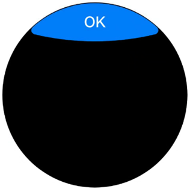
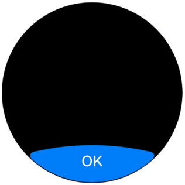
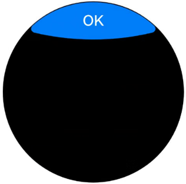
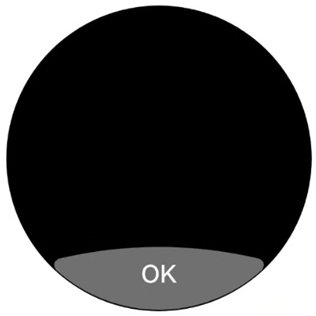
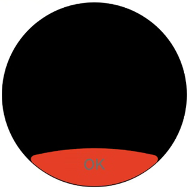
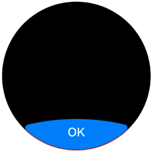
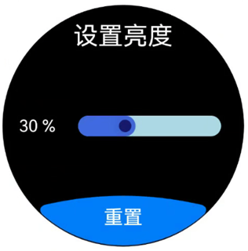

从API version 18开始支持ArcButton。ArcButton是弧形按钮组件，推荐用于圆形屏幕。为用户提供强调、普通、警告等样式按钮。具体用法请参考[ArcButton](https://developer.huawei.com/consumer/cn/doc/harmonyos-references/ohos-arkui-advanced-arcbutton)。

## 创建按钮

ArcButton通过调用以下接口来创建。

```
ArcButton({
  options: new ArcButtonOptions({
    label: 'OK',
    position: ArcButtonPosition.TOP_EDGE,
    styleMode: ArcButtonStyleMode.EMPHASIZED_LIGHT,
  // ···
  })
})
```


<div class="source-link-wrapper"><a href="https://gitcode.com/HarmonyOS_Samples/guide-snippets/blob/HarmonyOS-feature-20260402/ArkUISample/ButtonComponent/entry/src/main/ets/pages/ButtonAlignTop.ets#L27-L43" target="_blank" rel="noopener noreferrer" class="source-link"><svg class="source-link-icon" width="14" height="14" viewBox="0 0 24 24" fill="none" stroke="currentColor" strokeWidth="2" strokeLinecap="round" strokeLinejoin="round">\<path d="M18 13v6a2 2 0 0 1-2 2H5a2 2 0 0 1-2-2V8a2 2 0 0 1 2-2h6" /\>\<polyline points="15 3 21 3 21 9" /\>\<line x1="10" y1="14" x2="21" y2="3" /\></svg> 查看源码：ButtonAlignTop.ets</a></div>


其中，[label](https://developer.huawei.com/consumer/cn/doc/harmonyos-references/ohos-arkui-advanced-arcbutton#arcbuttonoptions)设置按钮文字，[position](https://developer.huawei.com/consumer/cn/doc/harmonyos-references/ohos-arkui-advanced-arcbutton#arcbuttonoptions)设置按钮类型，[styleMode](https://developer.huawei.com/consumer/cn/doc/harmonyos-references/ohos-arkui-advanced-arcbutton#arcbuttonoptions)设置按钮样式。



## 设置按钮类型

ArcButton有上弧形按钮和下弧形按钮两种类型。使用[position](https://developer.huawei.com/consumer/cn/doc/harmonyos-references/ohos-arkui-advanced-arcbutton#arcbuttonoptions)设置按钮类型。

* 下弧形按钮（默认类型）。

  通过将[position](https://developer.huawei.com/consumer/cn/doc/harmonyos-references/ohos-arkui-advanced-arcbutton#arcbuttonoptions)属性设置为ArcButtonPosition.BOTTOM\_EDGE，可以将按钮设置为下弧形按钮。

  ```
  ArcButton({
    options: new ArcButtonOptions({
      label: 'OK',
      position: ArcButtonPosition.BOTTOM_EDGE,
      styleMode: ArcButtonStyleMode.EMPHASIZED_LIGHT,
    // ···
    })

  })
  ```

  

<div class="source-link-wrapper"><a href="https://gitcode.com/HarmonyOS_Samples/guide-snippets/blob/HarmonyOS-feature-20260402/ArkUISample/ButtonComponent/entry/src/main/ets/pages/ButtonAlignBottom.ets#L27-L45" target="_blank" rel="noopener noreferrer" class="source-link"><svg class="source-link-icon" width="14" height="14" viewBox="0 0 24 24" fill="none" stroke="currentColor" strokeWidth="2" strokeLinecap="round" strokeLinejoin="round">\<path d="M18 13v6a2 2 0 0 1-2 2H5a2 2 0 0 1-2-2V8a2 2 0 0 1 2-2h6" /\>\<polyline points="15 3 21 3 21 9" /\>\<line x1="10" y1="14" x2="21" y2="3" /\></svg> 查看源码：ButtonAlignBottom.ets</a></div>


  
* 上弧形按钮。

  通过将[position](https://developer.huawei.com/consumer/cn/doc/harmonyos-references/ohos-arkui-advanced-arcbutton#arcbuttonoptions)属性设置为ArcButtonPosition.TOP\_EDGE，可以将按钮设置为上弧形按钮。

  ```
  ArcButton({
    options: new ArcButtonOptions({
      label: 'OK',
      position: ArcButtonPosition.TOP_EDGE,
      styleMode: ArcButtonStyleMode.EMPHASIZED_LIGHT,
    // ···
    })
  })
  ```

  

<div class="source-link-wrapper"><a href="https://gitcode.com/HarmonyOS_Samples/guide-snippets/blob/HarmonyOS-feature-20260402/ArkUISample/ButtonComponent/entry/src/main/ets/pages/ButtonAlignTop.ets#L27-L43" target="_blank" rel="noopener noreferrer" class="source-link"><svg class="source-link-icon" width="14" height="14" viewBox="0 0 24 24" fill="none" stroke="currentColor" strokeWidth="2" strokeLinecap="round" strokeLinejoin="round">\<path d="M18 13v6a2 2 0 0 1-2 2H5a2 2 0 0 1-2-2V8a2 2 0 0 1 2-2h6" /\>\<polyline points="15 3 21 3 21 9" /\>\<line x1="10" y1="14" x2="21" y2="3" /\></svg> 查看源码：ButtonAlignTop.ets</a></div>


  

## 自定义样式

* 设置背景色。

  使用[backgroundColor](https://developer.huawei.com/consumer/cn/doc/harmonyos-references/ohos-arkui-advanced-arcbutton#arcbuttonoptions)属性设置按钮的背景色。

  ```
  ArcButton({
    options: new ArcButtonOptions({
      label: 'OK',
      styleMode: ArcButtonStyleMode.CUSTOM,
      backgroundColor: ColorMetrics.resourceColor('#707070')
    })
  })
  ```

  

<div class="source-link-wrapper"><a href="https://gitcode.com/HarmonyOS_Samples/guide-snippets/blob/HarmonyOS-feature-20260402/ArkUISample/ButtonComponent/entry/src/main/ets/pages/ButtonBcgColor.ets#L23-L31" target="_blank" rel="noopener noreferrer" class="source-link"><svg class="source-link-icon" width="14" height="14" viewBox="0 0 24 24" fill="none" stroke="currentColor" strokeWidth="2" strokeLinecap="round" strokeLinejoin="round">\<path d="M18 13v6a2 2 0 0 1-2 2H5a2 2 0 0 1-2-2V8a2 2 0 0 1 2-2h6" /\>\<polyline points="15 3 21 3 21 9" /\>\<line x1="10" y1="14" x2="21" y2="3" /\></svg> 查看源码：ButtonBcgColor.ets</a></div>


  
* 设置文本颜色。

  使用[fontColor](https://developer.huawei.com/consumer/cn/doc/harmonyos-references/ohos-arkui-advanced-arcbutton#arcbuttonoptions)属性设置按钮的文本颜色。

  ```
  ArcButton({
    options: new ArcButtonOptions({
      label: 'OK',
      styleMode: ArcButtonStyleMode.CUSTOM,
      backgroundColor: ColorMetrics.resourceColor('#E84026'),
      fontColor: ColorMetrics.resourceColor('#707070')
    })
  })
  ```

  

<div class="source-link-wrapper"><a href="https://gitcode.com/HarmonyOS_Samples/guide-snippets/blob/HarmonyOS-feature-20260402/ArkUISample/ButtonComponent/entry/src/main/ets/pages/ButtonFontColor.ets#L23-L32" target="_blank" rel="noopener noreferrer" class="source-link"><svg class="source-link-icon" width="14" height="14" viewBox="0 0 24 24" fill="none" stroke="currentColor" strokeWidth="2" strokeLinecap="round" strokeLinejoin="round">\<path d="M18 13v6a2 2 0 0 1-2 2H5a2 2 0 0 1-2-2V8a2 2 0 0 1 2-2h6" /\>\<polyline points="15 3 21 3 21 9" /\>\<line x1="10" y1="14" x2="21" y2="3" /\></svg> 查看源码：ButtonFontColor.ets</a></div>


  
* 设置阴影颜色。

  使用[shadowEnabled](https://developer.huawei.com/consumer/cn/doc/harmonyos-references/ohos-arkui-advanced-arcbutton#arcbuttonoptions)属性启用按钮阴影，并通过[shadowColor](https://developer.huawei.com/consumer/cn/doc/harmonyos-references/ohos-arkui-advanced-arcbutton#arcbuttonoptions)属性设置按钮的阴影颜色。

  ```
  ArcButton({
    options: new ArcButtonOptions({
      label: 'OK',
      shadowEnabled: true,
      shadowColor: ColorMetrics.resourceColor('#ffec1022')
    })
  })
  ```

  

<div class="source-link-wrapper"><a href="https://gitcode.com/HarmonyOS_Samples/guide-snippets/blob/HarmonyOS-feature-20260402/ArkUISample/ButtonComponent/entry/src/main/ets/pages/ButtonShadow.ets#L23-L31" target="_blank" rel="noopener noreferrer" class="source-link"><svg class="source-link-icon" width="14" height="14" viewBox="0 0 24 24" fill="none" stroke="currentColor" strokeWidth="2" strokeLinecap="round" strokeLinejoin="round">\<path d="M18 13v6a2 2 0 0 1-2 2H5a2 2 0 0 1-2-2V8a2 2 0 0 1 2-2h6" /\>\<polyline points="15 3 21 3 21 9" /\>\<line x1="10" y1="14" x2="21" y2="3" /\></svg> 查看源码：ButtonShadow.ets</a></div>


  

## 添加事件

* 绑定onClick事件来响应点击操作后的自定义行为。

  ```
  ArcButton({
    options: new ArcButtonOptions({
      label: 'OK',
    // ···
      onClick: () => {
        hilog.info(DOMAIN, TAG, 'ArcButton onClick');
      },
    })
  })
  ```

  

<div class="source-link-wrapper"><a href="https://gitcode.com/HarmonyOS_Samples/guide-snippets/blob/HarmonyOS-feature-20260402/ArkUISample/ButtonComponent/entry/src/main/ets/pages/ButtonAlignTop.ets#L28-L44" target="_blank" rel="noopener noreferrer" class="source-link"><svg class="source-link-icon" width="14" height="14" viewBox="0 0 24 24" fill="none" stroke="currentColor" strokeWidth="2" strokeLinecap="round" strokeLinejoin="round">\<path d="M18 13v6a2 2 0 0 1-2 2H5a2 2 0 0 1-2-2V8a2 2 0 0 1 2-2h6" /\>\<polyline points="15 3 21 3 21 9" /\>\<line x1="10" y1="14" x2="21" y2="3" /\></svg> 查看源码：ButtonAlignTop.ets</a></div>

* 绑定onTouch事件来响应触摸操作后的自定义行为。

  ```
  ArcButton({
    options: new ArcButtonOptions({
      label: 'OK',
    // ···
      onTouch: (event: TouchEvent) => {
        hilog.info(DOMAIN, TAG, 'ArcButton onTouch');
      }
    })

  })
  ```

  

<div class="source-link-wrapper"><a href="https://gitcode.com/HarmonyOS_Samples/guide-snippets/blob/HarmonyOS-feature-20260402/ArkUISample/ButtonComponent/entry/src/main/ets/pages/ButtonAlignBottom.ets#L28-L44" target="_blank" rel="noopener noreferrer" class="source-link"><svg class="source-link-icon" width="14" height="14" viewBox="0 0 24 24" fill="none" stroke="currentColor" strokeWidth="2" strokeLinecap="round" strokeLinejoin="round">\<path d="M18 13v6a2 2 0 0 1-2 2H5a2 2 0 0 1-2-2V8a2 2 0 0 1 2-2h6" /\>\<polyline points="15 3 21 3 21 9" /\>\<line x1="10" y1="14" x2="21" y2="3" /\></svg> 查看源码：ButtonAlignBottom.ets</a></div>


## 场景示例

在亮度设置界面，进度条显示当前亮度为30%。点击重置后，亮度值将被重置为默认的50%。

运行该示例推荐在Wearable设备上以获得最佳显示效果，同时支持在其他设备上运行。若要在Wearable设备上运行，在src/main目录下的工程配置文件[module.json5](/docs/dev/app-dev/getting-started/dev-fundamentals/module-configuration-file)中[deviceTypes标签](/docs/dev/app-dev/getting-started/dev-fundamentals/module-configuration-file#devicetypes标签)内配置wearable。

```
"module": {
  // ···
  "deviceTypes": [
    "wearable"
  ],
  // ···
}
```


<div class="source-link-wrapper"><a href="https://gitcode.com/HarmonyOS_Samples/guide-snippets/blob/HarmonyOS-feature-20260402/ArkUISample/ButtonComponent/entry/src/main/module.json5#L17-L71" target="_blank" rel="noopener noreferrer" class="source-link"><svg class="source-link-icon" width="14" height="14" viewBox="0 0 24 24" fill="none" stroke="currentColor" strokeWidth="2" strokeLinecap="round" strokeLinejoin="round">\<path d="M18 13v6a2 2 0 0 1-2 2H5a2 2 0 0 1-2-2V8a2 2 0 0 1 2-2h6" /\>\<polyline points="15 3 21 3 21 9" /\>\<line x1="10" y1="14" x2="21" y2="3" /\></svg> 查看源码：module.json5</a></div>


```
import { LengthMetrics, LengthUnit, ArcButton, ArcButtonOptions, ArcButtonStyleMode } from '@kit.ArkUI';

const BRIGHT_NESS_VALUE = 30;
const BRIGHT_NESS_VALUE_DEFAULT = 50;

@Entry
@ComponentV2
struct BrightnessPage {
  @Local brightnessValue: number = BRIGHT_NESS_VALUE;
  private defaultBrightnessValue: number = BRIGHT_NESS_VALUE_DEFAULT;

  build() {
    RelativeContainer() {
      // 请将$r('app.string.Brightness')替换为实际资源文件，在本示例中该资源文件的value值为"设置亮度"
      Text($r('app.string.Brightness'))
        .fontColor(Color.White)
        .id('id_brightness_set_text')
        .fontSize(24)
        .margin({ top: 16 })
        .alignRules({
          middle: { anchor: '__container__', align: HorizontalAlign.Center }
        })

      Text(`${this.brightnessValue} %`)
        .fontColor(Color.White)
        .id('id_brightness_min_text')
        .margin({ left: 16 })
        .alignRules({
          start: { anchor: '__container__', align: HorizontalAlign.Start },
          center: { anchor: '__container__', align: VerticalAlign.Center }
        })

      Slider({
        value: this.brightnessValue,
        min: 0,
        max: 100,
        style: SliderStyle.InSet
      })
        .blockColor('#191970')
        .trackColor('#ADD8E6')
        .selectedColor('#4169E1')
        .width(150)
        .id('id_brightness_slider')
        .margin({ left: 16, right: 16 })
        .onChange((value: number, mode: SliderChangeMode) => {
          this.brightnessValue = value;
        })
        .alignRules({
          center: { anchor: 'id_brightness_min_text', align: VerticalAlign.Center },
          start: { anchor: 'id_brightness_min_text', align: HorizontalAlign.End }
        })

      ArcButton({
        options: new ArcButtonOptions({
          // 请将$r('app.string.Reset')替换为实际资源文件，在本示例中该资源文件的value值为"重置"
          label: $r('app.string.Reset'),
          styleMode: ArcButtonStyleMode.EMPHASIZED_LIGHT,
          fontSize: new LengthMetrics(19, LengthUnit.FP),
          onClick: () => {
            this.brightnessValue = this.defaultBrightnessValue;
          }
        })
      })
        .alignRules({
          middle: { anchor: '__container__', align: HorizontalAlign.Center },
          bottom: { anchor: '__container__', align: VerticalAlign.Bottom }
        })
    }
    .height('100%')
    .width('100%')
    .backgroundColor(Color.Black)
  }
}
```


<div class="source-link-wrapper"><a href="https://gitcode.com/HarmonyOS_Samples/guide-snippets/blob/HarmonyOS-feature-20260402/ArkUISample/ButtonComponent/entry/src/main/ets/pages/ButtonBrightness.ets#L16-L90" target="_blank" rel="noopener noreferrer" class="source-link"><svg class="source-link-icon" width="14" height="14" viewBox="0 0 24 24" fill="none" stroke="currentColor" strokeWidth="2" strokeLinecap="round" strokeLinejoin="round">\<path d="M18 13v6a2 2 0 0 1-2 2H5a2 2 0 0 1-2-2V8a2 2 0 0 1 2-2h6" /\>\<polyline points="15 3 21 3 21 9" /\>\<line x1="10" y1="14" x2="21" y2="3" /\></svg> 查看源码：ButtonBrightness.ets</a></div>



