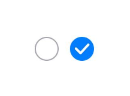
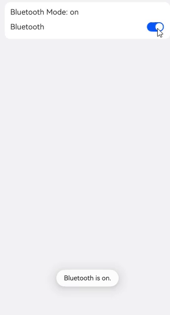

Toggle组件提供状态按钮样式、勾选框样式和开关样式，一般用于两种状态之间的切换。具体用法请参考[Toggle](https://developer.huawei.com/consumer/cn/doc/harmonyos-references/ts-basic-components-toggle)。

## 创建切换按钮

Toggle通过调用[ToggleOptions](https://developer.huawei.com/consumer/cn/doc/harmonyos-references/ts-basic-components-toggle#toggleoptions18对象说明)来创建，具体调用形式如下：

```
Toggle(options: { type: ToggleType, isOn?: boolean })
```

其中，ToggleType为开关类型，包括Button、Checkbox和Switch，isOn为切换按钮的状态。

API version 11开始，Checkbox默认样式由圆角方形变为圆形。

接口调用有以下两种形式：

* 创建不包含子组件的Toggle。

  当ToggleType为Checkbox或者Switch时，用于创建不包含子组件的Toggle：

  ```
  Toggle({ type: ToggleType.Checkbox, isOn: false }).id('toggle1') // 请开发者替换为实际的id
  Toggle({ type: ToggleType.Checkbox, isOn: true }).id('toggle2') // 请开发者替换为实际的id
  ```

  

<div class="source-link-wrapper"><a href="https://gitcode.com/HarmonyOS_Samples/guide-snippets/blob/HarmonyOS-feature-20260402/ArkUISample/ChooseComponent/entry/src/main/ets/pages/toggle/CreateToggle.ets#L30-L33" target="_blank" rel="noopener noreferrer" class="source-link"><svg class="source-link-icon" width="14" height="14" viewBox="0 0 24 24" fill="none" stroke="currentColor" strokeWidth="2" strokeLinecap="round" strokeLinejoin="round">\<path d="M18 13v6a2 2 0 0 1-2 2H5a2 2 0 0 1-2-2V8a2 2 0 0 1 2-2h6" /\>\<polyline points="15 3 21 3 21 9" /\>\<line x1="10" y1="14" x2="21" y2="3" /\></svg> 查看源码：CreateToggle.ets</a></div>


  

  ```
  Toggle({ type: ToggleType.Switch, isOn: false }).id('toggle3') // 请开发者替换为实际的id
  Toggle({ type: ToggleType.Switch, isOn: true }).id('toggle4') // 请开发者替换为实际的id
  ```

  

<div class="source-link-wrapper"><a href="https://gitcode.com/HarmonyOS_Samples/guide-snippets/blob/HarmonyOS-feature-20260402/ArkUISample/ChooseComponent/entry/src/main/ets/pages/toggle/CreateToggle.ets#L39-L42" target="_blank" rel="noopener noreferrer" class="source-link"><svg class="source-link-icon" width="14" height="14" viewBox="0 0 24 24" fill="none" stroke="currentColor" strokeWidth="2" strokeLinecap="round" strokeLinejoin="round">\<path d="M18 13v6a2 2 0 0 1-2 2H5a2 2 0 0 1-2-2V8a2 2 0 0 1 2-2h6" /\>\<polyline points="15 3 21 3 21 9" /\>\<line x1="10" y1="14" x2="21" y2="3" /\></svg> 查看源码：CreateToggle.ets</a></div>


  
* 创建包含子组件的Toggle。

  当ToggleType为Button时，只能包含一个子组件，如果子组件有文本设置，则相应的文本内容会显示在按钮上。

  ```
  Toggle({ type: ToggleType.Button, isOn: false }) {
    Text('status button')
      .fontColor('#182431')
      .fontSize(12)
  }.width(100).id('toggle5') // 请开发者替换为实际的id

  Toggle({ type: ToggleType.Button, isOn: true }) {
    Text('status button')
      .fontColor('#182431')
      .fontSize(12)
  }.width(100).id('toggle6') // 请开发者替换为实际的id
  ```

  

<div class="source-link-wrapper"><a href="https://gitcode.com/HarmonyOS_Samples/guide-snippets/blob/HarmonyOS-feature-20260402/ArkUISample/ChooseComponent/entry/src/main/ets/pages/toggle/CreateToggle.ets#L61-L73" target="_blank" rel="noopener noreferrer" class="source-link"><svg class="source-link-icon" width="14" height="14" viewBox="0 0 24 24" fill="none" stroke="currentColor" strokeWidth="2" strokeLinecap="round" strokeLinejoin="round">\<path d="M18 13v6a2 2 0 0 1-2 2H5a2 2 0 0 1-2-2V8a2 2 0 0 1 2-2h6" /\>\<polyline points="15 3 21 3 21 9" /\>\<line x1="10" y1="14" x2="21" y2="3" /\></svg> 查看源码：CreateToggle.ets</a></div>


  

## 自定义样式

* 通过selectedColor属性设置Toggle打开选中后的背景颜色。

  ```
    Toggle({ type: ToggleType.Button, isOn: true }) {
      Text('status button')
        .fontColor('#182431')
        .fontSize(12)
    }.width(100)
    .selectedColor(Color.Pink)
  // ···

    Toggle({ type: ToggleType.Checkbox, isOn: true })
      .selectedColor(Color.Pink)
      // ···
    Toggle({ type: ToggleType.Switch, isOn: true })
      .selectedColor(Color.Pink)
      // ···
  ```

  

<div class="source-link-wrapper"><a href="https://gitcode.com/HarmonyOS_Samples/guide-snippets/blob/HarmonyOS-feature-20260402/ArkUISample/ChooseComponent/entry/src/main/ets/pages/toggle/ToggleCustomStyle.ets#L31-L52" target="_blank" rel="noopener noreferrer" class="source-link"><svg class="source-link-icon" width="14" height="14" viewBox="0 0 24 24" fill="none" stroke="currentColor" strokeWidth="2" strokeLinecap="round" strokeLinejoin="round">\<path d="M18 13v6a2 2 0 0 1-2 2H5a2 2 0 0 1-2-2V8a2 2 0 0 1 2-2h6" /\>\<polyline points="15 3 21 3 21 9" /\>\<line x1="10" y1="14" x2="21" y2="3" /\></svg> 查看源码：ToggleCustomStyle.ets</a></div>


  
* 通过switchPointColor属性设置Switch类型的圆形滑块颜色，仅对type为ToggleType.Switch生效。

  ```
  Toggle({ type: ToggleType.Switch, isOn: false })
    .switchPointColor(Color.Pink)
    // ···
  Toggle({ type: ToggleType.Switch, isOn: true })
    .switchPointColor(Color.Pink)
    // ···
  ```

  

<div class="source-link-wrapper"><a href="https://gitcode.com/HarmonyOS_Samples/guide-snippets/blob/HarmonyOS-feature-20260402/ArkUISample/ChooseComponent/entry/src/main/ets/pages/toggle/ToggleCustomStyle.ets#L60-L71" target="_blank" rel="noopener noreferrer" class="source-link"><svg class="source-link-icon" width="14" height="14" viewBox="0 0 24 24" fill="none" stroke="currentColor" strokeWidth="2" strokeLinecap="round" strokeLinejoin="round">\<path d="M18 13v6a2 2 0 0 1-2 2H5a2 2 0 0 1-2-2V8a2 2 0 0 1 2-2h6" /\>\<polyline points="15 3 21 3 21 9" /\>\<line x1="10" y1="14" x2="21" y2="3" /\></svg> 查看源码：ToggleCustomStyle.ets</a></div>


  

## 添加事件

除支持[通用事件](https://developer.huawei.com/consumer/cn/doc/harmonyos-references/ts-component-general-events)外，Toggle还用于选中和取消选中后触发某些操作，可以绑定onChange事件来响应操作后的自定义行为。

```
Toggle({ type: ToggleType.Switch, isOn: false })
  .onChange((isOn: boolean) => {
    if(isOn) {
      // 需要执行的操作
      // ···
    }
  })
```


<div class="source-link-wrapper"><a href="https://gitcode.com/HarmonyOS_Samples/guide-snippets/blob/HarmonyOS-feature-20260402/ArkUISample/ChooseComponent/entry/src/main/ets/pages/toggle/CreateToggle.ets#L44-L54" target="_blank" rel="noopener noreferrer" class="source-link"><svg class="source-link-icon" width="14" height="14" viewBox="0 0 24 24" fill="none" stroke="currentColor" strokeWidth="2" strokeLinecap="round" strokeLinejoin="round">\<path d="M18 13v6a2 2 0 0 1-2 2H5a2 2 0 0 1-2-2V8a2 2 0 0 1 2-2h6" /\>\<polyline points="15 3 21 3 21 9" /\>\<line x1="10" y1="14" x2="21" y2="3" /\></svg> 查看源码：CreateToggle.ets</a></div>


## 场景示例

Toggle用于切换蓝牙开关状态。

```
// xxx.ets
import { promptAction } from '@kit.ArkUI';

@Entry
@Component
export struct ToggleSample {
  @State message: string = 'off';
  pathStack: NavPathStack = new NavPathStack();

  build() {
    NavDestination() {
      Column({ space: 8 }) {
        Column({ space: 8 }) {
          Text('Bluetooth Mode: ' + this.message)
            .id('message')
          Row() {
            Text('Bluetooth')
            Blank()
            Toggle({ type: ToggleType.Switch })
              .id('toggle') // 请开发者替换为实际的id
              .onChange((isOn: boolean) => {
                if (isOn) {
                  this.message = 'on';
                  promptAction.openToast({ 'message': 'Bluetooth is on.' });
                } else {
                  this.message = 'off';
                  promptAction.openToast({ 'message': 'Bluetooth is off.' });
                }
              })
          }.width('100%')
        }
        .alignItems(HorizontalAlign.Start)
        .backgroundColor('#fff')
        .borderRadius(12)
        .padding(12)
        .width('100%')
      }
      .width('100%')
      .height('100%')
      .padding({ left: 12, right: 12 })
    }
    .backgroundColor('#f1f2f3')
    // 请将$r('app.string.ToggleCaseExample_title')替换为实际资源文件，在本示例中该资源文件的value值为"toggle蓝牙示例"
    .title($r('app.string.ToggleCaseExample_title'))
  }
}
```


<div class="source-link-wrapper"><a href="https://gitcode.com/HarmonyOS_Samples/guide-snippets/blob/HarmonyOS-feature-20260402/ArkUISample/ChooseComponent/entry/src/main/ets/pages/toggle/ToggleCaseExample.ets#L16-L69" target="_blank" rel="noopener noreferrer" class="source-link"><svg class="source-link-icon" width="14" height="14" viewBox="0 0 24 24" fill="none" stroke="currentColor" strokeWidth="2" strokeLinecap="round" strokeLinejoin="round">\<path d="M18 13v6a2 2 0 0 1-2 2H5a2 2 0 0 1-2-2V8a2 2 0 0 1 2-2h6" /\>\<polyline points="15 3 21 3 21 9" /\>\<line x1="10" y1="14" x2="21" y2="3" /\></svg> 查看源码：ToggleCaseExample.ets</a></div>



