## 概述

弹性布局（[Flex](https://developer.huawei.com/consumer/cn/doc/harmonyos-references/ts-container-flex)）提供更加有效的方式对容器中的子元素进行排列、对齐和分配剩余空间。常用于页面头部导航栏的均匀分布、页面框架的搭建、多行数据的排列等。

容器默认存在主轴与交叉轴，子元素默认沿主轴排列，子元素在主轴方向的尺寸称为主轴尺寸，在交叉轴方向的尺寸称为交叉轴尺寸。

**图1** 主轴为水平方向的Flex容器示意图

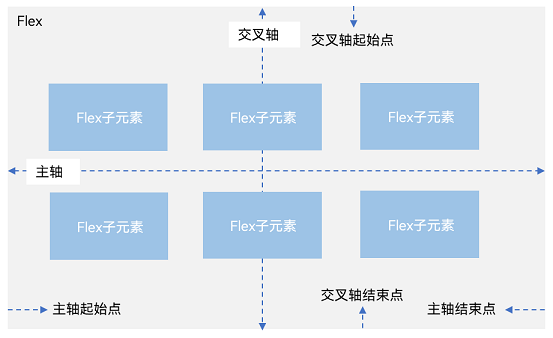

## 基本概念

* 主轴：Flex组件布局方向的轴线，子元素默认沿着主轴排列。主轴开始的位置称为主轴起始点，结束位置称为主轴结束点。
* 交叉轴：垂直于主轴方向的轴线。交叉轴开始的位置称为交叉轴起始点，结束位置称为交叉轴结束点。

## 布局方向

在弹性布局中，容器的子元素可以按照任意方向排列。通过设置[FlexOptions](https://developer.huawei.com/consumer/cn/doc/harmonyos-references/ts-container-flex#flexoptions对象说明)的参数direction，可以决定主轴的方向，从而控制子元素的排列方向。

**图2** 弹性布局方向图

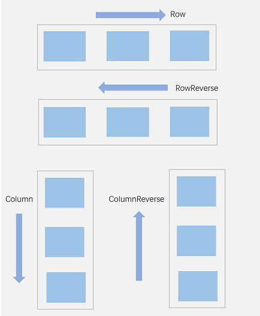

* FlexDirection.Row（默认值）：主轴为水平方向，子元素从起始端沿着水平方向开始排布。

  ```
  Flex({ direction: FlexDirection.Row }) {
    Text('1').width('33%').height(50).backgroundColor('#F5DEB3')
    Text('2').width('33%').height(50).backgroundColor('#D2B48C')
    Text('3').width('33%').height(50).backgroundColor('#F5DEB3')
  }
  .height(70)
  .width('90%')
  .padding(10)
  .backgroundColor('#AFEEEE')
  ```

  

<div class="source-link-wrapper"><a href="https://gitcode.com/HarmonyOS_Samples/guide-snippets/blob/HarmonyOS-feature-20260402/ArkUISample/MultipleLayoutProject/entry/src/main/ets/pages/flexlayout/FlexDirectionRow.ets#L20-L30" target="_blank" rel="noopener noreferrer" class="source-link"><svg class="source-link-icon" width="14" height="14" viewBox="0 0 24 24" fill="none" stroke="currentColor" strokeWidth="2" strokeLinecap="round" strokeLinejoin="round">\<path d="M18 13v6a2 2 0 0 1-2 2H5a2 2 0 0 1-2-2V8a2 2 0 0 1 2-2h6" /\>\<polyline points="15 3 21 3 21 9" /\>\<line x1="10" y1="14" x2="21" y2="3" /\></svg> 查看源码：FlexDirectionRow.ets</a></div>


  
* FlexDirection.RowReverse：主轴为水平方向，子元素从终点端沿着FlexDirection.Row相反的方向开始排布。

  ```
  Flex({ direction: FlexDirection.RowReverse }) {
    Text('1').width('33%').height(50).backgroundColor('#F5DEB3')
    Text('2').width('33%').height(50).backgroundColor('#D2B48C')
    Text('3').width('33%').height(50).backgroundColor('#F5DEB3')
  }
  .height(70)
  .width('90%')
  .padding(10)
  .backgroundColor('#AFEEEE')
  ```

  

<div class="source-link-wrapper"><a href="https://gitcode.com/HarmonyOS_Samples/guide-snippets/blob/HarmonyOS-feature-20260402/ArkUISample/MultipleLayoutProject/entry/src/main/ets/pages/flexlayout/FlexDirectionRowReverse.ets#L20-L30" target="_blank" rel="noopener noreferrer" class="source-link"><svg class="source-link-icon" width="14" height="14" viewBox="0 0 24 24" fill="none" stroke="currentColor" strokeWidth="2" strokeLinecap="round" strokeLinejoin="round">\<path d="M18 13v6a2 2 0 0 1-2 2H5a2 2 0 0 1-2-2V8a2 2 0 0 1 2-2h6" /\>\<polyline points="15 3 21 3 21 9" /\>\<line x1="10" y1="14" x2="21" y2="3" /\></svg> 查看源码：FlexDirectionRowReverse.ets</a></div>


  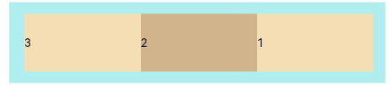
* FlexDirection.Column：主轴为垂直方向，子元素从起始端沿着垂直方向开始排布。

  ```
  Flex({ direction: FlexDirection.Column }) {
    Text('1').width('100%').height(50).backgroundColor('#F5DEB3')
    Text('2').width('100%').height(50).backgroundColor('#D2B48C')
    Text('3').width('100%').height(50).backgroundColor('#F5DEB3')
  }
  .height(70)
  .width('90%')
  .padding(10)
  .backgroundColor('#AFEEEE')
  ```

  

<div class="source-link-wrapper"><a href="https://gitcode.com/HarmonyOS_Samples/guide-snippets/blob/HarmonyOS-feature-20260402/ArkUISample/MultipleLayoutProject/entry/src/main/ets/pages/flexlayout/FlexDirectionColumn.ets#L20-L30" target="_blank" rel="noopener noreferrer" class="source-link"><svg class="source-link-icon" width="14" height="14" viewBox="0 0 24 24" fill="none" stroke="currentColor" strokeWidth="2" strokeLinecap="round" strokeLinejoin="round">\<path d="M18 13v6a2 2 0 0 1-2 2H5a2 2 0 0 1-2-2V8a2 2 0 0 1 2-2h6" /\>\<polyline points="15 3 21 3 21 9" /\>\<line x1="10" y1="14" x2="21" y2="3" /\></svg> 查看源码：FlexDirectionColumn.ets</a></div>


  
* FlexDirection.ColumnReverse：主轴为垂直方向，子元素从终点端沿着FlexDirection.Column相反的方向开始排布。

  ```
  Flex({ direction: FlexDirection.ColumnReverse }) {
    Text('1').width('100%').height(50).backgroundColor('#F5DEB3')
    Text('2').width('100%').height(50).backgroundColor('#D2B48C')
    Text('3').width('100%').height(50).backgroundColor('#F5DEB3')
  }
  .height(70)
  .width('90%')
  .padding(10)
  .backgroundColor('#AFEEEE')
  ```

  

<div class="source-link-wrapper"><a href="https://gitcode.com/HarmonyOS_Samples/guide-snippets/blob/HarmonyOS-feature-20260402/ArkUISample/MultipleLayoutProject/entry/src/main/ets/pages/flexlayout/FlexDirectionColumnReverse.ets#L20-L30" target="_blank" rel="noopener noreferrer" class="source-link"><svg class="source-link-icon" width="14" height="14" viewBox="0 0 24 24" fill="none" stroke="currentColor" strokeWidth="2" strokeLinecap="round" strokeLinejoin="round">\<path d="M18 13v6a2 2 0 0 1-2 2H5a2 2 0 0 1-2-2V8a2 2 0 0 1 2-2h6" /\>\<polyline points="15 3 21 3 21 9" /\>\<line x1="10" y1="14" x2="21" y2="3" /\></svg> 查看源码：FlexDirectionColumnReverse.ets</a></div>


  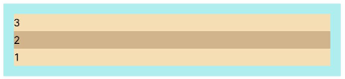

## 布局换行

弹性布局分为单行布局和多行布局。默认情况下，Flex容器中的子元素都排在一条线（又称“轴线”）上。wrap属性控制当子元素主轴尺寸之和大于容器主轴尺寸时，Flex是单行布局还是多行布局。在多行布局时，通过交叉轴方向，确认新行排列方向。

* FlexWrap.NoWrap（默认值）：不换行。如果子元素的宽度总和大于父元素的宽度，则子元素会被压缩宽度。

  ```
  Flex({ wrap: FlexWrap.NoWrap }) {
    Text('1').width('50%').height(50).backgroundColor('#F5DEB3')
    Text('2').width('50%').height(50).backgroundColor('#D2B48C')
    Text('3').width('50%').height(50).backgroundColor('#F5DEB3')
  }
  .width('90%')
  .padding(10)
  .backgroundColor('#AFEEEE')
  ```

  

<div class="source-link-wrapper"><a href="https://gitcode.com/HarmonyOS_Samples/guide-snippets/blob/HarmonyOS-feature-20260402/ArkUISample/MultipleLayoutProject/entry/src/main/ets/pages/flexlayout/FlexWrapNoWrap.ets#L20-L29" target="_blank" rel="noopener noreferrer" class="source-link"><svg class="source-link-icon" width="14" height="14" viewBox="0 0 24 24" fill="none" stroke="currentColor" strokeWidth="2" strokeLinecap="round" strokeLinejoin="round">\<path d="M18 13v6a2 2 0 0 1-2 2H5a2 2 0 0 1-2-2V8a2 2 0 0 1 2-2h6" /\>\<polyline points="15 3 21 3 21 9" /\>\<line x1="10" y1="14" x2="21" y2="3" /\></svg> 查看源码：FlexWrapNoWrap.ets</a></div>


  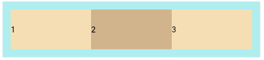
* FlexWrap.Wrap：换行，每一行子元素按照主轴方向排列。

  ```
  Flex({ wrap: FlexWrap.Wrap }) {
    Text('1').width('50%').height(50).backgroundColor('#F5DEB3')
    Text('2').width('50%').height(50).backgroundColor('#D2B48C')
    Text('3').width('50%').height(50).backgroundColor('#D2B48C')
  }
  .width('90%')
  .padding(10)
  .backgroundColor('#AFEEEE')
  ```

  

<div class="source-link-wrapper"><a href="https://gitcode.com/HarmonyOS_Samples/guide-snippets/blob/HarmonyOS-feature-20260402/ArkUISample/MultipleLayoutProject/entry/src/main/ets/pages/flexlayout/FlexWrapWrap.ets#L20-L29" target="_blank" rel="noopener noreferrer" class="source-link"><svg class="source-link-icon" width="14" height="14" viewBox="0 0 24 24" fill="none" stroke="currentColor" strokeWidth="2" strokeLinecap="round" strokeLinejoin="round">\<path d="M18 13v6a2 2 0 0 1-2 2H5a2 2 0 0 1-2-2V8a2 2 0 0 1 2-2h6" /\>\<polyline points="15 3 21 3 21 9" /\>\<line x1="10" y1="14" x2="21" y2="3" /\></svg> 查看源码：FlexWrapWrap.ets</a></div>


  
* FlexWrap.WrapReverse：换行，每一行子元素按照主轴反方向排列。

  ```
  Flex({ wrap: FlexWrap.WrapReverse}) {
    Text('1').width('50%').height(50).backgroundColor('#F5DEB3')
    Text('2').width('50%').height(50).backgroundColor('#D2B48C')
    Text('3').width('50%').height(50).backgroundColor('#F5DEB3')
  }
  .width('90%')
  .padding(10)
  .backgroundColor('#AFEEEE')
  ```

  

<div class="source-link-wrapper"><a href="https://gitcode.com/HarmonyOS_Samples/guide-snippets/blob/HarmonyOS-feature-20260402/ArkUISample/MultipleLayoutProject/entry/src/main/ets/pages/flexlayout/FlexWrapWrapReverse.ets#L20-L29" target="_blank" rel="noopener noreferrer" class="source-link"><svg class="source-link-icon" width="14" height="14" viewBox="0 0 24 24" fill="none" stroke="currentColor" strokeWidth="2" strokeLinecap="round" strokeLinejoin="round">\<path d="M18 13v6a2 2 0 0 1-2 2H5a2 2 0 0 1-2-2V8a2 2 0 0 1 2-2h6" /\>\<polyline points="15 3 21 3 21 9" /\>\<line x1="10" y1="14" x2="21" y2="3" /\></svg> 查看源码：FlexWrapWrapReverse.ets</a></div>


  

## 主轴对齐方式

通过[justifyContent](https://developer.huawei.com/consumer/cn/doc/harmonyos-references/ts-container-flex#flexoptions对象说明)参数设置子元素在主轴方向的对齐方式。

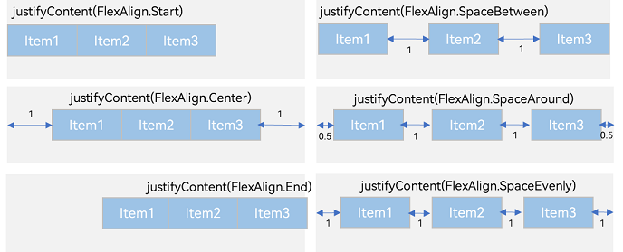

* FlexAlign.Start（默认值）：子元素在主轴方向起始端对齐， 第一个子元素与父元素边沿对齐，其他元素与前一个元素对齐。

  ```
  Flex({ justifyContent: FlexAlign.Start }) {
    Text('1').width('20%').height(50).backgroundColor('#F5DEB3')
    Text('2').width('20%').height(50).backgroundColor('#D2B48C')
    Text('3').width('20%').height(50).backgroundColor('#F5DEB3')
  }
  .width('90%')
  .padding({ top: 10, bottom: 10 })
  .backgroundColor('#AFEEEE')
  ```

  

<div class="source-link-wrapper"><a href="https://gitcode.com/HarmonyOS_Samples/guide-snippets/blob/HarmonyOS-feature-20260402/ArkUISample/MultipleLayoutProject/entry/src/main/ets/pages/flexlayout/FlexAlignStart.ets#L20-L33" target="_blank" rel="noopener noreferrer" class="source-link"><svg class="source-link-icon" width="14" height="14" viewBox="0 0 24 24" fill="none" stroke="currentColor" strokeWidth="2" strokeLinecap="round" strokeLinejoin="round">\<path d="M18 13v6a2 2 0 0 1-2 2H5a2 2 0 0 1-2-2V8a2 2 0 0 1 2-2h6" /\>\<polyline points="15 3 21 3 21 9" /\>\<line x1="10" y1="14" x2="21" y2="3" /\></svg> 查看源码：FlexAlignStart.ets</a></div>


  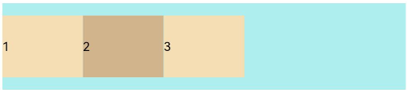
* FlexAlign.Center：子元素在主轴方向居中对齐。

  ```
  Flex({ justifyContent: FlexAlign.Center }) {
    Text('1').width('20%').height(50).backgroundColor('#F5DEB3')
    Text('2').width('20%').height(50).backgroundColor('#D2B48C')
    Text('3').width('20%').height(50).backgroundColor('#F5DEB3')
  }
  .width('90%')
  .padding({ top: 10, bottom: 10 })
  .backgroundColor('#AFEEEE')
  ```

  

<div class="source-link-wrapper"><a href="https://gitcode.com/HarmonyOS_Samples/guide-snippets/blob/HarmonyOS-feature-20260402/ArkUISample/MultipleLayoutProject/entry/src/main/ets/pages/flexlayout/FlexAlignCenter.ets#L20-L29" target="_blank" rel="noopener noreferrer" class="source-link"><svg class="source-link-icon" width="14" height="14" viewBox="0 0 24 24" fill="none" stroke="currentColor" strokeWidth="2" strokeLinecap="round" strokeLinejoin="round">\<path d="M18 13v6a2 2 0 0 1-2 2H5a2 2 0 0 1-2-2V8a2 2 0 0 1 2-2h6" /\>\<polyline points="15 3 21 3 21 9" /\>\<line x1="10" y1="14" x2="21" y2="3" /\></svg> 查看源码：FlexAlignCenter.ets</a></div>


  
* FlexAlign.End：子元素在主轴方向终点端对齐，最后一个子元素与父元素边沿对齐，其他元素与后一个元素对齐。

  ```
  Flex({ justifyContent: FlexAlign.End }) {
    Text('1').width('20%').height(50).backgroundColor('#F5DEB3')
    Text('2').width('20%').height(50).backgroundColor('#D2B48C')
    Text('3').width('20%').height(50).backgroundColor('#F5DEB3')
  }
  .width('90%')
  .padding({ top: 10, bottom: 10 })
  .backgroundColor('#AFEEEE')
  ```

  

<div class="source-link-wrapper"><a href="https://gitcode.com/HarmonyOS_Samples/guide-snippets/blob/HarmonyOS-feature-20260402/ArkUISample/MultipleLayoutProject/entry/src/main/ets/pages/flexlayout/FlexAlignEnd.ets#L20-L29" target="_blank" rel="noopener noreferrer" class="source-link"><svg class="source-link-icon" width="14" height="14" viewBox="0 0 24 24" fill="none" stroke="currentColor" strokeWidth="2" strokeLinecap="round" strokeLinejoin="round">\<path d="M18 13v6a2 2 0 0 1-2 2H5a2 2 0 0 1-2-2V8a2 2 0 0 1 2-2h6" /\>\<polyline points="15 3 21 3 21 9" /\>\<line x1="10" y1="14" x2="21" y2="3" /\></svg> 查看源码：FlexAlignEnd.ets</a></div>


  
* FlexAlign.SpaceBetween：Flex主轴方向均匀分配弹性元素，相邻子元素之间距离相同。第一个子元素和最后一个子元素与父元素边沿对齐。

  ```
  Flex({ justifyContent: FlexAlign.SpaceBetween }) {
    Text('1').width('20%').height(50).backgroundColor('#F5DEB3')
    Text('2').width('20%').height(50).backgroundColor('#D2B48C')
    Text('3').width('20%').height(50).backgroundColor('#F5DEB3')
  }
  .width('90%')
  .padding({ top: 10, bottom: 10 })
  .backgroundColor('#AFEEEE')
  ```

  

<div class="source-link-wrapper"><a href="https://gitcode.com/HarmonyOS_Samples/guide-snippets/blob/HarmonyOS-feature-20260402/ArkUISample/MultipleLayoutProject/entry/src/main/ets/pages/flexlayout/FlexAlignSpaceBetween.ets#L20-L29" target="_blank" rel="noopener noreferrer" class="source-link"><svg class="source-link-icon" width="14" height="14" viewBox="0 0 24 24" fill="none" stroke="currentColor" strokeWidth="2" strokeLinecap="round" strokeLinejoin="round">\<path d="M18 13v6a2 2 0 0 1-2 2H5a2 2 0 0 1-2-2V8a2 2 0 0 1 2-2h6" /\>\<polyline points="15 3 21 3 21 9" /\>\<line x1="10" y1="14" x2="21" y2="3" /\></svg> 查看源码：FlexAlignSpaceBetween.ets</a></div>


  
* FlexAlign.SpaceAround：Flex主轴方向均匀分配弹性元素，相邻子元素之间距离相同。第一个子元素到主轴起始端的距离和最后一个子元素到主轴终点端的距离是相邻元素之间距离的一半。

  ```
  Flex({ justifyContent: FlexAlign.SpaceAround }) {
    Text('1').width('20%').height(50).backgroundColor('#F5DEB3')
    Text('2').width('20%').height(50).backgroundColor('#D2B48C')
    Text('3').width('20%').height(50).backgroundColor('#F5DEB3')
  }
  .width('90%')
  .padding({ top: 10, bottom: 10 })
  .backgroundColor('#AFEEEE')
  ```

  

<div class="source-link-wrapper"><a href="https://gitcode.com/HarmonyOS_Samples/guide-snippets/blob/HarmonyOS-feature-20260402/ArkUISample/MultipleLayoutProject/entry/src/main/ets/pages/flexlayout/FlexAlignSpaceAround.ets#L20-L29" target="_blank" rel="noopener noreferrer" class="source-link"><svg class="source-link-icon" width="14" height="14" viewBox="0 0 24 24" fill="none" stroke="currentColor" strokeWidth="2" strokeLinecap="round" strokeLinejoin="round">\<path d="M18 13v6a2 2 0 0 1-2 2H5a2 2 0 0 1-2-2V8a2 2 0 0 1 2-2h6" /\>\<polyline points="15 3 21 3 21 9" /\>\<line x1="10" y1="14" x2="21" y2="3" /\></svg> 查看源码：FlexAlignSpaceAround.ets</a></div>


  
* FlexAlign.SpaceEvenly：Flex主轴方向元素等间距布局，相邻子元素之间的间距、第一个子元素与主轴起始端的间距、最后一个子元素到主轴终点端的间距均相等。

  ```
  Flex({ justifyContent: FlexAlign.SpaceEvenly }) {
    Text('1').width('20%').height(50).backgroundColor('#F5DEB3')
    Text('2').width('20%').height(50).backgroundColor('#D2B48C')
    Text('3').width('20%').height(50).backgroundColor('#F5DEB3')
  }
  .width('90%')
  .padding({ top: 10, bottom: 10 })
  .backgroundColor('#AFEEEE')
  ```

  

<div class="source-link-wrapper"><a href="https://gitcode.com/HarmonyOS_Samples/guide-snippets/blob/HarmonyOS-feature-20260402/ArkUISample/MultipleLayoutProject/entry/src/main/ets/pages/flexlayout/FlexAlignSpaceEvenly.ets#L20-L29" target="_blank" rel="noopener noreferrer" class="source-link"><svg class="source-link-icon" width="14" height="14" viewBox="0 0 24 24" fill="none" stroke="currentColor" strokeWidth="2" strokeLinecap="round" strokeLinejoin="round">\<path d="M18 13v6a2 2 0 0 1-2 2H5a2 2 0 0 1-2-2V8a2 2 0 0 1 2-2h6" /\>\<polyline points="15 3 21 3 21 9" /\>\<line x1="10" y1="14" x2="21" y2="3" /\></svg> 查看源码：FlexAlignSpaceEvenly.ets</a></div>


  

## 交叉轴对齐方式

容器和子元素都可以设置交叉轴对齐方式，且子元素设置的对齐方式优先级较高。

### 容器组件设置交叉轴对齐

可以通过设置[FlexOptions](https://developer.huawei.com/consumer/cn/doc/harmonyos-references/ts-container-flex#flexoptions对象说明)的参数alignItems，设置子元素在交叉轴的对齐方式。

* ItemAlign.Auto：使用Flex容器中默认配置。

  ```
  Flex({ alignItems: ItemAlign.Auto }) {
    Text('1').width('33%').height(30).backgroundColor('#F5DEB3')
    Text('2').width('33%').height(40).backgroundColor('#D2B48C')
    Text('3').width('33%').height(50).backgroundColor('#F5DEB3')
  }
  .size({ width: '90%', height: 80 })
  .padding(10)
  .backgroundColor('#AFEEEE')
  ```

  

<div class="source-link-wrapper"><a href="https://gitcode.com/HarmonyOS_Samples/guide-snippets/blob/HarmonyOS-feature-20260402/ArkUISample/MultipleLayoutProject/entry/src/main/ets/pages/flexlayout/FlexItemAlignAuto.ets#L20-L29" target="_blank" rel="noopener noreferrer" class="source-link"><svg class="source-link-icon" width="14" height="14" viewBox="0 0 24 24" fill="none" stroke="currentColor" strokeWidth="2" strokeLinecap="round" strokeLinejoin="round">\<path d="M18 13v6a2 2 0 0 1-2 2H5a2 2 0 0 1-2-2V8a2 2 0 0 1 2-2h6" /\>\<polyline points="15 3 21 3 21 9" /\>\<line x1="10" y1="14" x2="21" y2="3" /\></svg> 查看源码：FlexItemAlignAuto.ets</a></div>


  
* ItemAlign.Start：交叉轴方向首部对齐。

  ```
  Flex({ alignItems: ItemAlign.Start }) {
    Text('1').width('33%').height(30).backgroundColor('#F5DEB3')
    Text('2').width('33%').height(40).backgroundColor('#D2B48C')
    Text('3').width('33%').height(50).backgroundColor('#F5DEB3')
  }
  .size({ width: '90%', height: 80 })
  .padding(10)
  .backgroundColor('#AFEEEE')
  ```

  

<div class="source-link-wrapper"><a href="https://gitcode.com/HarmonyOS_Samples/guide-snippets/blob/HarmonyOS-feature-20260402/ArkUISample/MultipleLayoutProject/entry/src/main/ets/pages/flexlayout/FlexItemAlignStart.ets#L20-L20" target="_blank" rel="noopener noreferrer" class="source-link"><svg class="source-link-icon" width="14" height="14" viewBox="0 0 24 24" fill="none" stroke="currentColor" strokeWidth="2" strokeLinecap="round" strokeLinejoin="round">\<path d="M18 13v6a2 2 0 0 1-2 2H5a2 2 0 0 1-2-2V8a2 2 0 0 1 2-2h6" /\>\<polyline points="15 3 21 3 21 9" /\>\<line x1="10" y1="14" x2="21" y2="3" /\></svg> 查看源码：FlexItemAlignStart.ets</a></div>


  
* ItemAlign.Center：交叉轴方向居中对齐。

  ```
  Flex({ alignItems: ItemAlign.Center }) {
    Text('1').width('33%').height(30).backgroundColor('#F5DEB3')
    Text('2').width('33%').height(40).backgroundColor('#D2B48C')
    Text('3').width('33%').height(50).backgroundColor('#F5DEB3')
  }
  .size({ width: '90%', height: 80 })
  .padding(10)
  .backgroundColor('#AFEEEE')
  ```

  

<div class="source-link-wrapper"><a href="https://gitcode.com/HarmonyOS_Samples/guide-snippets/blob/HarmonyOS-feature-20260402/ArkUISample/MultipleLayoutProject/entry/src/main/ets/pages/flexlayout/FlexItemAlignCenter.ets#L20-L29" target="_blank" rel="noopener noreferrer" class="source-link"><svg class="source-link-icon" width="14" height="14" viewBox="0 0 24 24" fill="none" stroke="currentColor" strokeWidth="2" strokeLinecap="round" strokeLinejoin="round">\<path d="M18 13v6a2 2 0 0 1-2 2H5a2 2 0 0 1-2-2V8a2 2 0 0 1 2-2h6" /\>\<polyline points="15 3 21 3 21 9" /\>\<line x1="10" y1="14" x2="21" y2="3" /\></svg> 查看源码：FlexItemAlignCenter.ets</a></div>


  
* ItemAlign.End：交叉轴方向底部对齐。

  ```
  Flex({ alignItems: ItemAlign.End }) {
    Text('1').width('33%').height(30).backgroundColor('#F5DEB3')
    Text('2').width('33%').height(40).backgroundColor('#D2B48C')
    Text('3').width('33%').height(50).backgroundColor('#F5DEB3')
  }
  .size({ width: '90%', height: 80 })
  .padding(10)
  .backgroundColor('#AFEEEE')
  ```

  

<div class="source-link-wrapper"><a href="https://gitcode.com/HarmonyOS_Samples/guide-snippets/blob/HarmonyOS-feature-20260402/ArkUISample/MultipleLayoutProject/entry/src/main/ets/pages/flexlayout/FlexItemAlignEnd.ets#L20-L29" target="_blank" rel="noopener noreferrer" class="source-link"><svg class="source-link-icon" width="14" height="14" viewBox="0 0 24 24" fill="none" stroke="currentColor" strokeWidth="2" strokeLinecap="round" strokeLinejoin="round">\<path d="M18 13v6a2 2 0 0 1-2 2H5a2 2 0 0 1-2-2V8a2 2 0 0 1 2-2h6" /\>\<polyline points="15 3 21 3 21 9" /\>\<line x1="10" y1="14" x2="21" y2="3" /\></svg> 查看源码：FlexItemAlignEnd.ets</a></div>


  
* ItemAlign.Stretch：交叉轴方向拉伸填充，在未设置尺寸时，拉伸到容器尺寸。元素在Flex容器中，沿交叉轴方向拉伸填充。容器为Flex且设置[FlexWrap](https://developer.huawei.com/consumer/cn/doc/harmonyos-references/ts-appendix-enums#flexwrap)为FlexWrap.Wrap或FlexWrap.WrapReverse时，元素拉伸到与当前行或列交叉轴长度最长的元素尺寸。其余情况下，无论元素尺寸是否设置，均拉伸到容器尺寸。

  ```
  Flex({ alignItems: ItemAlign.Stretch }) {
    Text('1').width('33%').backgroundColor('#F5DEB3')
    Text('2').width('33%').backgroundColor('#D2B48C')
    Text('3').width('33%').backgroundColor('#F5DEB3')
  }
  .size({ width: '90%', height: 80 })
  .padding(10)
  .backgroundColor('#AFEEEE')
  ```

  

<div class="source-link-wrapper"><a href="https://gitcode.com/HarmonyOS_Samples/guide-snippets/blob/HarmonyOS-feature-20260402/ArkUISample/MultipleLayoutProject/entry/src/main/ets/pages/flexlayout/FlexItemAlignStretch.ets#L20-L29" target="_blank" rel="noopener noreferrer" class="source-link"><svg class="source-link-icon" width="14" height="14" viewBox="0 0 24 24" fill="none" stroke="currentColor" strokeWidth="2" strokeLinecap="round" strokeLinejoin="round">\<path d="M18 13v6a2 2 0 0 1-2 2H5a2 2 0 0 1-2-2V8a2 2 0 0 1 2-2h6" /\>\<polyline points="15 3 21 3 21 9" /\>\<line x1="10" y1="14" x2="21" y2="3" /\></svg> 查看源码：FlexItemAlignStretch.ets</a></div>


  
* ItemAlign.Baseline：交叉轴方向文本基线对齐。

  ```
  Flex({ alignItems: ItemAlign.Baseline }) {
    Text('1').width('33%').height(30).backgroundColor('#F5DEB3')
    Text('2').width('33%').height(40).backgroundColor('#D2B48C')
    Text('3').width('33%').height(50).backgroundColor('#F5DEB3')
  }
  .size({ width: '90%', height: 80 })
  .padding(10)
  .backgroundColor('#AFEEEE')
  ```

  

<div class="source-link-wrapper"><a href="https://gitcode.com/HarmonyOS_Samples/guide-snippets/blob/HarmonyOS-feature-20260402/ArkUISample/MultipleLayoutProject/entry/src/main/ets/pages/flexlayout/FlexItemAlignBaseline.ets#L20-L29" target="_blank" rel="noopener noreferrer" class="source-link"><svg class="source-link-icon" width="14" height="14" viewBox="0 0 24 24" fill="none" stroke="currentColor" strokeWidth="2" strokeLinecap="round" strokeLinejoin="round">\<path d="M18 13v6a2 2 0 0 1-2 2H5a2 2 0 0 1-2-2V8a2 2 0 0 1 2-2h6" /\>\<polyline points="15 3 21 3 21 9" /\>\<line x1="10" y1="14" x2="21" y2="3" /\></svg> 查看源码：FlexItemAlignBaseline.ets</a></div>


  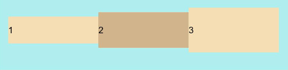

### 子元素设置交叉轴对齐

子元素的[alignSelf](https://developer.huawei.com/consumer/cn/doc/harmonyos-references/ts-universal-attributes-flex-layout#alignself)属性也可以设置子元素在父容器交叉轴的对齐方式，且会覆盖Flex布局容器中alignItems配置。如下例所示：

```
Flex({ direction: FlexDirection.Row, alignItems: ItemAlign.Center }) { // 容器组件设置子元素居中
  Text('alignSelf Start').width('25%').height(80)
    .alignSelf(ItemAlign.Start)
    .backgroundColor('#F5DEB3')
  Text('alignSelf Baseline')
    .alignSelf(ItemAlign.Baseline)
    .width('25%')
    .height(80)
    .backgroundColor('#D2B48C')
  Text('alignSelf Baseline').width('25%').height(100)
    .backgroundColor('#F5DEB3')
    .alignSelf(ItemAlign.Baseline)
  Text('no alignSelf').width('25%').height(100)
    .backgroundColor('#D2B48C')
  Text('no alignSelf').width('25%').height(100)
    .backgroundColor('#F5DEB3')

}.width('90%').height(220).backgroundColor('#AFEEEE')
```


<div class="source-link-wrapper"><a href="https://gitcode.com/HarmonyOS_Samples/guide-snippets/blob/HarmonyOS-feature-20260402/ArkUISample/MultipleLayoutProject/entry/src/main/ets/pages/flexlayout/FlexAlignSelf.ets#L20-L39" target="_blank" rel="noopener noreferrer" class="source-link"><svg class="source-link-icon" width="14" height="14" viewBox="0 0 24 24" fill="none" stroke="currentColor" strokeWidth="2" strokeLinecap="round" strokeLinejoin="round">\<path d="M18 13v6a2 2 0 0 1-2 2H5a2 2 0 0 1-2-2V8a2 2 0 0 1 2-2h6" /\>\<polyline points="15 3 21 3 21 9" /\>\<line x1="10" y1="14" x2="21" y2="3" /\></svg> 查看源码：FlexAlignSelf.ets</a></div>


上例中，Flex容器中alignItems设置交叉轴子元素的对齐方式为居中，子元素自身设置了alignSelf属性的情况，覆盖父组件的alignItems值，表现为alignSelf的定义。

### 内容对齐

可以通过[alignContent](https://developer.huawei.com/consumer/cn/doc/harmonyos-references/ts-container-flex#flexoptions对象说明)参数设置子元素各行在交叉轴剩余空间内的对齐方式，只在多行的Flex布局中生效，可选值有：

* FlexAlign.Start：子元素各行与交叉轴起点对齐。

  ```
  Flex({ justifyContent: FlexAlign.SpaceBetween, wrap: FlexWrap.Wrap, alignContent: FlexAlign.Start }) {
    Text('1').width('30%').height(20).backgroundColor('#F5DEB3')
    Text('2').width('60%').height(20).backgroundColor('#D2B48C')
    Text('3').width('40%').height(20).backgroundColor('#D2B48C')
    Text('4').width('30%').height(20).backgroundColor('#F5DEB3')
    Text('5').width('20%').height(20).backgroundColor('#D2B48C')
  }
  .width('90%')
  .height(100)
  .backgroundColor('#AFEEEE')
  ```

  

<div class="source-link-wrapper"><a href="https://gitcode.com/HarmonyOS_Samples/guide-snippets/blob/HarmonyOS-feature-20260402/ArkUISample/MultipleLayoutProject/entry/src/main/ets/pages/flexlayout/FlexAlignCenterFlexAlignStart.ets#L20-L99" target="_blank" rel="noopener noreferrer" class="source-link"><svg class="source-link-icon" width="14" height="14" viewBox="0 0 24 24" fill="none" stroke="currentColor" strokeWidth="2" strokeLinecap="round" strokeLinejoin="round">\<path d="M18 13v6a2 2 0 0 1-2 2H5a2 2 0 0 1-2-2V8a2 2 0 0 1 2-2h6" /\>\<polyline points="15 3 21 3 21 9" /\>\<line x1="10" y1="14" x2="21" y2="3" /\></svg> 查看源码：FlexAlignCenterFlexAlignStart.ets</a></div>


  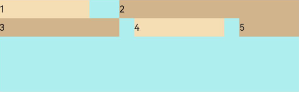
* FlexAlign.Center：子元素各行在交叉轴方向居中对齐。

  ```
  Flex({ justifyContent: FlexAlign.SpaceBetween, wrap: FlexWrap.Wrap, alignContent: FlexAlign.Center }) {
    Text('1').width('30%').height(20).backgroundColor('#F5DEB3')
    Text('2').width('60%').height(20).backgroundColor('#D2B48C')
    Text('3').width('40%').height(20).backgroundColor('#D2B48C')
    Text('4').width('30%').height(20).backgroundColor('#F5DEB3')
    Text('5').width('20%').height(20).backgroundColor('#D2B48C')
  }
  .width('90%')
  .height(100)
  .backgroundColor('#AFEEEE')
  ```

  

<div class="source-link-wrapper"><a href="https://gitcode.com/HarmonyOS_Samples/guide-snippets/blob/HarmonyOS-feature-20260402/ArkUISample/MultipleLayoutProject/entry/src/main/ets/pages/flexlayout/FlexAlignCenterFlexAlignCenter.ets#L20-L31" target="_blank" rel="noopener noreferrer" class="source-link"><svg class="source-link-icon" width="14" height="14" viewBox="0 0 24 24" fill="none" stroke="currentColor" strokeWidth="2" strokeLinecap="round" strokeLinejoin="round">\<path d="M18 13v6a2 2 0 0 1-2 2H5a2 2 0 0 1-2-2V8a2 2 0 0 1 2-2h6" /\>\<polyline points="15 3 21 3 21 9" /\>\<line x1="10" y1="14" x2="21" y2="3" /\></svg> 查看源码：FlexAlignCenterFlexAlignCenter.ets</a></div>


  
* FlexAlign.End：子元素各行与交叉轴终点对齐。

  ```
  Flex({ justifyContent: FlexAlign.SpaceBetween, wrap: FlexWrap.Wrap, alignContent: FlexAlign.End }) {
    Text('1').width('30%').height(20).backgroundColor('#F5DEB3')
    Text('2').width('60%').height(20).backgroundColor('#D2B48C')
    Text('3').width('40%').height(20).backgroundColor('#D2B48C')
    Text('4').width('30%').height(20).backgroundColor('#F5DEB3')
    Text('5').width('20%').height(20).backgroundColor('#D2B48C')
  }
  .width('90%')
  .height(100)
  .backgroundColor('#AFEEEE')
  ```

  

<div class="source-link-wrapper"><a href="https://gitcode.com/HarmonyOS_Samples/guide-snippets/blob/HarmonyOS-feature-20260402/ArkUISample/MultipleLayoutProject/entry/src/main/ets/pages/flexlayout/FlexAlignCenterFlexAlignEnd.ets#L20-L31" target="_blank" rel="noopener noreferrer" class="source-link"><svg class="source-link-icon" width="14" height="14" viewBox="0 0 24 24" fill="none" stroke="currentColor" strokeWidth="2" strokeLinecap="round" strokeLinejoin="round">\<path d="M18 13v6a2 2 0 0 1-2 2H5a2 2 0 0 1-2-2V8a2 2 0 0 1 2-2h6" /\>\<polyline points="15 3 21 3 21 9" /\>\<line x1="10" y1="14" x2="21" y2="3" /\></svg> 查看源码：FlexAlignCenterFlexAlignEnd.ets</a></div>


  
* FlexAlign.SpaceBetween：子元素各行与交叉轴两端对齐，各行间垂直间距平均分布。

  ```
  Flex({ justifyContent: FlexAlign.SpaceBetween, wrap: FlexWrap.Wrap, alignContent: FlexAlign.SpaceBetween }) {
    Text('1').width('30%').height(20).backgroundColor('#F5DEB3')
    Text('2').width('60%').height(20).backgroundColor('#D2B48C')
    Text('3').width('40%').height(20).backgroundColor('#D2B48C')
    Text('4').width('30%').height(20).backgroundColor('#F5DEB3')
    Text('5').width('20%').height(20).backgroundColor('#D2B48C')
  }
  .width('90%')
  .height(100)
  .backgroundColor('#AFEEEE')
  ```

  

<div class="source-link-wrapper"><a href="https://gitcode.com/HarmonyOS_Samples/guide-snippets/blob/HarmonyOS-feature-20260402/ArkUISample/MultipleLayoutProject/entry/src/main/ets/pages/flexlayout/FlexAlignCenterFlexAlignSpaceBetween.ets#L20-L31" target="_blank" rel="noopener noreferrer" class="source-link"><svg class="source-link-icon" width="14" height="14" viewBox="0 0 24 24" fill="none" stroke="currentColor" strokeWidth="2" strokeLinecap="round" strokeLinejoin="round">\<path d="M18 13v6a2 2 0 0 1-2 2H5a2 2 0 0 1-2-2V8a2 2 0 0 1 2-2h6" /\>\<polyline points="15 3 21 3 21 9" /\>\<line x1="10" y1="14" x2="21" y2="3" /\></svg> 查看源码：FlexAlignCenterFlexAlignSpaceBetween.ets</a></div>


  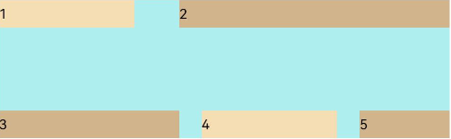
* FlexAlign.SpaceAround：子元素各行间距相等，是元素首尾行与交叉轴两端距离的两倍。

  ```
  Flex({ justifyContent: FlexAlign.SpaceBetween, wrap: FlexWrap.Wrap, alignContent: FlexAlign.SpaceAround }) {
    Text('1').width('30%').height(20).backgroundColor('#F5DEB3')
    Text('2').width('60%').height(20).backgroundColor('#D2B48C')
    Text('3').width('40%').height(20).backgroundColor('#D2B48C')
    Text('4').width('30%').height(20).backgroundColor('#F5DEB3')
    Text('5').width('20%').height(20).backgroundColor('#D2B48C')
  }
  .width('90%')
  .height(100)
  .backgroundColor('#AFEEEE')
  ```

  

<div class="source-link-wrapper"><a href="https://gitcode.com/HarmonyOS_Samples/guide-snippets/blob/HarmonyOS-feature-20260402/ArkUISample/MultipleLayoutProject/entry/src/main/ets/pages/flexlayout/FlexAlignCenterFlexAlignSpaceAround.ets#L20-L31" target="_blank" rel="noopener noreferrer" class="source-link"><svg class="source-link-icon" width="14" height="14" viewBox="0 0 24 24" fill="none" stroke="currentColor" strokeWidth="2" strokeLinecap="round" strokeLinejoin="round">\<path d="M18 13v6a2 2 0 0 1-2 2H5a2 2 0 0 1-2-2V8a2 2 0 0 1 2-2h6" /\>\<polyline points="15 3 21 3 21 9" /\>\<line x1="10" y1="14" x2="21" y2="3" /\></svg> 查看源码：FlexAlignCenterFlexAlignSpaceAround.ets</a></div>


  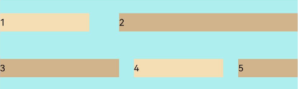
* FlexAlign.SpaceEvenly: 子元素各行间距，子元素首尾行与交叉轴两端距离都相等。

  ```
  Flex({ justifyContent: FlexAlign.SpaceBetween, wrap: FlexWrap.Wrap, alignContent: FlexAlign.SpaceEvenly }) {
    Text('1').width('30%').height(20).backgroundColor('#F5DEB3')
    Text('2').width('60%').height(20).backgroundColor('#D2B48C')
    Text('3').width('40%').height(20).backgroundColor('#D2B48C')
    Text('4').width('30%').height(20).backgroundColor('#F5DEB3')
    Text('5').width('20%').height(20).backgroundColor('#D2B48C')
  }
  .width('90%')
  .height(100)
  .backgroundColor('#AFEEEE')
  ```

  

<div class="source-link-wrapper"><a href="https://gitcode.com/HarmonyOS_Samples/guide-snippets/blob/HarmonyOS-feature-20260402/ArkUISample/MultipleLayoutProject/entry/src/main/ets/pages/flexlayout/FlexAlignCenterFlexAlignSpaceEvenly.ets#L20-L31" target="_blank" rel="noopener noreferrer" class="source-link"><svg class="source-link-icon" width="14" height="14" viewBox="0 0 24 24" fill="none" stroke="currentColor" strokeWidth="2" strokeLinecap="round" strokeLinejoin="round">\<path d="M18 13v6a2 2 0 0 1-2 2H5a2 2 0 0 1-2-2V8a2 2 0 0 1 2-2h6" /\>\<polyline points="15 3 21 3 21 9" /\>\<line x1="10" y1="14" x2="21" y2="3" /\></svg> 查看源码：FlexAlignCenterFlexAlignSpaceEvenly.ets</a></div>


  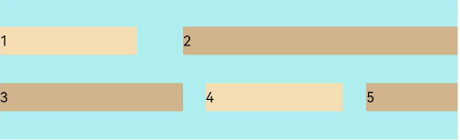

## 自适应拉伸

在弹性布局父组件尺寸过小时，通过子元素的以下属性设置其在父容器的占比，达到自适应布局。

* [flexBasis](https://developer.huawei.com/consumer/cn/doc/harmonyos-references/ts-universal-attributes-flex-layout#flexbasis)：设置子元素在父容器主轴方向上的基准尺寸。如果设置了该属性，则子项占用的空间为该属性所设置的值；如果没设置该属性，那子项的空间为width/height的值。

  ```
  Flex() {
    Text('flexBasis("auto")')
      .flexBasis('auto')// 未设置width以及flexBasis值为auto，内容自身宽度
      .height(100)
      .backgroundColor('#F5DEB3')
    Text('flexBasis("auto")'+' width("40%")')
      .width('40%')
      .flexBasis('auto')// 设置width以及flexBasis值auto，使用width的值
      .height(100)
      .backgroundColor('#D2B48C')

    Text('flexBasis(100)') // 未设置width以及flexBasis值为100，宽度为100vp
      .flexBasis(100)
      .height(100)
      .backgroundColor('#F5DEB3')

    Text('flexBasis(100)')
      .flexBasis(100)
      .width(200)// flexBasis值为100，覆盖width的设置值，宽度为100vp
      .height(100)
      .backgroundColor('#D2B48C')
  }.width('90%').height(120).padding(10).backgroundColor('#AFEEEE')
  ```

  

<div class="source-link-wrapper"><a href="https://gitcode.com/HarmonyOS_Samples/guide-snippets/blob/HarmonyOS-feature-20260402/ArkUISample/MultipleLayoutProject/entry/src/main/ets/pages/flexlayout/FlexBasis.ets#L20-L43" target="_blank" rel="noopener noreferrer" class="source-link"><svg class="source-link-icon" width="14" height="14" viewBox="0 0 24 24" fill="none" stroke="currentColor" strokeWidth="2" strokeLinecap="round" strokeLinejoin="round">\<path d="M18 13v6a2 2 0 0 1-2 2H5a2 2 0 0 1-2-2V8a2 2 0 0 1 2-2h6" /\>\<polyline points="15 3 21 3 21 9" /\>\<line x1="10" y1="14" x2="21" y2="3" /\></svg> 查看源码：FlexBasis.ets</a></div>


  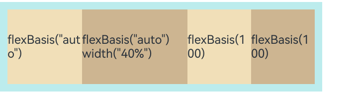
* [flexGrow](https://developer.huawei.com/consumer/cn/doc/harmonyos-references/ts-universal-attributes-flex-layout#flexgrow)：设置父容器的剩余空间分配给此属性所在组件的比例，用于分配父组件的剩余空间。

  ```
  Flex() {
    Text('flexGrow(1)')
      .flexGrow(1)
      .width(100)
      .height(100)
      .backgroundColor('#F5DEB3')
    Text('flexGrow(4)')
      .flexGrow(4)
      .width(100)
      .height(100)
      .backgroundColor('#D2B48C')

    Text('no flexGrow')
      .width(100)
      .height(100)
      .backgroundColor('#F5DEB3')
  }.width(360).height(120).padding(10).backgroundColor('#AFEEEE')
  ```

  

<div class="source-link-wrapper"><a href="https://gitcode.com/HarmonyOS_Samples/guide-snippets/blob/HarmonyOS-feature-20260402/ArkUISample/MultipleLayoutProject/entry/src/main/ets/pages/flexlayout/FlexGrow.ets#L20-L38" target="_blank" rel="noopener noreferrer" class="source-link"><svg class="source-link-icon" width="14" height="14" viewBox="0 0 24 24" fill="none" stroke="currentColor" strokeWidth="2" strokeLinecap="round" strokeLinejoin="round">\<path d="M18 13v6a2 2 0 0 1-2 2H5a2 2 0 0 1-2-2V8a2 2 0 0 1 2-2h6" /\>\<polyline points="15 3 21 3 21 9" /\>\<line x1="10" y1="14" x2="21" y2="3" /\></svg> 查看源码：FlexGrow.ets</a></div>


  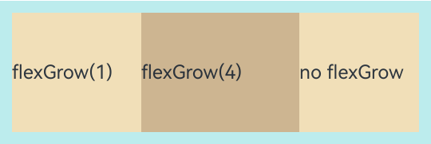

  父容器宽度360vp，三个子元素原始宽度均为100vp，左右padding为20vp，总和320vp，剩余空间40vp根据flexGrow值的占比分配给子元素，未设置flexGrow的子元素不参与分配。

  第一个元素以及第二个元素以1:4分配剩下的40vp。第一个元素为100vp+40vp \* 1/5=108vp，第二个元素为100vp+40vp \* 4/5=132vp。
* [flexShrink](https://developer.huawei.com/consumer/cn/doc/harmonyos-references/ts-universal-attributes-flex-layout#flexshrink): 当父容器空间不足时，子元素的压缩比例。

  ```
  Flex({ direction: FlexDirection.Row }) {
    Text('flexShrink(3)')
      .flexShrink(3)
      .width(200)
      .height(100)
      .backgroundColor('#F5DEB3')

    Text('no flexShrink')
      .width(200)
      .height(100)
      .backgroundColor('#D2B48C')

    Text('flexShrink(2)')
      .flexShrink(2)
      .width(200)
      .height(100)
      .backgroundColor('#F5DEB3')
  }.width(400).height(120).padding(10).backgroundColor('#AFEEEE')
  ```

  

<div class="source-link-wrapper"><a href="https://gitcode.com/HarmonyOS_Samples/guide-snippets/blob/HarmonyOS-feature-20260402/ArkUISample/MultipleLayoutProject/entry/src/main/ets/pages/flexlayout/FlexShrink.ets#L20-L39" target="_blank" rel="noopener noreferrer" class="source-link"><svg class="source-link-icon" width="14" height="14" viewBox="0 0 24 24" fill="none" stroke="currentColor" strokeWidth="2" strokeLinecap="round" strokeLinejoin="round">\<path d="M18 13v6a2 2 0 0 1-2 2H5a2 2 0 0 1-2-2V8a2 2 0 0 1 2-2h6" /\>\<polyline points="15 3 21 3 21 9" /\>\<line x1="10" y1="14" x2="21" y2="3" /\></svg> 查看源码：FlexShrink.ets</a></div>


  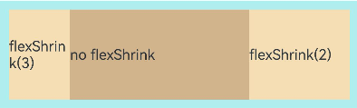

  父容器宽度400vp，三个子元素原始宽度为200vp，左右padding为20vp，父容器给子元素的布局空间为380vp，超出父容器空间220vp。

  将第一个元素和第三个元素以3:2的压缩比例进行压缩，直至不再超出父容器提供的布局空间。第一个元素为200vp - (220vp / 5) \* 3=68vp，第三个元素为200vp - (220vp / 5) \* 2=112vp。

## 场景示例

使用弹性布局，可以实现子元素沿水平方向排列，两端对齐，子元素间距平分，垂直方向上子元素居中的效果。

```
@Entry
@Component
struct FlexExample {
  build() {
    Column() {
      Column({ space: 5 }) {
        Flex({
          direction: FlexDirection.Row,
          wrap: FlexWrap.NoWrap,
          justifyContent: FlexAlign.SpaceBetween,
          alignItems: ItemAlign.Center
        }) {
          Text('1').width('30%').height(50).backgroundColor('#F5DEB3')
          Text('2').width('30%').height(50).backgroundColor('#D2B48C')
          Text('3').width('30%').height(50).backgroundColor('#F5DEB3')
        }
        .height(70)
        .width('90%')
        .backgroundColor('#AFEEEE')
      }.width('100%').margin({ top: 5 })
    }.width('100%')
  }
}
```


<div class="source-link-wrapper"><a href="https://gitcode.com/HarmonyOS_Samples/guide-snippets/blob/HarmonyOS-feature-20260402/ArkUISample/MultipleLayoutProject/entry/src/main/ets/pages/flexlayout/FlexExample.ets#L15-L39" target="_blank" rel="noopener noreferrer" class="source-link"><svg class="source-link-icon" width="14" height="14" viewBox="0 0 24 24" fill="none" stroke="currentColor" strokeWidth="2" strokeLinecap="round" strokeLinejoin="round">\<path d="M18 13v6a2 2 0 0 1-2 2H5a2 2 0 0 1-2-2V8a2 2 0 0 1 2-2h6" /\>\<polyline points="15 3 21 3 21 9" /\>\<line x1="10" y1="14" x2="21" y2="3" /\></svg> 查看源码：FlexExample.ets</a></div>


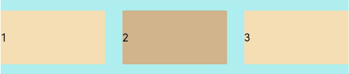
