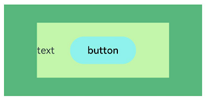
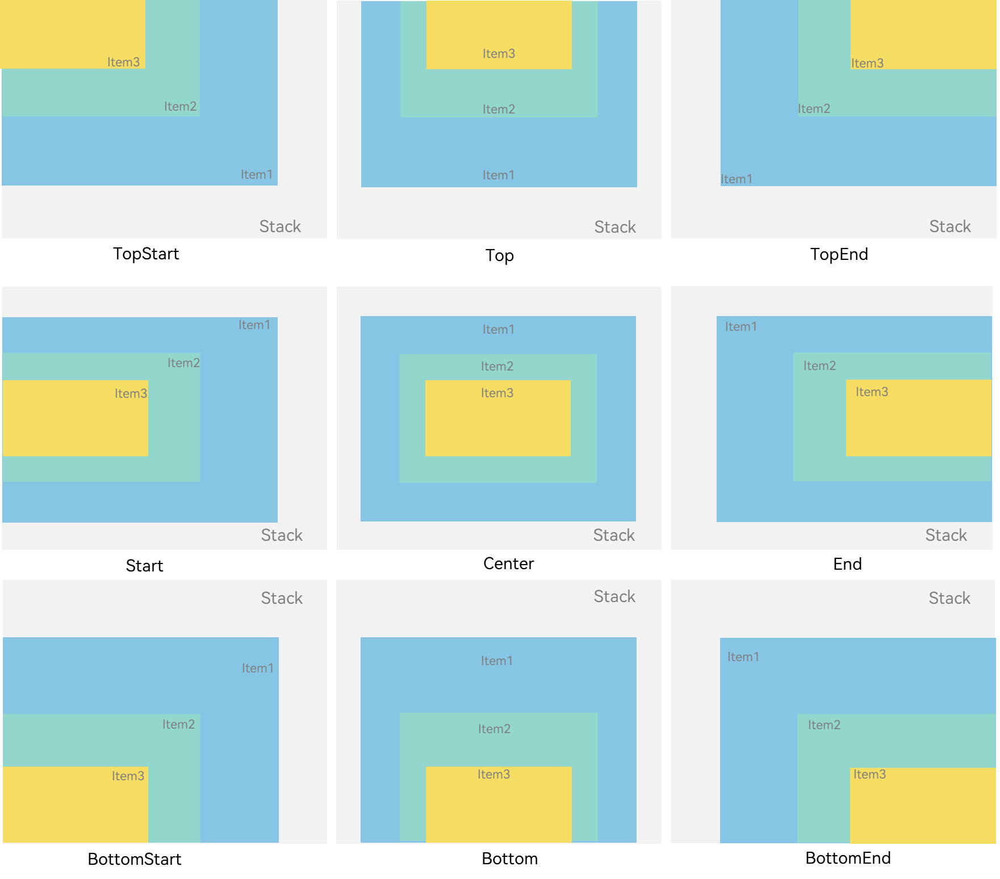
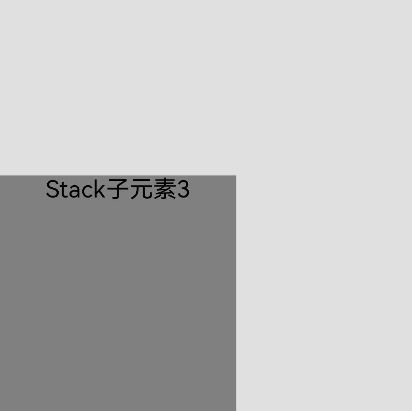
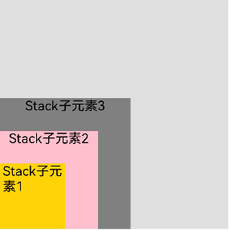
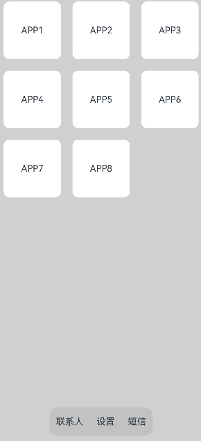

## 概述

层叠布局（StackLayout）用于在屏幕上预留一块区域来显示组件中的元素，提供元素可以重叠的布局。层叠布局通过[Stack](https://developer.huawei.com/consumer/cn/doc/harmonyos-references/ts-container-stack)容器组件实现位置的固定定位与层叠，容器中的子元素依次入栈，后一个子元素覆盖前一个子元素，子元素可以叠加，也可以设置位置。

层叠布局具有较强的页面层叠、位置定位能力，其使用场景有广告、卡片层叠效果等。

如图1，Stack作为容器，容器内的子元素的顺序为Item1->Item2->Item3。

**图1** 层叠布局


过多的嵌套组件数会导致性能劣化。在部分场景中，直接使用组件属性或借助系统API的能力可以替代层叠布局的效果，减少了嵌套组件数进而优化性能。最佳实践请参考[组件嵌套优化-优先使用组件属性代替嵌套组件](/docs/quality/component-nesting-optimization#section78181114123811)。

## 开发布局

Stack组件为容器组件，容器内可包含各种子元素。其中子元素默认进行居中堆叠。子元素被约束在Stack下，进行自己的样式定义以及排列。

```
// xxx.ets
let mTop:Record<string,number> = { 'top': 50 }

@Entry
@Component
struct StackLayoutExample {
  build() {
    Column(){
      Stack({ }) {
        Column(){}.width('90%').height('100%').backgroundColor('#ff58b87c')
        Text('text').width('60%').height('60%').backgroundColor('#ffc3f6aa')
        Button('button').width('30%').height('30%').backgroundColor('#ff8ff3eb').fontColor('#000')
      }.width('100%').height(150).margin(mTop)
    }
  }
}
```


<div class="source-link-wrapper"><a href="https://gitcode.com/HarmonyOS_Samples/guide-snippets/blob/HarmonyOS-feature-20260402/ArkUISample/MultipleLayoutProject/entry/src/main/ets/pages/stacklayout/StackLayoutExample.ets#L15-L32" target="_blank" rel="noopener noreferrer" class="source-link"><svg class="source-link-icon" width="14" height="14" viewBox="0 0 24 24" fill="none" stroke="currentColor" strokeWidth="2" strokeLinecap="round" strokeLinejoin="round">\<path d="M18 13v6a2 2 0 0 1-2 2H5a2 2 0 0 1-2-2V8a2 2 0 0 1 2-2h6" /\>\<polyline points="15 3 21 3 21 9" /\>\<line x1="10" y1="14" x2="21" y2="3" /\></svg> 查看源码：StackLayoutExample.ets</a></div>




## 对齐方式

Stack组件通过[alignContent参数](https://developer.huawei.com/consumer/cn/doc/harmonyos-references/ts-container-stack#aligncontent)实现位置的相对移动。如图2所示，支持九种对齐方式。

**图2** Stack容器内元素的对齐方式



```
// xxx.ets
@Entry
@Component
struct StackAlignContentExample {
  build() {
    Stack({ alignContent: Alignment.TopStart }) {
      Text('Stack').width('90%').height('100%').backgroundColor('#e1dede').align(Alignment.BottomEnd)
      Text('Item 1').width('70%').height('80%').backgroundColor(0xd2cab3).align(Alignment.BottomEnd)
      Text('Item 2').width('50%').height('60%').backgroundColor(0xc1cbac).align(Alignment.BottomEnd)
    }.width('100%').height(150).margin({ top: 5 })
  }
}
```


<div class="source-link-wrapper"><a href="https://gitcode.com/HarmonyOS_Samples/guide-snippets/blob/HarmonyOS-feature-20260402/ArkUISample/MultipleLayoutProject/entry/src/main/ets/pages/stacklayout/StackLayoutAlignContent.ets#L15-L28" target="_blank" rel="noopener noreferrer" class="source-link"><svg class="source-link-icon" width="14" height="14" viewBox="0 0 24 24" fill="none" stroke="currentColor" strokeWidth="2" strokeLinecap="round" strokeLinejoin="round">\<path d="M18 13v6a2 2 0 0 1-2 2H5a2 2 0 0 1-2-2V8a2 2 0 0 1 2-2h6" /\>\<polyline points="15 3 21 3 21 9" /\>\<line x1="10" y1="14" x2="21" y2="3" /\></svg> 查看源码：StackLayoutAlignContent.ets</a></div>


## Z序控制

Stack容器中兄弟组件显示层级关系可以通过[Z序控制](https://developer.huawei.com/consumer/cn/doc/harmonyos-references/ts-universal-attributes-z-order)的zIndex属性改变。zIndex值越大，显示层级越高，即zIndex值大的组件会覆盖在zIndex值小的组件上方。

在层叠布局中，如果后面子元素尺寸大于前面子元素尺寸，则前面子元素完全隐藏。

```
Stack({ alignContent: Alignment.BottomStart }) {
  Column() {
    // 请将$r('app.string.stack_num1')替换为实际资源文件，在本示例中该资源文件的value值为"Stack子元素1"
    Text($r('app.string.stack_num1')).textAlign(TextAlign.End).fontSize(20)
  }.width(100).height(100).backgroundColor(0xffd306)

  Column() {
    // 请将$r('app.string.stack_num2')替换为实际资源文件，在本示例中该资源文件的value值为"Stack子元素2"
    Text($r('app.string.stack_num2')).fontSize(20)
  }.width(150).height(150).backgroundColor(Color.Pink)

  Column() {
    // 请将$r('app.string.stack_num3')替换为实际资源文件，在本示例中该资源文件的value值为"Stack子元素3"
    Text($r('app.string.stack_num3')).fontSize(20)
  }.width(200).height(200).backgroundColor(Color.Grey)
}.width(350).height(350).backgroundColor(0xe0e0e0)
```


<div class="source-link-wrapper"><a href="https://gitcode.com/HarmonyOS_Samples/guide-snippets/blob/HarmonyOS-feature-20260402/ArkUISample/MultipleLayoutProject/entry/src/main/ets/pages/stacklayout/StackLayoutNozIndex.ets#L20-L37" target="_blank" rel="noopener noreferrer" class="source-link"><svg class="source-link-icon" width="14" height="14" viewBox="0 0 24 24" fill="none" stroke="currentColor" strokeWidth="2" strokeLinecap="round" strokeLinejoin="round">\<path d="M18 13v6a2 2 0 0 1-2 2H5a2 2 0 0 1-2-2V8a2 2 0 0 1 2-2h6" /\>\<polyline points="15 3 21 3 21 9" /\>\<line x1="10" y1="14" x2="21" y2="3" /\></svg> 查看源码：StackLayoutNozIndex.ets</a></div>




上图中，最后的子元素3的尺寸大于前面的所有子元素，所以，前面两个元素完全隐藏。改变子元素1、子元素2的zIndex属性后，可以将元素展示出来。

```
Stack({ alignContent: Alignment.BottomStart }) {
  Column() {
    // 请将$r('app.string.stack_num1')替换为实际资源文件，在本示例中该资源文件的value值为"Stack子元素1"
    Text($r('app.string.stack_num1')).fontSize(20)
  }.width(100).height(100).backgroundColor(0xffd306).zIndex(2)

  Column() {
    // 请将$r('app.string.stack_num2')替换为实际资源文件，在本示例中该资源文件的value值为"Stack子元素2"
    Text($r('app.string.stack_num2')).fontSize(20)
  }.width(150).height(150).backgroundColor(Color.Pink).zIndex(1)

  Column() {
    // 请将$r('app.string.stack_num3')替换为实际资源文件，在本示例中该资源文件的value值为"Stack子元素3"
    Text($r('app.string.stack_num3')).fontSize(20)
  }.width(200).height(200).backgroundColor(Color.Grey)
}.width(350).height(350).backgroundColor(0xe0e0e0)
```


<div class="source-link-wrapper"><a href="https://gitcode.com/HarmonyOS_Samples/guide-snippets/blob/HarmonyOS-feature-20260402/ArkUISample/MultipleLayoutProject/entry/src/main/ets/pages/stacklayout/StackLayoutzIndex.ets#L20-L37" target="_blank" rel="noopener noreferrer" class="source-link"><svg class="source-link-icon" width="14" height="14" viewBox="0 0 24 24" fill="none" stroke="currentColor" strokeWidth="2" strokeLinecap="round" strokeLinejoin="round">\<path d="M18 13v6a2 2 0 0 1-2 2H5a2 2 0 0 1-2-2V8a2 2 0 0 1 2-2h6" /\>\<polyline points="15 3 21 3 21 9" /\>\<line x1="10" y1="14" x2="21" y2="3" /\></svg> 查看源码：StackLayoutzIndex.ets</a></div>




## 场景示例

使用层叠布局快速搭建页面。

```
@Entry
@Component
struct StackSample {
  private arr: string[] = ['APP1', 'APP2', 'APP3', 'APP4', 'APP5', 'APP6', 'APP7', 'APP8'];

  build() {
    Stack({ alignContent: Alignment.Bottom }) {
      Flex({ wrap: FlexWrap.Wrap }) {
        ForEach(this.arr, (item:string) => {
          Text(item)
            .width(100)
            .height(100)
            .fontSize(16)
            .margin(10)
            .textAlign(TextAlign.Center)
            .borderRadius(10)
            .backgroundColor(0xFFFFFF)
        }, (item:string):string => item)
      }.width('100%').height('100%')

      Flex({ justifyContent: FlexAlign.SpaceAround, alignItems: ItemAlign.Center }) {
        // 请将$r('app.string.contacts')替换为实际资源文件，在本示例中该资源文件的value值为"联系人"
        Text($r('app.string.contacts')).fontSize(16)
        // 请将$r('app.string.setting')替换为实际资源文件，在本示例中该资源文件的value值为"设置"
        Text($r('app.string.setting')).fontSize(16)
        // 请将$r('app.string.text_message')替换为实际资源文件，在本示例中该资源文件的value值为"短信"
        Text($r('app.string.text_message')).fontSize(16)
      }
      .width('50%')
      .height(50)
      .backgroundColor('#16302e2e')
      .margin({ bottom: 15 })
      .borderRadius(15)
    }.width('100%').height('100%').backgroundColor('#CFD0CF')
  }
}
```


<div class="source-link-wrapper"><a href="https://gitcode.com/HarmonyOS_Samples/guide-snippets/blob/HarmonyOS-feature-20260402/ArkUISample/MultipleLayoutProject/entry/src/main/ets/pages/stacklayout/StackLayoutSceneExample.ets#L15-L52" target="_blank" rel="noopener noreferrer" class="source-link"><svg class="source-link-icon" width="14" height="14" viewBox="0 0 24 24" fill="none" stroke="currentColor" strokeWidth="2" strokeLinecap="round" strokeLinejoin="round">\<path d="M18 13v6a2 2 0 0 1-2 2H5a2 2 0 0 1-2-2V8a2 2 0 0 1 2-2h6" /\>\<polyline points="15 3 21 3 21 9" /\>\<line x1="10" y1="14" x2="21" y2="3" /\></svg> 查看源码：StackLayoutSceneExample.ets</a></div>




## 示例代码

* [组件堆叠](https://gitcode.com/HarmonyOS_Samples/component-stack)
