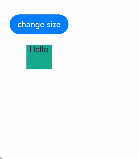

在状态管理从V1迁移至V2的过程中，[animateTo](https://developer.huawei.com/consumer/cn/doc/harmonyos-references/arkts-apis-uicontext-uicontext#animateto)执行动画前如需修改状态变量，可参考本文档的适配方案。

## 执行动画前重新定义初始态场景

**V1实现代码如下：**

```
@Entry
@Component
struct Index {
  @State w: number = 50; // 宽度
  @State h: number = 50; // 高度
  @State message: string = 'Hello';

  build() {
    Column() {
      Button('change size')
        .margin(20)
        .onClick(() => {
          // 在执行动画前，存在额外的修改
          this.w = 100;
          this.h = 100;
          this.message = 'Hello World';
          this.getUIContext().animateTo({
            duration: 1000
          }, () => {
            this.w = 200;
            this.h = 200;
            this.message = 'Hello ArkUI';
          })
        })
      Column() {
        Text(`${this.message}`)
      }
      .backgroundColor('#ff17a98d')
      .width(this.w)
      .height(this.h)
    }
  }
}
```


<div class="source-link-wrapper"><a href="https://gitcode.com/HarmonyOS_Samples/guide-snippets/blob/HarmonyOS-feature-20260402/ArkUISample/ParadigmStateManagement/entry/src/main/ets/pages/local/LocalQuestionV1animateTo.ets#L29-L63" target="_blank" rel="noopener noreferrer" class="source-link"><svg class="source-link-icon" width="14" height="14" viewBox="0 0 24 24" fill="none" stroke="currentColor" strokeWidth="2" strokeLinecap="round" strokeLinejoin="round">\<path d="M18 13v6a2 2 0 0 1-2 2H5a2 2 0 0 1-2-2V8a2 2 0 0 1 2-2h6" /\>\<polyline points="15 3 21 3 21 9" /\>\<line x1="10" y1="14" x2="21" y2="3" /\></svg> 查看源码：LocalQuestionV1animateTo.ets</a></div>


预期动画效果：绿色矩形从长宽100变为200，字符串从Hello World变为Hello ArkUI。



**V1迁移V2**

```
@Entry
@ComponentV2
struct Index {
  @Local w: number = 50; // 宽度
  @Local h: number = 50; // 高度
  @Local message: string = 'Hello';

  build() {
    Column() {
      Button('change size')
        .margin(20)
        .onClick(() => {
          // 在执行动画前，存在额外的修改
          this.w = 100;
          this.h = 100;
          this.message = 'Hello World';
          this.getUIContext().animateTo({
            duration: 1000
          }, () => {
            this.w = 200;
            this.h = 200;
            this.message = 'Hello ArkUI';
          })
        })
      Column() {
        Text(`${this.message}`)
      }
      .backgroundColor('#ff17a98d')
      .width(this.w)
      .height(this.h)
    }
  }
}
```


<div class="source-link-wrapper"><a href="https://gitcode.com/HarmonyOS_Samples/guide-snippets/blob/HarmonyOS-feature-20260402/ArkUISample/ParadigmStateManagement/entry/src/main/ets/pages/local/LocalQuestionV2animateTo.ets#L29-L63" target="_blank" rel="noopener noreferrer" class="source-link"><svg class="source-link-icon" width="14" height="14" viewBox="0 0 24 24" fill="none" stroke="currentColor" strokeWidth="2" strokeLinecap="round" strokeLinejoin="round">\<path d="M18 13v6a2 2 0 0 1-2 2H5a2 2 0 0 1-2-2V8a2 2 0 0 1 2-2h6" /\>\<polyline points="15 3 21 3 21 9" /\>\<line x1="10" y1="14" x2="21" y2="3" /\></svg> 查看源码：LocalQuestionV2animateTo.ets</a></div>


由于当前animateTo与V2的刷新机制不兼容，执行动画前的额外修改未生效，实际显示的动画效果如下图所示：绿色矩形从长宽50变为200，字符串从Hello变为Hello ArkUI。


## 迁移方案

### API version 22之前的迁移方案

从API version 22之前，可以使用一个duration为0的[animateToImmediately](https://developer.huawei.com/consumer/cn/doc/harmonyos-references/ts-explicit-animatetoimmediately#animatetoimmediately)将额外的修改先刷新，再执行原来的动画达成预期的效果。

完整代码如下：

```
@Entry
@ComponentV2
struct Index {
  @Local w: number = 50; // 宽度
  @Local h: number = 50; // 高度
  @Local message: string = 'Hello';

  build() {
    Column() {
      Button('change size')
        .margin(20)
        .onClick(() => {
          // 在执行动画前，存在额外的修改
          this.w = 100;
          this.h = 100;
          this.message = 'Hello World';
          animateToImmediately({
            duration: 0
          }, () => {
          })
          this.getUIContext().animateTo({
            duration: 1000
          }, () => {
            this.w = 200;
            this.h = 200;
            this.message = 'Hello ArkUI';
          })
        })
      Column() {
        Text(`${this.message}`)
      }
      .backgroundColor('#ff17a98d')
      .width(this.w)
      .height(this.h)
    }
  }
}
```


<div class="source-link-wrapper"><a href="https://gitcode.com/HarmonyOS_Samples/guide-snippets/blob/HarmonyOS-feature-20260402/ArkUISample/ParadigmStateManagement/entry/src/main/ets/pages/local/LocalQuestionAnimateToImmediately.ets#L29-L67" target="_blank" rel="noopener noreferrer" class="source-link"><svg class="source-link-icon" width="14" height="14" viewBox="0 0 24 24" fill="none" stroke="currentColor" strokeWidth="2" strokeLinecap="round" strokeLinejoin="round">\<path d="M18 13v6a2 2 0 0 1-2 2H5a2 2 0 0 1-2-2V8a2 2 0 0 1 2-2h6" /\>\<polyline points="15 3 21 3 21 9" /\>\<line x1="10" y1="14" x2="21" y2="3" /\></svg> 查看源码：LocalQuestionAnimateToImmediately.ets</a></div>


### API version 22及以后的迁移方案

从API version 22开始，可以使用[applySync接口](https://developer.huawei.com/consumer/cn/doc/harmonyos-guides/arkts-new-applysync-flushupdates-flushuiupdates)实现预期的显示效果。

原理为使用applySync接口同步刷新闭包函数内的状态变量变化，再执行原来的动画达成预期的效果。

```
import { UIUtils } from '@kit.ArkUI';

@Entry
@ComponentV2
struct Index {
  @Local w: number = 50; // 宽度
  @Local h: number = 50; // 高度
  @Local message: string = 'Hello';

  build() {
    Column() {
      Button('change size')
        .margin(20)
        .onClick(() => {
          // 在执行动画前，存在额外的修改
          UIUtils.applySync(() => {
            this.w = 100;
            this.h = 100;
            this.message = 'Hello World';
          })
          this.getUIContext().animateTo({
            duration: 1000
          }, () => {
            this.w = 200;
            this.h = 200;
            this.message = 'Hello ArkUI';
          })
        })
      Column() {
        Text(`${this.message}`)
      }
      .backgroundColor('#ff17a98d')
      .width(this.w)
      .height(this.h)
    }
  }
}
```


<div class="source-link-wrapper"><a href="https://gitcode.com/HarmonyOS_Samples/guide-snippets/blob/HarmonyOS-feature-20260402/ArkUISample/ParadigmStateManagement/entry/src/main/ets/pages/local/LocalQuestionExpectedEffect.ets#L15-L53" target="_blank" rel="noopener noreferrer" class="source-link"><svg class="source-link-icon" width="14" height="14" viewBox="0 0 24 24" fill="none" stroke="currentColor" strokeWidth="2" strokeLinecap="round" strokeLinejoin="round">\<path d="M18 13v6a2 2 0 0 1-2 2H5a2 2 0 0 1-2-2V8a2 2 0 0 1 2-2h6" /\>\<polyline points="15 3 21 3 21 9" /\>\<line x1="10" y1="14" x2="21" y2="3" /\></svg> 查看源码：LocalQuestionExpectedEffect.ets</a></div>
