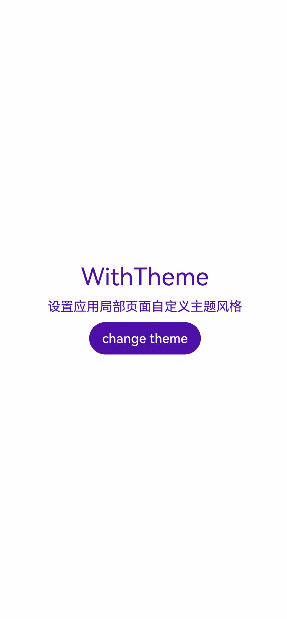
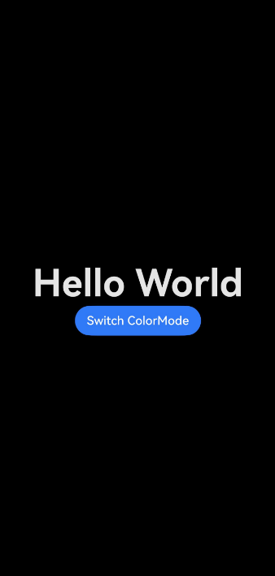

## 概述

对于采用ArkTS开发的应用，提供了应用内组件的主题换肤功能，支持局部的深浅色切换及动态换肤。目前，该功能只支持设置应用内主题换肤，暂不支持在UIAbility或窗口层面进行主题设置，同时也不支持C-API和Node-API。

## 自定义主题色

当应用需要使用换肤功能时，应自定义主题颜色。[CustomTheme](https://developer.huawei.com/consumer/cn/doc/harmonyos-references/js-apis-arkui-theme#customtheme)用于自定义主题色的内容，其属性可选，仅需对需要修改的token字段赋值，其余token将继承系统默认颜色值，可参考[系统默认的token颜色值](#系统缺省token色值)。请参照以下示例自定义主题色：

```
import { CustomColors, CustomTheme } from '@kit.ArkUI';

export class AppColors implements CustomColors {
  // 自定义主题色
  public brand: ResourceColor = '#FF75D9';
  // 使用$r，让一级警示色在深色和浅色模式下，设置为不同的颜色
  public warning: ResourceColor = $r('sys.color.ohos_id_color_warning');
}

export class AppTheme implements CustomTheme {
  public colors: AppColors = new AppColors();
}

export let gAppTheme: CustomTheme = new AppTheme();
```


<div class="source-link-wrapper"><a href="https://gitcode.com/HarmonyOS_Samples/guide-snippets/blob/HarmonyOS-feature-20260402/ArkUISample/ThemeSkinning/entry/src/main/ets/pages/Theme1/AppTheme.ets#L16-L31" target="_blank" rel="noopener noreferrer" class="source-link"><svg class="source-link-icon" width="14" height="14" viewBox="0 0 24 24" fill="none" stroke="currentColor" strokeWidth="2" strokeLinecap="round" strokeLinejoin="round">\<path d="M18 13v6a2 2 0 0 1-2 2H5a2 2 0 0 1-2-2V8a2 2 0 0 1 2-2h6" /\>\<polyline points="15 3 21 3 21 9" /\>\<line x1="10" y1="14" x2="21" y2="3" /\></svg> 查看源码：AppTheme.ets</a></div>


## 设置应用内组件自定义主题色

* 若在页面入口处设置应用内组件自定义主题色，需确保在页面build前执行[ThemeControl](https://developer.huawei.com/consumer/cn/doc/harmonyos-references/js-apis-arkui-theme#themecontrol).[setDefaultTheme](https://developer.huawei.com/consumer/cn/doc/harmonyos-references/js-apis-arkui-theme#setdefaulttheme)。

  示例代码中，[onWillApplyTheme](https://developer.huawei.com/consumer/cn/doc/harmonyos-references/ts-custom-component-lifecycle#onwillapplytheme12)回调函数用于使自定义组件获取当前生效的Theme对象。

  ```
  // Index.ets
  import { Theme, ThemeControl } from '@kit.ArkUI';
  import { gAppTheme } from './AppTheme';

  //在页面build前执行ThemeControl
  ThemeControl.setDefaultTheme(gAppTheme);

  @Entry
  @Component
  struct DisplayPage {
    @State menuItemColor: ResourceColor = $r('sys.color.background_primary');

    onWillApplyTheme(theme: Theme) {
      this.menuItemColor = theme.colors.backgroundPrimary;
    }

    build() {
      Column() {
        List({ space: 10 }) {
          ListItem() {
            Column({ space: '5vp' }) {
              Text('Color mode')
                .margin({ top: '5vp', left: '14fp' })
                .width('100%')
              Row() {
                Column() {
                  Text('Light')
                    .fontSize('16fp')
                    .textAlign(TextAlign.Start)
                    .alignSelf(ItemAlign.Center)
                  Radio({ group: 'light or dark', value: 'light' })
                    .checked(true)
                }
                .width('50%')

                Column() {
                  Text('Dark')
                    .fontSize('16fp')
                    .textAlign(TextAlign.Start)
                    .alignSelf(ItemAlign.Center)
                  Radio({ group: 'light or dark', value: 'dark' })
                }
                .width('50%')
              }
            }
            .width('100%')
            .height('90vp')
            .borderRadius('10vp')
            .backgroundColor(this.menuItemColor)
          }

          ListItem() {
            Column() {
              Text('Brightness')
                .width('100%')
                .margin({ top: '5vp', left: '14fp' })
              Slider({ value: 40, max: 100 })
            }
            .width('100%')
            .height('70vp')
            .borderRadius('10vp')
            .backgroundColor(this.menuItemColor)
          }

          ListItem() {
            Column() {
              Row() {
                Column({ space: '5vp' }) {
                  Text('Touch sensitivity')
                    .fontSize('16fp')
                    .textAlign(TextAlign.Start)
                    .width('100%')
                  Text('Increase the touch sensitivity of your screen' +
                    ' for use with screen protectors')
                    .fontSize('12fp')
                    .fontColor(Color.Blue)
                    .textAlign(TextAlign.Start)
                    .width('100%')
                }
                .alignSelf(ItemAlign.Center)
                .margin({ left: '14fp' })
                .width('75%')

                Toggle({ type: ToggleType.Switch, isOn: true })
                  .margin({ right: '14fp' })
                  .alignSelf(ItemAlign.Center)
              }
              .width('100%')
              .height('80vp')
            }
            .width('100%')
            .borderRadius('10vp')
            .backgroundColor(this.menuItemColor)
          }
          ListItem() {
            Column() {
              Text('Warning')
                .width('100%')
                .margin({ top: '5vp', left: '14fp' })
              Button('Text')
                .type(ButtonType.Capsule)
                .role(ButtonRole.ERROR)
                .width('40%')
            }
            .width('100%')
            .height('70vp')
            .borderRadius('10vp')
            .backgroundColor(this.menuItemColor)
          }
        }
      }
      .padding('10vp')
      .backgroundColor('#dcdcdc')
      .width('100%')
      .height('100%')
    }
  }
  ```

  

<div class="source-link-wrapper"><a href="https://gitcode.com/HarmonyOS_Samples/guide-snippets/blob/HarmonyOS-feature-20260402/ArkUISample/ThemeSkinning/entry/src/main/ets/pages/Theme1/Theme1.ets#L16-L134" target="_blank" rel="noopener noreferrer" class="source-link"><svg class="source-link-icon" width="14" height="14" viewBox="0 0 24 24" fill="none" stroke="currentColor" strokeWidth="2" strokeLinecap="round" strokeLinejoin="round">\<path d="M18 13v6a2 2 0 0 1-2 2H5a2 2 0 0 1-2-2V8a2 2 0 0 1 2-2h6" /\>\<polyline points="15 3 21 3 21 9" /\>\<line x1="10" y1="14" x2="21" y2="3" /\></svg> 查看源码：Theme1.ets</a></div>

* 若在UIAbility中设置应用内组件自定义主题色，需在onWindowStageCreate()方法的windowStage.[loadContent](https://developer.huawei.com/consumer/cn/doc/harmonyos-references/arkts-apis-window-window#loadcontent9)的完成时回调中调用[ThemeControl](https://developer.huawei.com/consumer/cn/doc/harmonyos-references/js-apis-arkui-theme#themecontrol).[setDefaultTheme](https://developer.huawei.com/consumer/cn/doc/harmonyos-references/js-apis-arkui-theme#setdefaulttheme)，设置应用内组件的自定义主题色。

  ```
  // EntryAbility.ets
  import {AbilityConstant, UIAbility, Want } from '@kit.AbilityKit';
  import { hilog } from '@kit.PerformanceAnalysisKit';
  import { window, CustomColors, ThemeControl } from '@kit.ArkUI';

  class AppColors implements CustomColors {
    fontPrimary = 0xFFD53032;
    iconOnPrimary = 0xFFD53032;
    iconFourth = 0xFFD53032;
  }

  const abilityThemeColors = new AppColors();

  export default class EntryAbility extends UIAbility {
    onCreate(want: Want, launchParam: AbilityConstant.LaunchParam) {
      hilog.info(0x0000, 'testTag', '%{public}s', 'Ability onCreate');
    }

    onDestroy() {
      hilog.info(0x0000, 'testTag', '%{public}s', 'Ability onDestroy');
    }

    onWindowStageCreate(windowStage: window.WindowStage) {
      // Main window is created, set main page for this ability
      hilog.info(0x0000, 'testTag', '%{public}s', 'Ability onWindowStageCreate');

      windowStage.loadContent('pages/Index', (err, data) => {
        if (err.code) {
          hilog.error(0x0000, 'testTag', 'Failed to load the content. Cause: %{public}s', JSON.stringify(err) ?? '');
          return;
        }
        hilog.info(0x0000, 'testTag', 'Succeeded in loading the content. Data: %{public}s', JSON.stringify(data) ?? '');
        // 在onWindowStageCreate()方法中setDefaultTheme
        ThemeControl.setDefaultTheme({ colors: abilityThemeColors });
        hilog.info(0x0000, 'testTag', '%{public}s', 'ThemeControl.setDefaultTheme done');
      });
    }
  }
  ```

  

<div class="source-link-wrapper"><a href="https://gitcode.com/HarmonyOS_Samples/guide-snippets/blob/HarmonyOS-feature-20260402/ArkUISample/ThemeSkinning/entry/src/main/ets/entryability/EntryAbility.ets#L16-L55" target="_blank" rel="noopener noreferrer" class="source-link"><svg class="source-link-icon" width="14" height="14" viewBox="0 0 24 24" fill="none" stroke="currentColor" strokeWidth="2" strokeLinecap="round" strokeLinejoin="round">\<path d="M18 13v6a2 2 0 0 1-2 2H5a2 2 0 0 1-2-2V8a2 2 0 0 1 2-2h6" /\>\<polyline points="15 3 21 3 21 9" /\>\<line x1="10" y1="14" x2="21" y2="3" /\></svg> 查看源码：EntryAbility.ets</a></div>


  

  

  + 当setDefaultTheme的参数为undefined时，会清除先前设置的自定义主题，默认token值对应的色值参考[系统缺省token色值](#系统缺省token色值)。
  + setDefaultTheme需要在ArkUI初始化后即windowStage.loadContent的完成时回调中使用。

## 设置应用局部页面自定义主题风格

通过设置[WithTheme](https://developer.huawei.com/consumer/cn/doc/harmonyos-references/ts-container-with-theme)，将自定义主题Theme的配色应用于内部组件的默认样式。在WithTheme的作用范围内，组件的配色会根据Theme的配色进行调整。


在自定义节点[BuilderNode](https://developer.huawei.com/consumer/cn/doc/harmonyos-references/js-apis-arkui-buildernode)中使用[WithTheme](https://developer.huawei.com/consumer/cn/doc/harmonyos-references/ts-container-with-theme)，为了确保显示效果正确，需手动传递系统环境变化事件，触发节点的全量更新，详细请参考[BuilderNode系统环境变化更新](https://developer.huawei.com/consumer/cn/doc/harmonyos-references/js-apis-arkui-buildernode#updateconfiguration12)。

如示例所示，使用WithTheme(\{ theme: this.CustomTheme \})可将作用域内组件的配色设置为自定义主题风格。后续可以通过更新this.CustomTheme来更换主题风格。[onWillApplyTheme](https://developer.huawei.com/consumer/cn/doc/harmonyos-references/ts-custom-component-lifecycle#onwillapplytheme12)回调函数用于使自定义组件能够获取当前生效的Theme对象。

```
import { CustomColors, CustomTheme, Theme } from '@kit.ArkUI';
import { common } from '@kit.AbilityKit';
//请将$r('app.color.xxx')替换为实际资源文件
class AppColors implements CustomColors {
  public fontPrimary: ResourceColor = $r('app.color.brand_purple');
  public backgroundEmphasize: ResourceColor = $r('app.color.brand_purple');
}

class AppColorsSec implements CustomColors {
  public fontPrimary: ResourceColor = $r('app.color.brand');
  public backgroundEmphasize: ResourceColor = $r('app.color.brand');
}

class AppTheme implements CustomTheme {
  public colors: AppColors = new AppColors();
}

class AppThemeSec implements CustomTheme {
  public colors: AppColors = new AppColorsSec();
}

@Entry
@Component
struct DisplayPage1 {
  @State customTheme: CustomTheme = new AppTheme();
  // 请将$r('app.string.SetCustomThemeStyle')替换为实际资源文件，在本示例中该资源文件的value值为"设置应用局部页面自定义主题风格"
  @State message: ResourceStr = $r('app.string.SetCustomThemeStyle');
  count = 0;

  build() {
    WithTheme({ theme: this.customTheme }) {
      Row(){
        Column() {
          Text('WithTheme')
            .fontSize(30)
            .margin({bottom: 10})
          Text(this.message)
            .margin({bottom: 10})
          Button('change theme').onClick(() => {
            this.count++;
            if (this.count > 1) {
              this.count = 0;
            }
            switch (this.count) {
              case 0:
                this.customTheme = new AppTheme();
                break;
              case 1:
                this.customTheme = new AppThemeSec();
                break;
              default:
                break;
            }
          })
        }
        .width('100%')
      }
      .height('100%')
      .width('100%')
    }
  }
}
```


<div class="source-link-wrapper"><a href="https://gitcode.com/HarmonyOS_Samples/guide-snippets/blob/HarmonyOS-feature-20260402/ArkUISample/ThemeSkinning/entry/src/main/ets/pages/Theme2/Theme2.ets#L16-L79" target="_blank" rel="noopener noreferrer" class="source-link"><svg class="source-link-icon" width="14" height="14" viewBox="0 0 24 24" fill="none" stroke="currentColor" strokeWidth="2" strokeLinecap="round" strokeLinejoin="round">\<path d="M18 13v6a2 2 0 0 1-2 2H5a2 2 0 0 1-2-2V8a2 2 0 0 1 2-2h6" /\>\<polyline points="15 3 21 3 21 9" /\>\<line x1="10" y1="14" x2="21" y2="3" /\></svg> 查看源码：Theme2.ets</a></div>




## 设置应用页面局部深浅色

通过[WithTheme](https://developer.huawei.com/consumer/cn/doc/harmonyos-references/ts-container-with-theme)可以设置三种颜色模式，跟随系统模式，浅色模式和深色模式。

在WithTheme的作用范围内，组件的样式资源值会根据指定的模式，读取对应的深浅色模式系统和应用资源值。这意味着，在WithTheme作用范围内，组件的配色会根据所指定的深浅模式进行调整。

如下面的示例所示，通过WithTheme(\{ colorMode: ThemeColorMode.DARK \})，可以将作用范围内的组件设置为深色模式。

设置局部深浅色时，需要添加dark.json资源文件，深浅色模式才会生效。


dark.json数据示例：

```
  {
    "color": [
      {
        "name": "start_window_background",
        "value": "#000000"
      }
    ]
  }
```

```
import { ThemeControl } from '@kit.ArkUI';

ThemeControl.setDefaultTheme(undefined);

@Entry
@Component
struct DisplayPage3 {
  @State message: string = 'Hello World';
  @State colorMode: ThemeColorMode = ThemeColorMode.DARK;

  build() {
    WithTheme({ colorMode: this.colorMode }) {
      Row() {
        Column() {
          Text(this.message)
            .fontSize(50)
            .fontWeight(FontWeight.Bold)
          Button('Switch ColorMode').onClick(() => {
            if (this.colorMode === ThemeColorMode.LIGHT) {
              this.colorMode = ThemeColorMode.DARK;
            } else if (this.colorMode === ThemeColorMode.DARK) {
              this.colorMode = ThemeColorMode.LIGHT;
            }
          })
        }
        .width('100%')
      }
      .backgroundColor($r('sys.color.background_primary'))
      .height('100%')
      // 扩展安全区，实现沉浸式深浅色变更效果
      .expandSafeArea(
        [SafeAreaType.SYSTEM], [SafeAreaEdge.TOP, SafeAreaEdge.END, SafeAreaEdge.BOTTOM, SafeAreaEdge.START])
    }
  }
}
```


<div class="source-link-wrapper"><a href="https://gitcode.com/HarmonyOS_Samples/guide-snippets/blob/HarmonyOS-feature-20260402/ArkUISample/ThemeSkinning/entry/src/main/ets/pages/Theme3/Theme3.ets#L16-L50" target="_blank" rel="noopener noreferrer" class="source-link"><svg class="source-link-icon" width="14" height="14" viewBox="0 0 24 24" fill="none" stroke="currentColor" strokeWidth="2" strokeLinecap="round" strokeLinejoin="round">\<path d="M18 13v6a2 2 0 0 1-2 2H5a2 2 0 0 1-2-2V8a2 2 0 0 1 2-2h6" /\>\<polyline points="15 3 21 3 21 9" /\>\<line x1="10" y1="14" x2="21" y2="3" /\></svg> 查看源码：Theme3.ets</a></div>




## 系统缺省token色值

| Token | 场景类别 | Light | 说明 | Dark | 说明 |
| --- | --- | --- | --- | --- | --- |
| theme.colors.brand | 品牌色 | #ff0a59f7 |  | #ff317af7 |  |
| theme.colors.warning | 一级警示色 | #ffe84026 |  | #ffd94838 |  |
| theme.colors.alert | 二级警示色 | #ffed6f21 |  | #ffdb6b42 |  |
| theme.colors.confirm | 确认色 | #ff64bb5c |  | #ff5be854 |  |
| theme.colors.fontPrimary | 一级文本 | #e5000000 |  | #e5ffffff |  |
| theme.colors.fontSecondary | 二级文本 | #99000000 |  | #99ffffff |  |
| theme.colors.fontTertiary | 三级文本 | #66000000 |  | #66ffffff |  |
| theme.colors.fontFourth | 四级文本 | #33000000 |  | #33ffffff |  |
| theme.colors.fontEmphasize | 高亮文本 | #ff0a59f7 |  | #ff317af7 |  |
| theme.colors.fontOnPrimary | 一级文本反色 | #ffffffff |  | #ff000000 |  |
| theme.colors.fontOnSecondary | 二级文本反色 | #99ffffff |  | #99000000 |  |
| theme.colors.fontOnTertiary | 三级文本反色 | #66ffffff |  | #66000000 |  |
| theme.colors.fontOnFourth | 四级文本反色 | #33ffffff |  | #33000000 |  |
| theme.colors.iconPrimary | 一级图标 | #e5000000 |  | #e5ffffff |  |
| theme.colors.iconSecondary | 二级图标 | #99000000 |  | #99ffffff |  |
| theme.colors.iconTertiary | 三级图标 | #66000000 |  | #66ffffff |  |
| theme.colors.iconFourth | 四级图标 | #33000000 |  | #33ffffff |  |
| theme.colors.iconEmphasize | 高亮图标 | #ff0a59f7 |  | #ff317af7 |  |
| theme.colors.iconSubEmphasize | 高亮辅助图标 | #660a59f7 |  | #66317af7 |  |
| theme.colors.iconOnPrimary | 一级图标反色 | #ffffffff |  | #ff000000 |  |
| theme.colors.iconOnSecondary | 二级图标反色 | #99ffffff |  | #99000000 |  |
| theme.colors.iconOnTertiary | 三级图标反色 | #66ffffff |  | #66000000 |  |
| theme.colors.iconOnFourth | 四级图标反色 | #33ffffff |  | #33000000 |  |
| theme.colors.backgroundPrimary | 一级背景（实色/不透明色） | #ffffffff |  | #ffe5e5e5 |  |
| theme.colors.backgroundSecondary | 二级背景（实色/不透明色） | #fff1f3f5 |  | #ff191a1c |  |
| theme.colors.backgroundTertiary | 三级背景（实色/不透明色） | #ffe5e5ea |  | #ff202224 |  |
| theme.colors.backgroundFourth | 四级背景（实色/不透明色） | #ffd1d1d6 |  | #ff2e3033 |  |
| theme.colors.backgroundEmphasize | 高亮背景（实色/不透明色） | #ff0a59f7 |  | #ff317af7 |  |
| theme.colors.compForegroundPrimary | 前背景 | #ff000000 |  | #ffe5e5e5 |  |
| theme.colors.compBackgroundPrimary | 白色背景 | #ffffffff |  | #ffffffff |  |
| theme.colors.compBackgroundPrimaryTran | 白色透明背景 | #ffffffff |  | #33ffffff |  |
| theme.colors.compBackgroundPrimaryContrary | 常亮背景 | #ffffffff |  | #ffe5e5e5 |  |
| theme.colors.compBackgroundGray | 灰色背景 | #fff1f3f5 |  | #ffe5e5ea |  |
| theme.colors.compBackgroundSecondary | 二级背景 | #19000000 |  | #19ffffff |  |
| theme.colors.compBackgroundTertiary | 三级背景 | #0c000000 |  | #0cffffff |  |
| theme.colors.compBackgroundEmphasize | 高亮背景 | #ff0a59f7 |  | #ff317af7 |  |
| theme.colors.compBackgroundNeutral | 黑色中性高亮背景 | #ff000000 |  | #ffffffff |  |
| theme.colors.compEmphasizeSecondary | 20%高亮背景 | #330a59f7 |  | #33317af7 |  |
| theme.colors.compEmphasizeTertiary | 10%高亮背景 | #190a59f7 |  | #19317af7 |  |
| theme.colors.compDivider | 分割线颜色 | #33000000 |  | #33ffffff |  |
| theme.colors.compCommonContrary | 通用反色 | #ffffffff |  | #ff000000 |  |
| theme.colors.compBackgroundFocus | 获焦态背景色 | #fff1f3f5 |  | #ff000000 |  |
| theme.colors.compFocusedPrimary | 获焦态一级反色 | #e5000000 |  | #e5ffffff |  |
| theme.colors.compFocusedSecondary | 获焦态二级反色 | #99000000 |  | #99ffffff |  |
| theme.colors.compFocusedTertiary | 获焦态三级反色 | #66000000 |  | #66ffffff |  |
| theme.colors.interactiveHover | 通用悬停交互式颜色 | #0c000000 |  | #0cffffff |  |
| theme.colors.interactivePressed | 通用按压交互式颜色 | #19000000 |  | #19ffffff |  |
| theme.colors.interactiveFocus | 通用获焦交互式颜色 | #ff0a59f7 |  | #ff317af7 |  |
| theme.colors.interactiveActive | 通用激活交互式颜色 | #ff0a59f7 |  | #ff317af7 |  |
| theme.colors.interactiveSelect | 通用选择交互式颜色 | #33000000 |  | #33ffffff |  |
| theme.colors.interactiveClick | 通用点击交互式颜色 | #19000000 |  | #19ffffff |  |

各个token色值可影响的组件可参考[Colors](https://developer.huawei.com/consumer/cn/doc/harmonyos-references/js-apis-arkui-theme#colors)接口说明。
