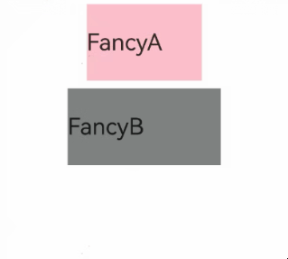

如果每个组件的样式都需要单独设置，在开发过程中会出现大量代码在进行重复样式设置，虽然可以复制粘贴，但为了代码简洁性和后续方便维护，我们推出了可以提炼公共样式进行复用的装饰器@Styles。

@Styles装饰器可以将多条样式设置提炼成一个方法，直接在组件声明的位置调用。通过@Styles装饰器可以快速定义并复用自定义样式。


从API version 9开始支持。

从API version 9开始，该装饰器支持在ArkTS卡片中使用。

从API version 11开始，该装饰器支持在元服务中使用。

## 装饰器使用说明

* 当前@Styles仅支持[通用属性](https://developer.huawei.com/consumer/cn/doc/harmonyos-references/ts-component-general-attributes)和[通用事件](https://developer.huawei.com/consumer/cn/doc/harmonyos-references/ts-component-general-events)。
* @Styles可以定义在组件内或全局，在全局定义时需在方法名前面添加function关键字，组件内定义时则不需要添加function关键字。请参考用例[组件内styles和全局styles的用法](#组件内styles和全局styles的用法)。
* 组件内@Styles的优先级高于全局@Styles。框架优先找当前组件内的@Styles，如果找不到，则会全局查找。


只能在当前文件内使用@Styles，不支持export。

若需要实现样式导出，推荐使用[AttributeModifier](/docs/dev/app-dev/application-framework/arkui/arkts-ui-development/arkts-user-defined-capabilities/arkts-modifier/arkts-user-defined-extension-attributemodifier)。

定义在组件内的@Styles可以通过this访问组件的常量和状态变量，并可以在@Styles里通过事件来改变状态变量的值，示例如下：

```
@Entry
@Component
struct FancyUse {
  @State heightValue: number = 50;

  @Styles
  fancy() {
    .height(this.heightValue)
    .backgroundColor(Color.Blue)
    .onClick(() => {
      this.heightValue = 100;
    })
  }

  build() {
    Column() {
      Button('change height')
        .fancy()
    }
    .height('100%')
    .width('100%')
  }
}
```


<div class="source-link-wrapper"><a href="https://gitcode.com/HarmonyOS_Samples/guide-snippets/blob/HarmonyOS-feature-20260402/ArkUISample/ComponentExtension/entry/src/main/ets/pages/StylesDecorator/StylesDecorator2.ets#L30-L54" target="_blank" rel="noopener noreferrer" class="source-link"><svg class="source-link-icon" width="14" height="14" viewBox="0 0 24 24" fill="none" stroke="currentColor" strokeWidth="2" strokeLinecap="round" strokeLinejoin="round">\<path d="M18 13v6a2 2 0 0 1-2 2H5a2 2 0 0 1-2-2V8a2 2 0 0 1 2-2h6" /\>\<polyline points="15 3 21 3 21 9" /\>\<line x1="10" y1="14" x2="21" y2="3" /\></svg> 查看源码：StylesDecorator2.ets</a></div>


## 限制条件

* @Styles方法不支持传入参数，编译期会报错。

```
  // 错误写法： @Styles不支持参数，编译期报错
  @Styles
  function globalFancy (value: number) {
    .width(value)
  }
```

```
// 正确写法
  @Styles
  function globalFancy () {
    .width(100)
  }
```


<div class="source-link-wrapper"><a href="https://gitcode.com/HarmonyOS_Samples/guide-snippets/blob/HarmonyOS-feature-20260402/ArkUISample/ComponentExtension/entry/src/main/ets/pages/StylesDecorator/StylesDecorator2.ets#L16-L22" target="_blank" rel="noopener noreferrer" class="source-link"><svg class="source-link-icon" width="14" height="14" viewBox="0 0 24 24" fill="none" stroke="currentColor" strokeWidth="2" strokeLinecap="round" strokeLinejoin="round">\<path d="M18 13v6a2 2 0 0 1-2 2H5a2 2 0 0 1-2-2V8a2 2 0 0 1 2-2h6" /\>\<polyline points="15 3 21 3 21 9" /\>\<line x1="10" y1="14" x2="21" y2="3" /\></svg> 查看源码：StylesDecorator2.ets</a></div>


* 不支持在@Styles方法内使用逻辑组件，逻辑组件内的属性不生效。

```
  // 错误写法
  @Styles
  function backgroundColorStyle() {
    if (true) {
      .backgroundColor(Color.Red)
    }
  }
```

```
// 正确写法
  @Styles
  function backgroundColorStyle() {
    .backgroundColor(Color.Red)
  }
```


<div class="source-link-wrapper"><a href="https://gitcode.com/HarmonyOS_Samples/guide-snippets/blob/HarmonyOS-feature-20260402/ArkUISample/ComponentExtension/entry/src/main/ets/pages/StylesDecorator/StylesDecorator2.ets#L23-L29" target="_blank" rel="noopener noreferrer" class="source-link"><svg class="source-link-icon" width="14" height="14" viewBox="0 0 24 24" fill="none" stroke="currentColor" strokeWidth="2" strokeLinecap="round" strokeLinejoin="round">\<path d="M18 13v6a2 2 0 0 1-2 2H5a2 2 0 0 1-2-2V8a2 2 0 0 1 2-2h6" /\>\<polyline points="15 3 21 3 21 9" /\>\<line x1="10" y1="14" x2="21" y2="3" /\></svg> 查看源码：StylesDecorator2.ets</a></div>


## 使用场景

### 组件内@Styles和全局@Styles的用法

```
// 定义在全局的@Styles封装的样式
@Styles
function globalFancy1() {
  .width(150)
  .height(100)
  .backgroundColor(Color.Pink)
}

@Entry
@Component
struct GlobalFancy {
  @State heightValue: number = 100;

  // 定义在组件内的@Styles封装的样式
  @Styles
  fancy() {
    .width(200)
    .height(this.heightValue)
    .backgroundColor(Color.Gray)
    .onClick(() => {
      this.heightValue = 200;
    })
  }

  build() {
    Column({ space: 10 }) {
      // 使用全局的@Styles封装的样式
      Text('FancyA')
        .globalFancy1()
        .fontSize(30)
      // 使用组件内的@Styles封装的样式
      Text('FancyB')
        .fancy()
        .fontSize(30)
    }
    .width('100%')
  }
}
```


<div class="source-link-wrapper"><a href="https://gitcode.com/HarmonyOS_Samples/guide-snippets/blob/HarmonyOS-feature-20260402/ArkUISample/ComponentExtension/entry/src/main/ets/pages/StylesDecorator/StylesDecorator1.ets#L16-L52" target="_blank" rel="noopener noreferrer" class="source-link"><svg class="source-link-icon" width="14" height="14" viewBox="0 0 24 24" fill="none" stroke="currentColor" strokeWidth="2" strokeLinecap="round" strokeLinejoin="round">\<path d="M18 13v6a2 2 0 0 1-2 2H5a2 2 0 0 1-2-2V8a2 2 0 0 1 2-2h6" /\>\<polyline points="15 3 21 3 21 9" /\>\<line x1="10" y1="14" x2="21" y2="3" /\></svg> 查看源码：StylesDecorator1.ets</a></div>



