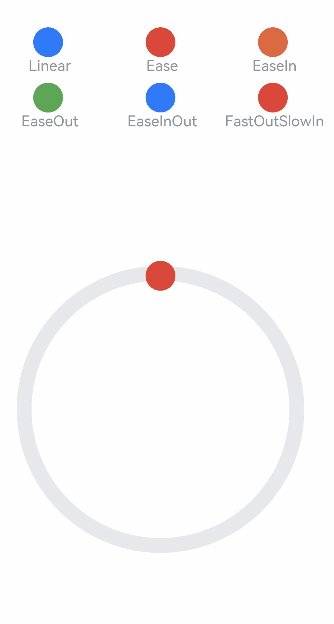

传统曲线基于数学公式，创造形状符合开发者预期的动画曲线。以三阶贝塞尔曲线为代表，通过调整曲线控制点，可以改变曲线形状，从而带来缓入、缓出等动画效果。对于同一条传统曲线，由于不具备物理含义，其形状不会因为用户行为发生任何改变，缺少物理动画的自然感和生动感。建议优先采用物理曲线创建动画，将传统曲线作为辅助用于极少数必要场景中。

ArkUI提供了贝塞尔曲线、阶梯曲线等传统曲线接口，开发者可参照[插值计算](https://developer.huawei.com/consumer/cn/doc/harmonyos-references/js-apis-curve)进行查阅。

传统曲线的示例和效果如下：

```
class TraditionalCurve {
  public title: string;
  public curve: Curve;
  public color: Color | string;

  constructor(title: string, curve: Curve, color: Color | string = '') {
    this.title = title;
    this.curve = curve;
    this.color = color;
  }
}

const traditionalCurves: TraditionalCurve[] = [
  new TraditionalCurve(' Linear', Curve.Linear, '#317AF7'),
  new TraditionalCurve(' Ease', Curve.Ease, '#D94838'),
  new TraditionalCurve(' EaseIn', Curve.EaseIn, '#DB6B42'),
  new TraditionalCurve(' EaseOut', Curve.EaseOut, '#5BA854'),
  new TraditionalCurve(' EaseInOut', Curve.EaseInOut, '#317AF7'),
  new TraditionalCurve(' FastOutSlowIn', Curve.FastOutSlowIn, '#D94838')
]

@Entry
@Component
struct CurveDemo {
  @State dRotate: number = 0; // 旋转角度

  build() {
    Column() {
      // 曲线图例
      Grid() {
        ForEach(traditionalCurves, (item: TraditionalCurve) => {
          GridItem() {
            Column() {
              Row()
                .width(30)
                .height(30)
                .borderRadius(15)
                .backgroundColor(item.color)
              Text(item.title)
                .fontSize(15)
                .fontColor(0x909399)
            }
            .width('100%')
          }
        })
      }
      .columnsTemplate('1fr 1fr 1fr')
      .rowsTemplate('1fr 1fr 1fr 1fr 1fr')
      .padding(10)
      .width('100%')
      .height(300)
      .margin({ top: 50 })

      Stack() {
        // 摆动管道
        Row()
          .width(290)
          .height(290)
          .border({
            width: 15,
            color: 0xE6E8EB,
            radius: 145
          })

        ForEach(traditionalCurves, (item: TraditionalCurve) => {
          // 小球
          Column() {
            Row()
              .width(30)
              .height(30)
              .borderRadius(15)
              .backgroundColor(item.color)
          }
          .width(20)
          .height(300)
          .rotate({ angle: this.dRotate })
          .animation({
            duration: 2000,
            iterations: -1,
            curve: item.curve,
            delay: 100
          })
        })
      }
      .width('100%')
      .height(200)
      .onClick(() => {
        this.dRotate ? null : this.dRotate = 360;
      })
    }
    .width('100%')
  }
}
```


<div class="source-link-wrapper"><a href="https://gitcode.com/HarmonyOS_Samples/guide-snippets/blob/HarmonyOS-feature-20260402/ArkUISample/Animation/entry/src/main/ets/pages/traditionalCurve/template1/CurveDemo.ets#L16-L111" target="_blank" rel="noopener noreferrer" class="source-link"><svg class="source-link-icon" width="14" height="14" viewBox="0 0 24 24" fill="none" stroke="currentColor" strokeWidth="2" strokeLinecap="round" strokeLinejoin="round">\<path d="M18 13v6a2 2 0 0 1-2 2H5a2 2 0 0 1-2-2V8a2 2 0 0 1 2-2h6" /\>\<polyline points="15 3 21 3 21 9" /\>\<line x1="10" y1="14" x2="21" y2="3" /\></svg> 查看源码：CurveDemo.ets</a></div>



