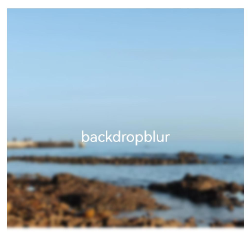
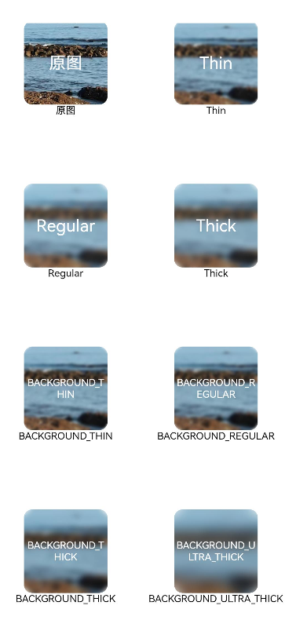
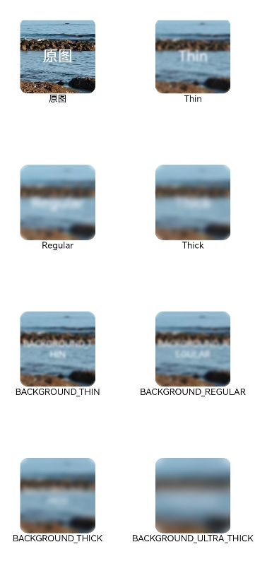
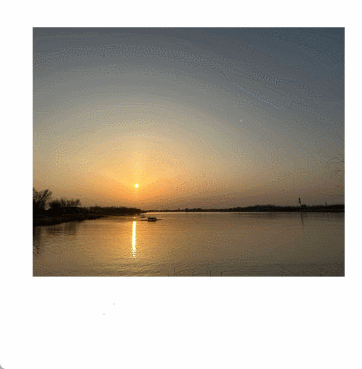

动画效果可以丰富界面的细节，提升UI界面的真实感和品质感。例如，模糊和阴影效果可以让物体看起来更加立体，使得动画更加生动。ArkUI提供了丰富的效果接口，开发者可快速打造出精致、个性化的效果。本章主要介绍常用的模糊、阴影和色彩效果等接口。

模糊效果可以体现界面空间的纵深感，区分前后元素的层级关系。

| 接口 | 说明 |
| --- | --- |
| [backdropBlur](https://developer.huawei.com/consumer/cn/doc/harmonyos-references/ts-universal-attributes-background#backdropblur) | 为当前组件添加背景模糊效果，入参为模糊半径。 |
| [blur](https://developer.huawei.com/consumer/cn/doc/harmonyos-references/ts-universal-attributes-image-effect#blur) | 为当前组件添加内容模糊效果，入参为模糊半径。 |
| [backgroundBlurStyle](https://developer.huawei.com/consumer/cn/doc/harmonyos-references/ts-universal-attributes-background#backgroundblurstyle9) | 为当前组件添加背景模糊效果，入参为模糊样式。 |
| [foregroundBlurStyle](https://developer.huawei.com/consumer/cn/doc/harmonyos-references/ts-universal-attributes-foreground-blur-style#foregroundblurstyle) | 为当前组件添加内容模糊效果，入参为模糊样式。 |
| [motionBlur](https://developer.huawei.com/consumer/cn/doc/harmonyos-references/ts-universal-attributes-motionblur#motionblur) | 为当前组件添加由缩放大小或位移变化引起的运动过程中的动态模糊效果，入参为模糊半径和锚点坐标。 |


以上接口均为实时模糊接口，每帧执行实时渲染，性能负载较大。当模糊内容与模糊半径均无需变动时，推荐采用静态模糊接口[blur](https://developer.huawei.com/consumer/cn/doc/harmonyos-references/js-apis-effectkit#blur)。最佳实践请参考：[图像模糊动效优化-使用场景](https://developer.huawei.com/consumer/cn/doc/best-practices/bpta-fuzzy-scene-performance-optimization#section4945532519)。

## 使用backdropBlur为组件添加背景模糊

```
@Entry
@Component
struct BlurEffectsExample {
  build() {
    Column({ space: 10 }) {
      Text('backdropBlur')
        .width('90%')
        .height('90%')
        .fontSize(20)
        .fontColor(Color.White)
        .textAlign(TextAlign.Center)
        .backdropBlur(10)// 对背景进行模糊
        // 请将$r('app.media.bg')替换为实际资源文件
        .backgroundImage($r('app.media.bg'))
        .backgroundImageSize({ width: 400, height: 300 })
    }
    .width('100%')
    .height('50%')
    .margin({ top: 20 })
  }
}
```


<div class="source-link-wrapper"><a href="https://gitcode.com/HarmonyOS_Samples/guide-snippets/blob/HarmonyOS-feature-20260402/ArkUISample/Animation/entry/src/main/ets/pages/animationBlur/template1/BlurEffectsExample.ets#L15-L37" target="_blank" rel="noopener noreferrer" class="source-link"><svg class="source-link-icon" width="14" height="14" viewBox="0 0 24 24" fill="none" stroke="currentColor" strokeWidth="2" strokeLinecap="round" strokeLinejoin="round">\<path d="M18 13v6a2 2 0 0 1-2 2H5a2 2 0 0 1-2-2V8a2 2 0 0 1 2-2h6" /\>\<polyline points="15 3 21 3 21 9" /\>\<line x1="10" y1="14" x2="21" y2="3" /\></svg> 查看源码：BlurEffectsExample.ets</a></div>




## 使用blur为组件添加内容模糊

```
import { common } from '@kit.AbilityKit';

@Entry
@Component
struct Index {
  private context = this.getUIContext().getHostContext() as common.UIAbilityContext;
  @State radius: number = 0;
  @State text: string = '';
  @State y: Resource | string = this.context.resourceManager.getStringSync($r('app.string.animation_blur_text1').id);// 请在resources\base\element\string.json文件中配置name为'animation_blur_text1'，value为非空字符串的资源

  aboutToAppear() {
    // 请在resources\base\element\string.json文件中配置name为'animation_blur_text2'，value为非空字符串的资源
    // 请在resources\base\element\string.json文件中配置name为'animation_blur_text3'，value为非空字符串的资源
    // 请在resources\base\element\string.json文件中配置name为'animation_blur_text4'，value为非空字符串的资源
    this.text = this.context.resourceManager.getStringSync($r('app.string.animation_blur_text2').id) +
    "\n" + this.context.resourceManager.getStringSync($r('app.string.animation_blur_text3').id) + this.y +
      "\n" + this.context.resourceManager.getStringSync($r('app.string.animation_blur_text4').id) + this.radius;
  }

  build() {
    Flex({ direction: FlexDirection.Column, alignItems: ItemAlign.Center, justifyContent: FlexAlign.SpaceBetween }) {
      Text(this.text)
        .height(200)
        .fontSize(20)
        .fontWeight(FontWeight.Bold)
        .fontFamily("cursive")
        .fontStyle(FontStyle.Italic)
      // 请将$r('app.media.bg')替换为实际资源文件
      Image($r("app.media.bg"))
        .blur(this.radius)// 使用blur接口为照片组件添加内容模糊效果
        .height('100%')
        .width("100%")
        .objectFit(ImageFit.Cover)
    }.height('100%')
    .width("100%")
    .onTouch((event?: TouchEvent) => {
      if (event) {
        if (event.type === TouchType.Move) {
          this.y = Number(event.touches[0].y.toString()).toString();
          this.radius = Number(this.y) / 10; // 根据跟手过程中的滑动距离修改模糊半径，配合模糊接口，形成跟手模糊效果
        }
        if (event.type === TouchType.Up) {
          this.radius = 0;
          // 请在resources\base\element\string.json文件中配置name为'animation_blur_text1'，value为非空字符串的资源
          this.y = this.context.resourceManager.getStringSync($r('app.string.animation_blur_text1').id);
        }
      }
      // 请在resources\base\element\string.json文件中配置name为'animation_blur_text2'，value为非空字符串的资源
      // 请在resources\base\element\string.json文件中配置name为'animation_blur_text3'，value为非空字符串的资源
      // 请在resources\base\element\string.json文件中配置name为'animation_blur_text4'，value为非空字符串的资源
      this.text = this.context.resourceManager.getStringSync($r('app.string.animation_blur_text2').id) + "\n" + this.context.resourceManager.getStringSync($r('app.string.animation_blur_text3').id) + this.y +
        "\n" + this.context.resourceManager.getStringSync($r('app.string.animation_blur_text4').id) + this.radius;
    })
  }
}
```


<div class="source-link-wrapper"><a href="https://gitcode.com/HarmonyOS_Samples/guide-snippets/blob/HarmonyOS-feature-20260402/ArkUISample/Animation/entry/src/main/ets/pages/animationBlur/template2/Index.ets#L15-L71" target="_blank" rel="noopener noreferrer" class="source-link"><svg class="source-link-icon" width="14" height="14" viewBox="0 0 24 24" fill="none" stroke="currentColor" strokeWidth="2" strokeLinecap="round" strokeLinejoin="round">\<path d="M18 13v6a2 2 0 0 1-2 2H5a2 2 0 0 1-2-2V8a2 2 0 0 1 2-2h6" /\>\<polyline points="15 3 21 3 21 9" /\>\<line x1="10" y1="14" x2="21" y2="3" /\></svg> 查看源码：Index.ets</a></div>


## 使用backgroundBlurStyle为组件添加背景模糊效果

```
@Entry
@Component
struct BackDropBlurStyleDemo {
  build() {
    Grid() {
      GridItem() {
        Column() {
          Column() {
            // 请将$r('app.string.originalImage')替换为实际资源文件，在本示例中该资源文件的value值为"原图"
            Text($r('app.string.originalImage'))
              .fontSize(20)
              .fontColor(Color.White)
              .textAlign(TextAlign.Center)
              .width('100%')
              .height('100%')
          }
          .height(100)
          .aspectRatio(1)
          .borderRadius(10)
          // 请将$r('app.media.bg')替换为实际资源文件
          .backgroundImage($r('app.media.bg'))

          // 请将$r('app.string.originalImage')替换为实际资源文件，在本示例中该资源文件的value值为"原图"
          Text($r('app.string.originalImage'))
            .fontSize(12)
            .fontColor(Color.Black)
        }
        .height('100%')
        .margin({ top: 20 })
        .justifyContent(FlexAlign.Start)
      }
      .width(200)
      .height(200)

      GridItem() {
        Column() {
          Column() {
            Text('Thin')
              .fontSize(20)
              .fontColor(Color.White)
              .textAlign(TextAlign.Center)
              .width('100%')
              .height('100%')
          }
          .height(100)
          .aspectRatio(1)
          .borderRadius(10)
          // 请将$r('app.media.bg')替换为实际资源文件
          .backgroundImage($r('app.media.bg'))
          // BlurStyle.Thin: 为组件添加轻薄材质模糊效果
          // ThemeColorMode.LIGHT: 固定使用浅色模式效果
          // AdaptiveColor.DEFAULT: 不使用取色模糊，使用默认的颜色作为蒙版颜色
          // scale: 背景材质模糊效果程度，默认值是1
          .backgroundBlurStyle(BlurStyle.Thin, {
            colorMode: ThemeColorMode.LIGHT,
            adaptiveColor: AdaptiveColor.DEFAULT,
            scale: 0.1
          })

          Text('Thin')
            .fontSize(12)
            .fontColor(Color.Black)
        }
        .height('100%')
        .margin({ top: 20 })
        .justifyContent(FlexAlign.Start)
      }
      .width(200)
      .height(200)

      GridItem() {
        Column() {
          Column() {
            Text('Regular')
              .fontSize(20)
              .fontColor(Color.White)
              .textAlign(TextAlign.Center)
              .width('100%')
              .height('100%')
          }
          .height(100)
          .aspectRatio(1)
          .borderRadius(10)
          // 请将$r('app.media.bg')替换为实际资源文件
          .backgroundImage($r('app.media.bg'))
          .backgroundBlurStyle(BlurStyle.Regular, {
            colorMode: ThemeColorMode.LIGHT,
            adaptiveColor: AdaptiveColor.DEFAULT,
            scale: 0.1
          })

          Text('Regular')
            .fontSize(12)
            .fontColor(Color.Black)
        }
        .height('100%')
        .justifyContent(FlexAlign.Start)
      }
      .width(200)
      .height(200)

      GridItem() {
        Column() {
          Column() {
            Text('Thick')
              .fontSize(20)
              .fontColor(Color.White)
              .textAlign(TextAlign.Center)
              .width('100%')
              .height('100%')
          }
          .height(100)
          .aspectRatio(1)
          .borderRadius(10)
          // 请将$r('app.media.bg')替换为实际资源文件
          .backgroundImage($r('app.media.bg'))
          .backgroundBlurStyle(BlurStyle.Thick, {
            colorMode: ThemeColorMode.LIGHT,
            adaptiveColor: AdaptiveColor.DEFAULT,
            scale: 0.1
          })

          Text('Thick')
            .fontSize(12)
            .fontColor(Color.Black)
        }
        .height('100%')
        .justifyContent(FlexAlign.Start)
      }
      .width(200)
      .height(200)

      GridItem() {
        Column() {
          Column() {
            Text('BACKGROUND_THIN')
              .fontSize(12)
              .fontColor(Color.White)
              .textAlign(TextAlign.Center)
              .width('100%')
              .height('100%')
          }
          .height(100)
          .aspectRatio(1)
          .borderRadius(10)
          // 请将$r('app.media.bg')替换为实际资源文件
          .backgroundImage($r('app.media.bg'))
          .backgroundBlurStyle(BlurStyle.BACKGROUND_THIN, {
            colorMode: ThemeColorMode.LIGHT,
            adaptiveColor: AdaptiveColor.DEFAULT,
            scale: 0.1
          })

          Text('BACKGROUND_THIN')
            .fontSize(12)
            .fontColor(Color.Black)
        }
        .height('100%')
        .justifyContent(FlexAlign.Start)
      }
      .width(200)
      .height(200)

      GridItem() {
        Column() {
          Column() {
            Text('BACKGROUND_REGULAR')
              .fontSize(12)
              .fontColor(Color.White)
              .textAlign(TextAlign.Center)
              .width('100%')
              .height('100%')
          }
          .height(100)
          .aspectRatio(1)
          .borderRadius(10)
          // 请将$r('app.media.bg')替换为实际资源文件
          .backgroundImage($r('app.media.bg'))
          .backgroundBlurStyle(BlurStyle.BACKGROUND_REGULAR, {
            colorMode: ThemeColorMode.LIGHT,
            adaptiveColor: AdaptiveColor.DEFAULT,
            scale: 0.1
          })

          Text('BACKGROUND_REGULAR')
            .fontSize(12)
            .fontColor(Color.Black)
        }
        .height('100%')
        .justifyContent(FlexAlign.Start)
      }
      .width(200)
      .height(200)

      GridItem() {
        Column() {
          Column() {
            Text('BACKGROUND_THICK')
              .fontSize(12)
              .fontColor(Color.White)
              .textAlign(TextAlign.Center)
              .width('100%')
              .height('100%')
          }
          .height(100)
          .aspectRatio(1)
          .borderRadius(10)
          // 请将$r('app.media.bg')替换为实际资源文件
          .backgroundImage($r('app.media.bg'))
          .backgroundBlurStyle(BlurStyle.BACKGROUND_THICK, {
            colorMode: ThemeColorMode.LIGHT,
            adaptiveColor: AdaptiveColor.DEFAULT,
            scale: 0.1
          })

          Text('BACKGROUND_THICK')
            .fontSize(12)
            .fontColor(Color.Black)
        }
        .height('100%')
        .justifyContent(FlexAlign.Start)
      }
      .width(200)
      .height(200)

      GridItem() {
        Column() {
          Column() {
            Text('BACKGROUND_ULTRA_THICK')
              .fontSize(12)
              .fontColor(Color.White)
              .textAlign(TextAlign.Center)
              .width('100%')
              .height('100%')
          }
          .height(100)
          .aspectRatio(1)
          .borderRadius(10)
          // 请将$r('app.media.bg')替换为实际资源文件
          .backgroundImage($r('app.media.bg'))
          .backgroundBlurStyle(BlurStyle.BACKGROUND_ULTRA_THICK, {
            colorMode: ThemeColorMode.LIGHT,
            adaptiveColor: AdaptiveColor.DEFAULT,
            scale: 0.1
          })

          Text('BACKGROUND_ULTRA_THICK')
            .fontSize(12)
            .fontColor(Color.Black)
        }
        .height('100%')
        .justifyContent(FlexAlign.Start)
      }
      .width(200)
      .height(200)
    }
    .columnsTemplate('1fr 1fr')
    .rowsTemplate('1fr 1fr 1fr 1fr')
    .width('100%')
    .height('100%')
    .margin({ top: 40 })
  }
}
```


<div class="source-link-wrapper"><a href="https://gitcode.com/HarmonyOS_Samples/guide-snippets/blob/HarmonyOS-feature-20260402/ArkUISample/Animation/entry/src/main/ets/pages/animationBlur/template3/BackDropBlurStyleDemo.ets#L15-L279" target="_blank" rel="noopener noreferrer" class="source-link"><svg class="source-link-icon" width="14" height="14" viewBox="0 0 24 24" fill="none" stroke="currentColor" strokeWidth="2" strokeLinecap="round" strokeLinejoin="round">\<path d="M18 13v6a2 2 0 0 1-2 2H5a2 2 0 0 1-2-2V8a2 2 0 0 1 2-2h6" /\>\<polyline points="15 3 21 3 21 9" /\>\<line x1="10" y1="14" x2="21" y2="3" /\></svg> 查看源码：BackDropBlurStyleDemo.ets</a></div>




## 使用foregroundBlurStyle为组件添加内容模糊效果

```
@Entry
@Component
struct ForegroundBlurStyleDemo {
  build() {
    Grid() {
      GridItem() {
        Column() {
          Column() {
            // 请将$r('app.string.originalImage')替换为实际资源文件，在本示例中该资源文件的value值为"原图"
            Text($r('app.string.originalImage'))
              .fontSize(20)
              .fontColor(Color.White)
              .textAlign(TextAlign.Center)
              .width('100%')
              .height('100%')
          }
          .height(100)
          .aspectRatio(1)
          .borderRadius(10)
          // 请将$r('app.media.bg')替换为实际资源文件
          .backgroundImage($r('app.media.bg'))

          // 请将$r('app.string.originalImage')替换为实际资源文件，在本示例中该资源文件的value值为"原图"
          Text($r('app.string.originalImage'))
            .fontSize(12)
            .fontColor(Color.Black)
        }
        .height('100%')
        .justifyContent(FlexAlign.Start)
      }
      .width(200)
      .height(200)

      GridItem() {
        Column() {
          Column() {
            Text('Thin')
              .fontSize(20)
              .fontColor(Color.White)
              .textAlign(TextAlign.Center)
              .width('100%')
              .height('100%')
          }
          .height(100)
          .aspectRatio(1)
          .borderRadius(10)
          // 请将$r('app.media.bg')替换为实际资源文件
          .backgroundImage($r('app.media.bg'))
          // BlurStyle.Thin: 为组件添加轻薄材质模糊效果
          // ThemeColorMode.LIGHT: 固定使用浅色模式效果
          // AdaptiveColor.DEFAULT: 不使用取色模糊，使用默认的颜色作为蒙版颜色
          // scale: 背景材质模糊效果程度，默认值是1
          .foregroundBlurStyle(BlurStyle.Thin, {
            colorMode: ThemeColorMode.LIGHT,
            adaptiveColor: AdaptiveColor.DEFAULT,
            scale: 0.1
          })

          Text('Thin')
            .fontSize(12)
            .fontColor(Color.Black)
        }
        .height('100%')
        .justifyContent(FlexAlign.Start)
      }
      .width(200)
      .height(200)

      GridItem() {
        Column() {
          Column() {
            Text('Regular')
              .fontSize(20)
              .fontColor(Color.White)
              .textAlign(TextAlign.Center)
              .width('100%')
              .height('100%')
          }
          .height(100)
          .aspectRatio(1)
          .borderRadius(10)
          // 请将$r('app.media.bg')替换为实际资源文件
          .backgroundImage($r('app.media.bg'))
          .foregroundBlurStyle(BlurStyle.Regular, {
            colorMode: ThemeColorMode.LIGHT,
            adaptiveColor: AdaptiveColor.DEFAULT,
            scale: 0.1
          })

          Text('Regular')
            .fontSize(12)
            .fontColor(Color.Black)
        }
        .height('100%')
        .justifyContent(FlexAlign.Start)
      }
      .width(200)
      .height(200)

      GridItem() {
        Column() {
          Column() {
            Text('Thick')
              .fontSize(20)
              .fontColor(Color.White)
              .textAlign(TextAlign.Center)
              .width('100%')
              .height('100%')
          }
          .height(100)
          .aspectRatio(1)
          .borderRadius(10)
          // 请将$r('app.media.bg')替换为实际资源文件
          .backgroundImage($r('app.media.bg'))
          .foregroundBlurStyle(BlurStyle.Thick, {
            colorMode: ThemeColorMode.LIGHT,
            adaptiveColor: AdaptiveColor.DEFAULT,
            scale: 0.1
          })

          Text('Thick')
            .fontSize(12)
            .fontColor(Color.Black)
        }
        .height('100%')
        .justifyContent(FlexAlign.Start)
      }
      .width(200)
      .height(200)

      GridItem() {
        Column() {
          Column() {
            Text('BACKGROUND_THIN')
              .fontSize(12)
              .fontColor(Color.White)
              .textAlign(TextAlign.Center)
              .width('100%')
              .height('100%')
          }
          .height(100)
          .aspectRatio(1)
          .borderRadius(10)
          // 请将$r('app.media.bg')替换为实际资源文件
          .backgroundImage($r('app.media.bg'))
          .foregroundBlurStyle(BlurStyle.BACKGROUND_THIN, {
            colorMode: ThemeColorMode.LIGHT,
            adaptiveColor: AdaptiveColor.DEFAULT,
            scale: 0.1
          })

          Text('BACKGROUND_THIN')
            .fontSize(12)
            .fontColor(Color.Black)
        }
        .height('100%')
        .justifyContent(FlexAlign.Start)
      }
      .width(200)
      .height(200)

      GridItem() {
        Column() {
          Column() {
            Text('BACKGROUND_REGULAR')
              .fontSize(12)
              .fontColor(Color.White)
              .textAlign(TextAlign.Center)
              .width('100%')
              .height('100%')
          }
          .height(100)
          .aspectRatio(1)
          .borderRadius(10)
          // 请将$r('app.media.bg')替换为实际资源文件
          .backgroundImage($r('app.media.bg'))
          .foregroundBlurStyle(BlurStyle.BACKGROUND_REGULAR, {
            colorMode: ThemeColorMode.LIGHT,
            adaptiveColor: AdaptiveColor.DEFAULT,
            scale: 0.1
          })

          Text('BACKGROUND_REGULAR')
            .fontSize(12)
            .fontColor(Color.Black)
        }
        .height('100%')
        .justifyContent(FlexAlign.Start)
      }
      .width(200)
      .height(200)

      GridItem() {
        Column() {
          Column() {
            Text('BACKGROUND_THICK')
              .fontSize(12)
              .fontColor(Color.White)
              .textAlign(TextAlign.Center)
              .width('100%')
              .height('100%')
          }
          .height(100)
          .aspectRatio(1)
          .borderRadius(10)
          // 请将$r('app.media.bg')替换为实际资源文件
          .backgroundImage($r('app.media.bg'))
          .foregroundBlurStyle(BlurStyle.BACKGROUND_THICK, {
            colorMode: ThemeColorMode.LIGHT,
            adaptiveColor: AdaptiveColor.DEFAULT,
            scale: 0.1
          })

          Text('BACKGROUND_THICK')
            .fontSize(12)
            .fontColor(Color.Black)
        }
        .height('100%')
        .justifyContent(FlexAlign.Start)
      }
      .width(200)
      .height(200)

      GridItem() {
        Column() {
          Column() {
            Text('BACKGROUND_ULTRA_THICK')
              .fontSize(12)
              .fontColor(Color.White)
              .textAlign(TextAlign.Center)
              .width('100%')
              .height('100%')
          }
          .height(100)
          .aspectRatio(1)
          .borderRadius(10)
          // 请将$r('app.media.bg')替换为实际资源文件
          .backgroundImage($r('app.media.bg'))
          .foregroundBlurStyle(BlurStyle.BACKGROUND_ULTRA_THICK, {
            colorMode: ThemeColorMode.LIGHT,
            adaptiveColor: AdaptiveColor.DEFAULT,
            scale: 0.1
          })

          Text('BACKGROUND_ULTRA_THICK')
            .fontSize(12)
            .fontColor(Color.Black)
        }
        .height('100%')
        .justifyContent(FlexAlign.Start)
      }
      .width(200)
      .height(200)
    }
    .columnsTemplate('1fr 1fr')
    .rowsTemplate('1fr 1fr 1fr 1fr')
    .width('100%')
    .height('100%')
    .margin({ top: 40 })
  }
}
```


<div class="source-link-wrapper"><a href="https://gitcode.com/HarmonyOS_Samples/guide-snippets/blob/HarmonyOS-feature-20260402/ArkUISample/Animation/entry/src/main/ets/pages/animationBlur/template4/ForegroundBlurStyleDemo.ets#L15-L277" target="_blank" rel="noopener noreferrer" class="source-link"><svg class="source-link-icon" width="14" height="14" viewBox="0 0 24 24" fill="none" stroke="currentColor" strokeWidth="2" strokeLinecap="round" strokeLinejoin="round">\<path d="M18 13v6a2 2 0 0 1-2 2H5a2 2 0 0 1-2-2V8a2 2 0 0 1 2-2h6" /\>\<polyline points="15 3 21 3 21 9" /\>\<line x1="10" y1="14" x2="21" y2="3" /\></svg> 查看源码：ForegroundBlurStyleDemo.ets</a></div>




## 使用motionBlur为组件添加运动模糊效果

```
import { curves } from '@kit.ArkUI';

@Entry
@Component
struct motionBlurTest {
  @State widthSize: number = 300;
  @State heightSize: number = 240;
  @State flag: boolean = true;
  @State radius: number = 0;
  @State x: number = 0.5;
  @State y: number = 0.5;

  build() {
    Column() {
      Column() {
        // 请将$r('app.media.testImg')替换为实际资源文件
        Image($r('app.media.testImg'))
          .width(this.widthSize)
          .height(this.heightSize)
          .scale({ x: this.flag ? 1 : 0.8,y: this.flag ? 1 : 0.8 ,centerX: '50%', centerY: '50%' })
          .onClick(() => {
            this.radius = 50;
            this.x = 0.5;
            this.y = 0.5;
            this.flag = !this.flag;
          })
          .animation({
            duration: 2000,
            iterations: 1,
            playMode: PlayMode.Alternate,
            onFinish: () => {
              this.radius = 0;
            }
          })
          .motionBlur({ radius: this.radius, anchor: { x: this.x, y: this.y } })
      }
    }.width('100%').margin({ top: 50 })
  }
}
```


<div class="source-link-wrapper"><a href="https://gitcode.com/HarmonyOS_Samples/guide-snippets/blob/HarmonyOS-feature-20260402/ArkUISample/Animation/entry/src/main/ets/pages/animationBlur/template5/MotionBlurTest.ets#L15-L55" target="_blank" rel="noopener noreferrer" class="source-link"><svg class="source-link-icon" width="14" height="14" viewBox="0 0 24 24" fill="none" stroke="currentColor" strokeWidth="2" strokeLinecap="round" strokeLinejoin="round">\<path d="M18 13v6a2 2 0 0 1-2 2H5a2 2 0 0 1-2-2V8a2 2 0 0 1 2-2h6" /\>\<polyline points="15 3 21 3 21 9" /\>\<line x1="10" y1="14" x2="21" y2="3" /\></svg> 查看源码：MotionBlurTest.ets</a></div>



