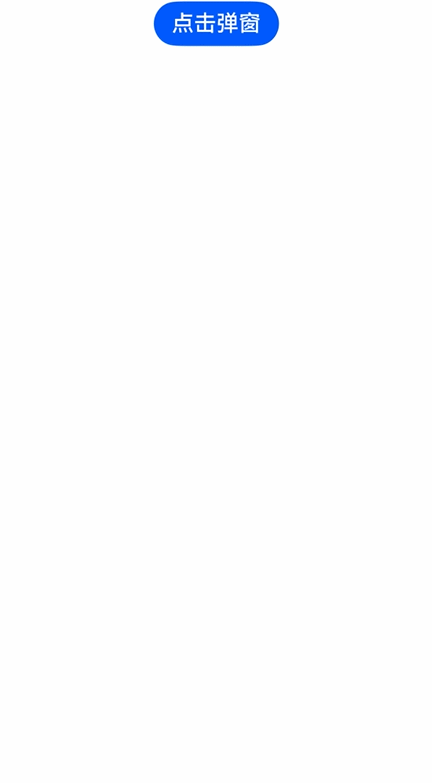

ArkUI的弹出框节点默认直接挂载在根节点上，会根据层级从小到大依次挂载。根节点下，高层级的弹出框节点会显示在低层级的弹出框节点之上，新创建的弹出框节点会根据层级大小插入到对应的位置，同一层级大小的弹出框节点按照创建的先后顺序进行挂载。

从API version 18开始，可以通过设置[levelOrder](https://developer.huawei.com/consumer/cn/doc/harmonyos-references/js-apis-promptaction#basedialogoptions11)参数来管理弹出框的显示顺序，确保层级较高的弹出框覆盖在层级较低的弹出框之上，从而根据需要灵活控制各层弹出框的显示效果。

## 使用约束

目前[openCustomDialog](/docs/dev/app-dev/application-framework/arkui/arkts-ui-development/arkts-use-dialog/arkts-use-dialogs/arkts-uicontext-custom-dialog)、[CustomDialog](/docs/dev/app-dev/application-framework/arkui/arkts-ui-development/arkts-use-dialog/arkts-use-dialogs/arkts-common-components-custom-dialog)、[AlertDialog](/docs/dev/app-dev/application-framework/arkui/arkts-ui-development/arkts-use-dialog/arkts-use-dialogs/arkts-fixes-style-dialog#警告弹窗-alertdialog)、[ActionSheet](/docs/dev/app-dev/application-framework/arkui/arkts-ui-development/arkts-use-dialog/arkts-use-dialogs/arkts-fixes-style-dialog#列表选择弹窗-actionsheet)、[showDialog](/docs/dev/app-dev/application-framework/arkui/arkts-ui-development/arkts-use-dialog/arkts-use-dialogs/arkts-fixes-style-dialog#对话框-showdialog)支持通过levelOrder参数来管理弹出框的层次。


弹出框层级管理不支持子窗场景，即当showInSubWindow设置为true时，levelOrder参数设置无效。不支持动态刷新弹出框的显示顺序。

## 创建不同层级的弹出框


详细变量定义请参考[完整示例](#完整示例)。

1. 初始化一个弹出框内容区，内部包含一个Text组件。

   ```
   @Builder
   normalCustomDialog(index: number) {
     Column() {
       // 请在resources\base\element\string.json文件中配置name为'open_normal_dialog'，value为非空字符串的资源
       Text(this.getUIContext().getHostContext()?.resourceManager.getStringByNameSync('open_normal_dialog') as string +
         index).fontSize(30)
     }.height(400).padding(5).justifyContent(FlexAlign.SpaceBetween)
   }
   ```

   

<div class="source-link-wrapper"><a href="https://gitcode.com/HarmonyOS_Samples/guide-snippets/blob/HarmonyOS-feature-20260402/ArkUISample/DialogProject/entry/src/main/ets/pages/customdialog/dialogboxlayermanagement/DialogBoxLayer.ets#L29-L39" target="_blank" rel="noopener noreferrer" class="source-link"><svg class="source-link-icon" width="14" height="14" viewBox="0 0 24 24" fill="none" stroke="currentColor" strokeWidth="2" strokeLinecap="round" strokeLinejoin="round">\<path d="M18 13v6a2 2 0 0 1-2 2H5a2 2 0 0 1-2-2V8a2 2 0 0 1 2-2h6" /\>\<polyline points="15 3 21 3 21 9" /\>\<line x1="10" y1="14" x2="21" y2="3" /\></svg> 查看源码：DialogBoxLayer.ets</a></div>

2. 初始化另一个弹出框内容区，内部包含一个点击打开普通弹出框的按钮，点击事件中通过调用[UIContext](https://developer.huawei.com/consumer/cn/doc/harmonyos-references/arkts-apis-uicontext-uicontext)中[getPromptAction](https://developer.huawei.com/consumer/cn/doc/harmonyos-references/arkts-apis-uicontext-uicontext#getpromptaction)方法获取[PromptAction](https://developer.huawei.com/consumer/cn/doc/harmonyos-references/arkts-apis-uicontext-promptaction)对象，再通过该对象调用[openCustomDialog](https://developer.huawei.com/consumer/cn/doc/harmonyos-references/arkts-apis-uicontext-promptaction#opencustomdialog12-1)接口，并且设置层级为0的[levelOrder](https://developer.huawei.com/consumer/cn/doc/harmonyos-references/js-apis-promptaction#basedialogoptions11)参数来创建普通层级弹出框。

   ```
   @Builder
   topCustomDialog() {
     Column() {
       // 请将$r('app.string.top_dialog')替换为实际资源文件，在本示例中该资源文件的value值为"我是置顶弹窗"
       Text($r('app.string.top_dialog')).fontSize(30)
       Row({ space: 50 }) {
         // 请将$r('app.string.open_dialog')替换为实际资源文件，在本示例中该资源文件的value值为"点我打开普通弹窗"
         Button($r('app.string.open_dialog'))
           .onClick(() => {
             this.getUIContext().getPromptAction().openCustomDialog({
               builder: () => {
                 this.normalCustomDialog(this.dialogIndex);
               },
               levelOrder: LevelOrder.clamp(0),
             })
               .catch((err: BusinessError) => {
                 hilog.error(DOMAIN, 'dialogBoxLayer', 'openCustomDialog error: ' + err.code + '' + err.message);
               });
             this.dialogIndex++;
           })
       }
     }.height(200).padding(5).justifyContent(FlexAlign.SpaceBetween)
   }
   ```

   

<div class="source-link-wrapper"><a href="https://gitcode.com/HarmonyOS_Samples/guide-snippets/blob/HarmonyOS-feature-20260402/ArkUISample/DialogProject/entry/src/main/ets/pages/customdialog/dialogboxlayermanagement/DialogBoxLayer.ets#L41-L68" target="_blank" rel="noopener noreferrer" class="source-link"><svg class="source-link-icon" width="14" height="14" viewBox="0 0 24 24" fill="none" stroke="currentColor" strokeWidth="2" strokeLinecap="round" strokeLinejoin="round">\<path d="M18 13v6a2 2 0 0 1-2 2H5a2 2 0 0 1-2-2V8a2 2 0 0 1 2-2h6" /\>\<polyline points="15 3 21 3 21 9" /\>\<line x1="10" y1="14" x2="21" y2="3" /\></svg> 查看源码：DialogBoxLayer.ets</a></div>

3. 通过调用[UIContext](https://developer.huawei.com/consumer/cn/doc/harmonyos-references/arkts-apis-uicontext-uicontext)中[getPromptAction](https://developer.huawei.com/consumer/cn/doc/harmonyos-references/arkts-apis-uicontext-uicontext#getpromptaction)方法获取[PromptAction](https://developer.huawei.com/consumer/cn/doc/harmonyos-references/arkts-apis-uicontext-promptaction)对象，再通过该对象调用[openCustomDialog](https://developer.huawei.com/consumer/cn/doc/harmonyos-references/arkts-apis-uicontext-promptaction#opencustomdialog12-1)接口，并且设置层级为100000的[levelOrder](https://developer.huawei.com/consumer/cn/doc/harmonyos-references/js-apis-promptaction#basedialogoptions11)参数来创建最高层级弹出框。

   ```
   this.getUIContext().getPromptAction().openCustomDialog({
     builder: () => {
       this.topCustomDialog();
     },
     levelOrder: LevelOrder.clamp(100000)
   }).catch((err: BusinessError) => {
     hilog.error(DOMAIN, 'dialogBoxLayer', 'openCustomDialog error: ' + err.code + ' ' + err.message);
   });
   ```

   

<div class="source-link-wrapper"><a href="https://gitcode.com/HarmonyOS_Samples/guide-snippets/blob/HarmonyOS-feature-20260402/ArkUISample/DialogProject/entry/src/main/ets/pages/customdialog/dialogboxlayermanagement/DialogBoxLayer.ets#L78-L87" target="_blank" rel="noopener noreferrer" class="source-link"><svg class="source-link-icon" width="14" height="14" viewBox="0 0 24 24" fill="none" stroke="currentColor" strokeWidth="2" strokeLinecap="round" strokeLinejoin="round">\<path d="M18 13v6a2 2 0 0 1-2 2H5a2 2 0 0 1-2-2V8a2 2 0 0 1 2-2h6" /\>\<polyline points="15 3 21 3 21 9" /\>\<line x1="10" y1="14" x2="21" y2="3" /\></svg> 查看源码：DialogBoxLayer.ets</a></div>


## 完整示例

```
import { LevelOrder } from '@kit.ArkUI';
import { BusinessError } from '@kit.BasicServicesKit';
import { hilog } from '@kit.PerformanceAnalysisKit';

const INDEX: number = 0;
const DOMAIN = 0x0000;

@Entry
@Component
export struct DialogBoxLayer {
  @StorageLink('dialogIndex') dialogIndex: number = INDEX;

  @Builder
  normalCustomDialog(index: number) {
    Column() {
      // 请在resources\base\element\string.json文件中配置name为'open_normal_dialog'，value为非空字符串的资源
      Text(this.getUIContext().getHostContext()?.resourceManager.getStringByNameSync('open_normal_dialog') as string +
        index).fontSize(30)
    }.height(400).padding(5).justifyContent(FlexAlign.SpaceBetween)
  }

  @Builder
  topCustomDialog() {
    Column() {
      // 请将$r('app.string.top_dialog')替换为实际资源文件，在本示例中该资源文件的value值为"我是置顶弹窗"
      Text($r('app.string.top_dialog')).fontSize(30)
      Row({ space: 50 }) {
        // 请将$r('app.string.open_dialog')替换为实际资源文件，在本示例中该资源文件的value值为"点我打开普通弹窗"
        Button($r('app.string.open_dialog'))
          .onClick(() => {
            this.getUIContext().getPromptAction().openCustomDialog({
              builder: () => {
                this.normalCustomDialog(this.dialogIndex);
              },
              levelOrder: LevelOrder.clamp(0),
            })
              .catch((err: BusinessError) => {
                hilog.error(DOMAIN, 'dialogBoxLayer', 'openCustomDialog error: ' + err.code + '' + err.message);
              });
            this.dialogIndex++;
          })
      }
    }.height(200).padding(5).justifyContent(FlexAlign.SpaceBetween)
  }

  build() {
    NavDestination() {
      Row() {
        Column({ space: 5 }) {
          // 请将$r('app.string.click_dialog')替换为实际资源文件，在本示例中该资源文件的value值为"点击弹窗"
          Button($r('app.string.click_dialog'))
            .fontSize(20)
            .onClick(() => {
              this.getUIContext().getPromptAction().openCustomDialog({
                builder: () => {
                  this.topCustomDialog();
                },
                levelOrder: LevelOrder.clamp(100000)
              }).catch((err: BusinessError) => {
                hilog.error(DOMAIN, 'dialogBoxLayer', 'openCustomDialog error: ' + err.code + ' ' + err.message);
              });
            })
        }.width('100%')
      }
    }
  }
}
```


<div class="source-link-wrapper"><a href="https://gitcode.com/HarmonyOS_Samples/guide-snippets/blob/HarmonyOS-feature-20260402/ArkUISample/DialogProject/entry/src/main/ets/pages/customdialog/dialogboxlayermanagement/DialogBoxLayer.ets#L16-L95" target="_blank" rel="noopener noreferrer" class="source-link"><svg class="source-link-icon" width="14" height="14" viewBox="0 0 24 24" fill="none" stroke="currentColor" strokeWidth="2" strokeLinecap="round" strokeLinejoin="round">\<path d="M18 13v6a2 2 0 0 1-2 2H5a2 2 0 0 1-2-2V8a2 2 0 0 1 2-2h6" /\>\<polyline points="15 3 21 3 21 9" /\>\<line x1="10" y1="14" x2="21" y2="3" /\></svg> 查看源码：DialogBoxLayer.ets</a></div>



