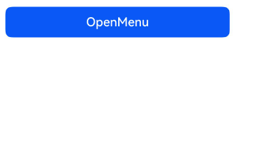

[菜单控制 (Menu)](https://developer.huawei.com/consumer/cn/doc/harmonyos-guides/arkts-popup-and-menu-components-menu)在使用时依赖绑定UI组件，否则无法使用。从API version 18开始，可以通过使用全局接口[openMenu](https://developer.huawei.com/consumer/cn/doc/harmonyos-references/arkts-apis-uicontext-promptaction#openmenu18)的方式，在无UI组件的场景下直接或封装使用，例如在事件回调中使用或封装后对外提供能力。

## 弹出菜单

通过[openMenu](https://developer.huawei.com/consumer/cn/doc/harmonyos-references/arkts-apis-uicontext-promptaction#openmenu18)可以弹出菜单。

```
this.getUIContext().getPromptAction()
  .openMenu(this.contentNode, { id: targetId }, {
    enableArrow: true
  })
  .then(() => {
    hilog.info(0xFF00, 'globalOpenMenu', 'openMenu success');
  })
  .catch((err: BusinessError) => {
    hilog.error(0xFF00, 'globalOpenMenu', 'openMenu error: ' + err.code + ' ' + err.message);
  });
```


<div class="source-link-wrapper"><a href="https://gitcode.com/HarmonyOS_Samples/guide-snippets/blob/HarmonyOS-feature-20260402/ArkUISample/DialogProject/entry/src/main/ets/pages/Menu/globalmenusindependentofuicomponents/GlobalOpenMenu.ets#L108-L119" target="_blank" rel="noopener noreferrer" class="source-link"><svg class="source-link-icon" width="14" height="14" viewBox="0 0 24 24" fill="none" stroke="currentColor" strokeWidth="2" strokeLinecap="round" strokeLinejoin="round">\<path d="M18 13v6a2 2 0 0 1-2 2H5a2 2 0 0 1-2-2V8a2 2 0 0 1 2-2h6" /\>\<polyline points="15 3 21 3 21 9" /\>\<line x1="10" y1="14" x2="21" y2="3" /\></svg> 查看源码：GlobalOpenMenu.ets</a></div>




### 创建ComponentContent

通过调用openMenu接口弹出菜单，需要定义ComponentContent，以提供自定义弹出框的内容。详细规格可参考[ComponentContent](https://developer.huawei.com/consumer/cn/doc/harmonyos-references/js-apis-arkui-componentcontent)说明。

```
private contentNode: ComponentContent<Object> =
  new ComponentContent(this.getUIContext(), wrapBuilder(buildText), this.message);
```


<div class="source-link-wrapper"><a href="https://gitcode.com/HarmonyOS_Samples/guide-snippets/blob/HarmonyOS-feature-20260402/ArkUISample/DialogProject/entry/src/main/ets/pages/Menu/globalmenusindependentofuicomponents/GlobalOpenMenu.ets#L96-L99" target="_blank" rel="noopener noreferrer" class="source-link"><svg class="source-link-icon" width="14" height="14" viewBox="0 0 24 24" fill="none" stroke="currentColor" strokeWidth="2" strokeLinecap="round" strokeLinejoin="round">\<path d="M18 13v6a2 2 0 0 1-2 2H5a2 2 0 0 1-2-2V8a2 2 0 0 1 2-2h6" /\>\<polyline points="15 3 21 3 21 9" /\>\<line x1="10" y1="14" x2="21" y2="3" /\></svg> 查看源码：GlobalOpenMenu.ets</a></div>


如果在wrapBuilder中包含其他组件（例如：[Popup](https://developer.huawei.com/consumer/cn/doc/harmonyos-references/ohos-arkui-advanced-popup)、[Chip](https://developer.huawei.com/consumer/cn/doc/harmonyos-references/ohos-arkui-advanced-chip)组件），则应在创建ComponentContent时设置[nestingBuilderSupported](https://developer.huawei.com/consumer/cn/doc/harmonyos-references/js-apis-arkui-buildernode#buildoptions12)属性为true。

```
@Builder
export function buildText(params: Params) {
  Popup({
    // 类型设置图标内容
    icon: {
      // 请将$r('app.media.app_icon')替换为实际资源文件
      image: $r('app.media.app_icon'),
      width: 32,
      height: 32,
      fillColor: Color.White,
      borderRadius: 10
    } as PopupIconOptions,
    // 设置文字内容
    title: {
      text: `This is a Popup title 1`,
      fontSize: 20,
      fontColor: Color.Black,
      fontWeight: FontWeight.Normal
    } as PopupTextOptions,
    // 设置文字内容
    message: {
      text: `This is a Popup message 1`,
      fontSize: 15,
      fontColor: Color.Black
    } as PopupTextOptions,
    // 设置按钮内容
    buttons: [{
      text: 'confirm',
      action: () => {
        hilog.info(0xFF00, 'globalOpenMenu', 'confirm button click');
      },
      fontSize: 15,
      fontColor: Color.Black,
    },
      {
        text: 'cancel',
        action: () => {
          hilog.info(0xFF00, 'globalOpenMenu', 'cancel button click');
        },
        fontSize: 15,
        fontColor: Color.Black
      },] as [PopupButtonOptions?, PopupButtonOptions?]
  })
}

let contentNode: ComponentContent<Object> =
  new ComponentContent(uiContext, wrapBuilder(buildText), message, { nestingBuilderSupported: true });
```


<div class="source-link-wrapper"><a href="https://gitcode.com/HarmonyOS_Samples/guide-snippets/blob/HarmonyOS-feature-20260402/ArkUISample/DialogProject/entry/src/main/ets/pages/Menu/globalmenusindependentofuicomponents/GlobalOpenMenu.ets#L39-L88" target="_blank" rel="noopener noreferrer" class="source-link"><svg class="source-link-icon" width="14" height="14" viewBox="0 0 24 24" fill="none" stroke="currentColor" strokeWidth="2" strokeLinecap="round" strokeLinejoin="round">\<path d="M18 13v6a2 2 0 0 1-2 2H5a2 2 0 0 1-2-2V8a2 2 0 0 1 2-2h6" /\>\<polyline points="15 3 21 3 21 9" /\>\<line x1="10" y1="14" x2="21" y2="3" /\></svg> 查看源码：GlobalOpenMenu.ets</a></div>


### 绑定组件信息

通过调用openMenu接口弹出菜单，需要提供绑定组件的信息[TargetInfo](https://developer.huawei.com/consumer/cn/doc/harmonyos-references/arkts-apis-uicontext-i#targetinfo18)。若未传入有效的target，菜单将无法弹出。

目前有两种设置target的方式。

* target的id属性设置为number类型，此时需要将id设置为对应组件的UniqueID，组件的UniqueID由系统保证唯一性。

  ```
  let frameNode: FrameNode | null = this.getUIContext().getFrameNodeByUniqueId(this.getUniqueId());
  let targetId = frameNode?.getChild(0)?.getUniqueId();
  ```

  

<div class="source-link-wrapper"><a href="https://gitcode.com/HarmonyOS_Samples/guide-snippets/blob/HarmonyOS-feature-20260402/ArkUISample/DialogProject/entry/src/main/ets/pages/Menu/globalmenusindependentofuicomponents/GlobalOpenMenu.ets#L156-L159" target="_blank" rel="noopener noreferrer" class="source-link"><svg class="source-link-icon" width="14" height="14" viewBox="0 0 24 24" fill="none" stroke="currentColor" strokeWidth="2" strokeLinecap="round" strokeLinejoin="round">\<path d="M18 13v6a2 2 0 0 1-2 2H5a2 2 0 0 1-2-2V8a2 2 0 0 1 2-2h6" /\>\<polyline points="15 3 21 3 21 9" /\>\<line x1="10" y1="14" x2="21" y2="3" /\></svg> 查看源码：GlobalOpenMenu.ets</a></div>

* target的id属性设置为string类型，此时需要将id设置为对应组件的通用属性[id](https://developer.huawei.com/consumer/cn/doc/harmonyos-references/ts-universal-attributes-component-id#id)值。当无法保证id的唯一性时，如多团队开发或者复用自定义组件，可以通过设置componentId属性明确指定此id的范围来精确指定target，此时componentId属性可以设置为对应组件的父组件或者所在自定义组件的UniqueID。

  ```
  build() {
    NavDestination() {
      Column() {
        Row() {
          Button('button1')
            .id(this.targetIdString)
        }

        Row() {
          Button('button2')
            .id(this.targetIdString)
        }

        Button('openMenu')
          .onClick(() => {
            let frameNode: FrameNode | null = this.uiContext.getFrameNodeByUniqueId(this.getUniqueId());
            let componentId = frameNode?.getChild(1)?.getChild(0)?.getChild(1)?.getUniqueId();
            if (componentId == undefined) {
              this.componentId = 0;
            } else {
              this.componentId = componentId;
            }
            this.promptAction.openMenu(this.contentNode, { id: this.targetIdString, componentId: this.componentId }, {
              enableArrow: true
            })
              .then(() => {
                hilog.info(0x0000, 'openMenuWithTargetIdString', 'openMenu success');
              })
              .catch((err: BusinessError) => {
                hilog.error(0x0000, 'openMenuWithTargetIdString', 'openMenu error: ' + err.code + ' ' + err.message);
              });
          })
      }
    }
  }
  ```

  

<div class="source-link-wrapper"><a href="https://gitcode.com/HarmonyOS_Samples/guide-snippets/blob/HarmonyOS-feature-20260402/ArkUISample/DialogProject/entry/src/main/ets/pages/Menu/globalmenusindependentofuicomponents/OpenMenuWithTargetIdString.ets#L46-L82" target="_blank" rel="noopener noreferrer" class="source-link"><svg class="source-link-icon" width="14" height="14" viewBox="0 0 24 24" fill="none" stroke="currentColor" strokeWidth="2" strokeLinecap="round" strokeLinejoin="round">\<path d="M18 13v6a2 2 0 0 1-2 2H5a2 2 0 0 1-2-2V8a2 2 0 0 1 2-2h6" /\>\<polyline points="15 3 21 3 21 9" /\>\<line x1="10" y1="14" x2="21" y2="3" /\></svg> 查看源码：OpenMenuWithTargetIdString.ets</a></div>


### 设置弹出菜单样式

通过调用openMenu接口弹出菜单，可以设置[MenuOptions](https://developer.huawei.com/consumer/cn/doc/harmonyos-references/ts-universal-attributes-menu#menuoptions10)中的属性调整菜单样式。title属性不生效。preview参数仅支持设置[MenuPreviewMode](https://developer.huawei.com/consumer/cn/doc/harmonyos-references/ts-universal-attributes-menu#menupreviewmode11)类型。

```
private options: MenuOptions = { enableArrow: true, placement: Placement.Bottom };
```


<div class="source-link-wrapper"><a href="https://gitcode.com/HarmonyOS_Samples/guide-snippets/blob/HarmonyOS-feature-20260402/ArkUISample/DialogProject/entry/src/main/ets/pages/Menu/globalmenusindependentofuicomponents/GlobalOpenMenu.ets#L100-L103" target="_blank" rel="noopener noreferrer" class="source-link"><svg class="source-link-icon" width="14" height="14" viewBox="0 0 24 24" fill="none" stroke="currentColor" strokeWidth="2" strokeLinecap="round" strokeLinejoin="round">\<path d="M18 13v6a2 2 0 0 1-2 2H5a2 2 0 0 1-2-2V8a2 2 0 0 1 2-2h6" /\>\<polyline points="15 3 21 3 21 9" /\>\<line x1="10" y1="14" x2="21" y2="3" /\></svg> 查看源码：GlobalOpenMenu.ets</a></div>


## 更新菜单样式

从API version 18开始，通过[updateMenu](https://developer.huawei.com/consumer/cn/doc/harmonyos-references/arkts-apis-uicontext-promptaction#updatemenu18)可以更新菜单的样式。支持全量更新和增量更新其菜单样式，不支持更新[MenuOptions](https://developer.huawei.com/consumer/cn/doc/harmonyos-references/ts-universal-attributes-menu#menuoptions10)中的showInSubWindow、preview、previewAnimationOptions、transition、onAppear、aboutToAppear、onDisappear、aboutToDisappear、onWillAppear、onDidAppear、onWillDisappear和onDidDisappear属性。

```
this.getUIContext().getPromptAction()
  .updateMenu(this.contentNode, {
    enableArrow: false
  }, true)
  .then(() => {
    hilog.info(0xFF00, 'globalOpenMenu', 'updateMenu success');
  })
  .catch((err: BusinessError) => {
    hilog.error(0xFF00, 'globalOpenMenu', 'updateMenu error: ' + err.code + ' ' + err.message);
  });
```


<div class="source-link-wrapper"><a href="https://gitcode.com/HarmonyOS_Samples/guide-snippets/blob/HarmonyOS-feature-20260402/ArkUISample/DialogProject/entry/src/main/ets/pages/Menu/globalmenusindependentofuicomponents/GlobalOpenMenu.ets#L123-L134" target="_blank" rel="noopener noreferrer" class="source-link"><svg class="source-link-icon" width="14" height="14" viewBox="0 0 24 24" fill="none" stroke="currentColor" strokeWidth="2" strokeLinecap="round" strokeLinejoin="round">\<path d="M18 13v6a2 2 0 0 1-2 2H5a2 2 0 0 1-2-2V8a2 2 0 0 1 2-2h6" /\>\<polyline points="15 3 21 3 21 9" /\>\<line x1="10" y1="14" x2="21" y2="3" /\></svg> 查看源码：GlobalOpenMenu.ets</a></div>


## 关闭菜单

从API version 18开始，通过调用[closeMenu](https://developer.huawei.com/consumer/cn/doc/harmonyos-references/arkts-apis-uicontext-promptaction#closemenu18)可以关闭菜单。

```
this.getUIContext().getPromptAction()
  .closeMenu(this.contentNode)
  .then(() => {
    hilog.info(0xFF00, 'globalOpenMenu', 'closeMenu success');
  })
  .catch((err: BusinessError) => {
    hilog.error(0xFF00, 'globalOpenMenu', 'closeMenu error: ' + err.code + ' ' + err.message);
  });
```


<div class="source-link-wrapper"><a href="https://gitcode.com/HarmonyOS_Samples/guide-snippets/blob/HarmonyOS-feature-20260402/ArkUISample/DialogProject/entry/src/main/ets/pages/Menu/globalmenusindependentofuicomponents/GlobalOpenMenu.ets#L138-L147" target="_blank" rel="noopener noreferrer" class="source-link"><svg class="source-link-icon" width="14" height="14" viewBox="0 0 24 24" fill="none" stroke="currentColor" strokeWidth="2" strokeLinecap="round" strokeLinejoin="round">\<path d="M18 13v6a2 2 0 0 1-2 2H5a2 2 0 0 1-2-2V8a2 2 0 0 1 2-2h6" /\>\<polyline points="15 3 21 3 21 9" /\>\<line x1="10" y1="14" x2="21" y2="3" /\></svg> 查看源码：GlobalOpenMenu.ets</a></div>


由于[updateMenu](https://developer.huawei.com/consumer/cn/doc/harmonyos-references/arkts-apis-uicontext-promptaction#updatemenu18)和[closeMenu](https://developer.huawei.com/consumer/cn/doc/harmonyos-references/arkts-apis-uicontext-promptaction#closemenu18)依赖content来更新或者关闭指定的菜单，开发者需自行维护传入的content。

## 在HAR包中使用全局菜单

可以通过[HAR](https://developer.huawei.com/consumer/cn/doc/harmonyos-guides/har-package)包封装一个Menu，从而对外提供菜单的弹出、更新和关闭能力。

具体调用方式参考[在HAR包中使用全局气泡提示](https://developer.huawei.com/consumer/cn/doc/harmonyos-guides/arkts-popup-and-menu-components-uicontext-popup#在har包中使用全局气泡提示)。
