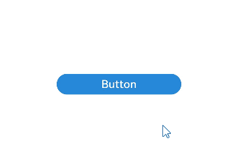
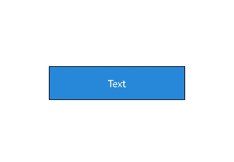

## 概述

在大量属性频繁更新的场景下，使用状态变量可能导致前端状态管理的计算量过大，并且需要对单个组件进行全量属性更新。尽管可以通过AttributeModifier[（动态属性设置）](https://developer.huawei.com/consumer/cn/doc/harmonyos-references/ts-universal-attributes-attribute-modifier)机制实现按需更新属性，但前端仍会采用一定的diff和reset策略，这可能带来性能问题。

AttributeUpdater作为一个特殊的AttributeModifier，不仅继承了AttributeModifier的功能，还提供了直接获取属性对象的能力。通过属性对象，开发者能够直接更新对应属性，无需经过状态变量。开发者可以利用AttributeUpdater实现自定义的更新策略，从而进一步提升属性更新的性能。

由于AttributeUpdater提供了较高的灵活性，无法限制“单一数据源”的规则，因此在与状态变量同时更新同一属性时，存在相互覆盖的情况。这要求开发者必须确保属性设置的合理性。

## 接口定义

```
export declare class AttributeUpdater<T, C = Initializer<T>> implements AttributeModifier<T> {

  applyNormalAttribute?(instance: T): void;

  initializeModifier(instance: T): void;

  get attribute(): T | undefined;

  public updateConstructorParams: C;
}
```


<div class="source-link-wrapper"><a href="https://gitcode.com/HarmonyOS_Samples/guide-snippets/blob/HarmonyOS-feature-20260402/ArkUISample/ArkTSUserAttributeUpdater/entry/src/main/ets/pages/Common.ets#L15-L26" target="_blank" rel="noopener noreferrer" class="source-link"><svg class="source-link-icon" width="14" height="14" viewBox="0 0 24 24" fill="none" stroke="currentColor" strokeWidth="2" strokeLinecap="round" strokeLinejoin="round">\<path d="M18 13v6a2 2 0 0 1-2 2H5a2 2 0 0 1-2-2V8a2 2 0 0 1 2-2h6" /\>\<polyline points="15 3 21 3 21 9" /\>\<line x1="10" y1="14" x2="21" y2="3" /\></svg> 查看源码：Common.ets</a></div>


AttributeUpdater实现了AttributeModifier接口，并额外提供了[initializeModifier](https://developer.huawei.com/consumer/cn/doc/harmonyos-references/js-apis-arkui-attributeupdater#initializemodifier)，可以对组件的属性进行初始化。通过[attribute](https://developer.huawei.com/consumer/cn/doc/harmonyos-references/js-apis-arkui-attributeupdater#attribute)属性方法可以获取属性对象，直接更新对应组件的属性。另外也可以直接通过[updateConstructorParams](https://developer.huawei.com/consumer/cn/doc/harmonyos-references/js-apis-arkui-attributeupdater#属性)更新组件的构造参数。

## 使用说明

* 开发者可以继承AttributeUpdater\<T\>类，并通过组件的通用方法attributeModifier设置，首次绑定时会触发initializeModifier方法，进行属性的初始化，后续其它的生命周期和AttributeModifier保持一致。
* 组件初始化完成之后，开发者可以通过AttributeUpdater实例的attribute属性方法，获取到属性对象，若获取不到则为undefined。
* 通过attribute属性对象直接修改属性，会将最新设置的属性记录在当前对象中，并立即触发组件属性的更新。
* 如果将AttributeUpdater实例标记为状态变量进行修改，或者通过其它状态变量更新对应组件的属性，会触发[applyNormalAttribute](https://developer.huawei.com/consumer/cn/doc/harmonyos-references/js-apis-arkui-attributeupdater#applynormalattribute)的流程，如果开发者没有复写该逻辑，默认会将属性对象记录的所有属性，进行一次批量更新。
* 如果开发者复写[applyNormalAttribute](https://developer.huawei.com/consumer/cn/doc/harmonyos-references/js-apis-arkui-attributeupdater#applynormalattribute)的逻辑，并且不调用super的该方法，将会失去获取attribute属性对象的能力，不会调用initializeModifier方法。
* 一个AttributeUpdater对象只能同时关联一个组件，否则只会有一个组件的属性设置生效。

## 通过modifier直接修改属性

组件初始化完成之后，开发者可以通过AttributeUpdater实例的attribute属性方法，获取到属性对象。通过属性对象直接修改属性，会立即触发组件属性的更新。

```
import { AttributeUpdater } from '@kit.ArkUI';

class MyButtonModifier extends AttributeUpdater<ButtonAttribute> {
  // 首次绑定时触发initializeModifier方法，进行属性初始化
  initializeModifier(instance: ButtonAttribute): void {
    instance.backgroundColor('#2787D9')
      .width('50%')
      .height(30)
  }
}

@Entry
@Component
struct updaterDemo {
  modifier: MyButtonModifier = new MyButtonModifier()

  build() {
    Row() {
      Column() {
        Button('Button')
          .attributeModifier(this.modifier)
          .onClick(() => {
            // 通过attribute，直接修改组件属性，并立即触发组件属性更新
            this.modifier.attribute?.backgroundColor('#17A98D').width('30%')
          })
      }
      .width('100%')
    }
    .height('100%')
  }
}
```


<div class="source-link-wrapper"><a href="https://gitcode.com/HarmonyOS_Samples/guide-snippets/blob/HarmonyOS-feature-20260402/ArkUISample/ArkTSUserAttributeUpdater/entry/src/main/ets/pages/AttModifier.ets#L15-L47" target="_blank" rel="noopener noreferrer" class="source-link"><svg class="source-link-icon" width="14" height="14" viewBox="0 0 24 24" fill="none" stroke="currentColor" strokeWidth="2" strokeLinecap="round" strokeLinejoin="round">\<path d="M18 13v6a2 2 0 0 1-2 2H5a2 2 0 0 1-2-2V8a2 2 0 0 1 2-2h6" /\>\<polyline points="15 3 21 3 21 9" /\>\<line x1="10" y1="14" x2="21" y2="3" /\></svg> 查看源码：AttModifier.ets</a></div>




## 通过modifier更新组件的构造参数

可以通过AttributeUpdater实例的updateConstructorParams方法，直接更新组件的构造参数。

```
import { AttributeUpdater } from '@kit.ArkUI';

class MyTextModifier extends AttributeUpdater<TextAttribute, TextInterface> {
  initializeModifier(instance: TextAttribute): void {
  }
}

@Entry
@Component
struct updaterDemo {
  modifier: MyTextModifier = new MyTextModifier();

  build() {
    Row() {
      Column() {
        Text('Text')
          .attributeModifier(this.modifier)
          .fontColor(Color.White)
          .fontSize(14)
          .border({ width: 1 })
          .textAlign(TextAlign.Center)
          .lineHeight(20)
          .width(200)
          .height(50)
          .backgroundColor('#2787D9')
          .onClick(() => {
            // 调用updateConstructorParams方法，直接更新组件的构造参数
            this.modifier.updateConstructorParams('Update');
          })
      }
      .width('100%')
    }
    .height('100%')
  }
}
```


<div class="source-link-wrapper"><a href="https://gitcode.com/HarmonyOS_Samples/guide-snippets/blob/HarmonyOS-feature-20260402/ArkUISample/ArkTSUserAttributeUpdater/entry/src/main/ets/pages/AttUpdate.ets#L15-L51" target="_blank" rel="noopener noreferrer" class="source-link"><svg class="source-link-icon" width="14" height="14" viewBox="0 0 24 24" fill="none" stroke="currentColor" strokeWidth="2" strokeLinecap="round" strokeLinejoin="round">\<path d="M18 13v6a2 2 0 0 1-2 2H5a2 2 0 0 1-2-2V8a2 2 0 0 1 2-2h6" /\>\<polyline points="15 3 21 3 21 9" /\>\<line x1="10" y1="14" x2="21" y2="3" /\></svg> 查看源码：AttUpdate.ets</a></div>



