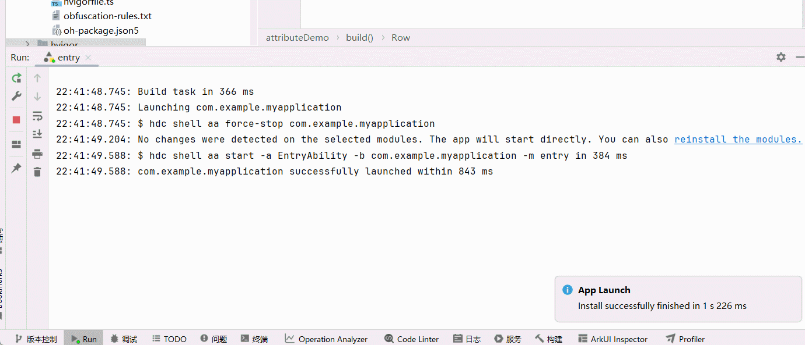

本文档介绍动态属性设置的常见问题并提供参考。

## 使用AttributeModifier设置组件动态属性，出现jscrash

**问题现象**

使用AttributeModifier对组件进行[动态属性设置](https://developer.huawei.com/consumer/cn/doc/harmonyos-references/ts-universal-attributes-attribute-modifier)，设置某些属性后出现[JS Crash](/docs/dev/app-dev/system/system-debug-optimize/performance-analysis-kit/fault-analysis/crash-detection/jscrash-guidelines)。


**解决措施**

根据提示跳转至报错日志，查看具体的报错原因，进行相应的修改，具体的跳转方法请参考下方示例代码。

**示例代码**

该示例通过Button绑定AttributeModifier，展示了AttributeModifier在设置不支持的属性时会抛出异常的场景，运行示例代码后会出现jscrash报错，参考下方的动图，跳转至具体的报错场景。在本示例中，删除reuseId相关代码即可正常运行。

```
// xxx.ets
// 设置Button组件属性的自定义AttributeModifier
class MyButtonModifier implements AttributeModifier<ButtonAttribute> {

  applyNormalAttribute(instance: ButtonAttribute): void {
    instance.reuseId('String') // 删除本行可以让程序正常运行
    instance.backgroundColor(Color.Red)
  }
}

@Entry
@Component
struct attributeDemo {
  @State modifier: MyButtonModifier = new MyButtonModifier();

  build() {
    Row() {
      Column() {
        Button('Button')
          .attributeModifier(this.modifier)
      }
      .width('100%')
    }
    .height('100%')
  }
}
```


