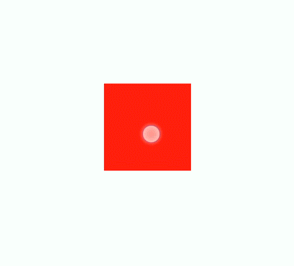
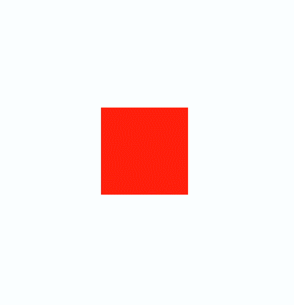
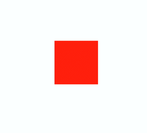

еңЁз»„件дёҠеҲӣе»әе’ҢиҝҗиЎҢеҠЁз”»зҡ„еҝ«жҚ·ж–№ејҸгҖӮе…·дҪ“з”Ёжі•иҜ·еҸӮиҖғ[йҖҡз”Ёж–№жі•](https://developer.huawei.com/consumer/cn/doc/harmonyos-references/js-components-common-methods)гҖӮ

## иҺ·еҸ–еҠЁз”»еҜ№иұЎ

йҖҡиҝҮи°ғз”Ёanimateж–№жі•иҺ·еҫ—animationеҜ№иұЎпјҢanimationеҜ№иұЎж”ҜжҢҒеҠЁз”»еұһжҖ§гҖҒеҠЁз”»ж–№жі•е’ҢеҠЁз”»дәӢ件гҖӮ

```
<!-- xxx.hml -->
<div class="container">
  <div id="content" class="box" onclick="Show"></div>
</div>
```

```
/* xxx.css */
.container {
  flex-direction: column;
  justify-content: center;
  align-items: center;
  width: 100%;
}
.box{
  width: 200px;
  height: 200px;
  background-color: #ff0000;
  margin-top: 30px;
}
```

```
/* xxx.js */
export default {
    data: {
        animation: '',
        options: {},
        frames: {}
    },
    onInit() {
        this.options = {
            duration: 1500,
        };
        this.frames = [
            {
                width: 200, height: 200,
            },
            {
                width: 300, height: 300,
            }
        ];
    },
    Show() {
        this.animation = this.$element('content').animate(this.frames, this.options); //иҺ·еҸ–еҠЁз”»еҜ№иұЎ
        this.animation.play();
    }
}
```




* дҪҝз”Ёanimateж–№жі•ж—¶еҝ…йЎ»дј е…ҘKeyframesе’ҢOptionsеҸӮж•°гҖӮ
* еӨҡж¬Ўи°ғз”Ёanimateж–№жі•ж—¶пјҢйҮҮз”Ёreplaceзӯ–з•ҘпјҢеҚіжңҖеҗҺдёҖж¬Ўи°ғз”Ёж—¶дј е…Ҙзҡ„еҸӮж•°з”ҹж•ҲгҖӮ

## и®ҫзҪ®еҠЁз”»еҸӮж•°

еңЁиҺ·еҸ–еҠЁз”»еҜ№иұЎеҗҺпјҢйҖҡиҝҮи®ҫзҪ®еҸӮж•°Keyframesи®ҫзҪ®еҠЁз”»еңЁз»„件дёҠзҡ„ж ·ејҸгҖӮ

```
<!-- xxx.hml -->
<div class="container">
   <div id="content" class="box" onclick="Show"></div>
</div>
```

```
/* xxx.css */
.container {
  flex-direction: column;
  justify-content: center;
  align-items: center;
  width: 100%;
  height: 100%;
}
.box{
  width: 200px;
  height: 200px;
  background-color: #ff0000;
  margin-top: 30px;
}
```

```
/* xxx.js */
export default {
  data: {
    animation: '',
    keyframes:{},
    options:{}
  },
  onInit() {
    this.options = {
      duration: 4000,
    }
    this.keyframes = [
    {
      transform: {
        translate: '-120px -0px',
        scale: 1,
        rotate: 0
        },
        transformOrigin: '100px 100px',
        offset: 0.0,
        width: 200,
        height: 200
      },
      {
        transform: {
          translate: '120px 0px',
          scale: 1.5,
          rotate: 90
          },
          transformOrigin: '100px 100px',
          offset: 1.0,
          width: 300,
          height: 300
      }
    ]
  },
  Show() {
    this.animation = this.$element('content').animate(this.keyframes, this.options)
    this.animation.play()
  }
}
```




* translateгҖҒscaleе’Ңrotateзҡ„е…ҲеҗҺйЎәеәҸдјҡеҪұе“ҚеҠЁз”»ж•ҲжһңгҖӮ
* transformOriginеҸӘеҜ№scaleе’Ңrotateиө·дҪңз”ЁгҖӮ

еңЁиҺ·еҸ–еҠЁз”»еҜ№иұЎеҗҺпјҢйҖҡиҝҮи®ҫзҪ®еҸӮж•°OptionsжқҘи®ҫзҪ®еҠЁз”»зҡ„еұһжҖ§гҖӮ

```
<!-- xxx.hml -->
<div class="container">
   <div id="content" class="box" onclick="Show"></div>
</div>
```

```
/* xxx.css */
.container {
  flex-direction: column;
  justify-content: center;
  align-items: center;
  width: 100%;
}
.box{
  width: 200px;
  height: 200px;
  background-color: #ff0000;
  margin-top: 30px;
}
```

```
/* xxx.js */
export default {
    data: {
        animation: '',
        options: {},
        frames: {}
    },
    onInit() {
        this.options = {
            duration: 1500,
            easing: 'ease-in',
            delay: 5,
            iterations: 2,
            direction: 'normal',
        };
        this.frames = [
            {
                transform: {
                    translate: '-150px -0px'
                }
            },
            {
                transform: {
                    translate: '150px 0px'
                }
            }
        ];
    },
    Show() {
        this.animation = this.$element('content').animate(this.frames, this.options);
        this.animation.play();
    }
}
```




directionпјҡжҢҮе®ҡеҠЁз”»зҡ„ж’ӯж”ҫжЁЎејҸгҖӮ

normalпјҡ еҠЁз”»жӯЈеҗ‘еҫӘзҺҜж’ӯж”ҫгҖӮ

reverseпјҡ еҠЁз”»еҸҚеҗ‘еҫӘзҺҜж’ӯж”ҫгҖӮ

alternateпјҡеҠЁз”»дәӨжӣҝеҫӘзҺҜж’ӯж”ҫпјҢеҘҮж•°ж¬ЎжӯЈеҗ‘ж’ӯж”ҫпјҢеҒ¶ж•°ж¬ЎеҸҚеҗ‘ж’ӯж”ҫгҖӮ

alternate-reverseпјҡеҠЁз”»еҸҚеҗ‘дәӨжӣҝеҫӘзҺҜж’ӯж”ҫпјҢеҘҮж•°ж¬ЎеҸҚеҗ‘ж’ӯж”ҫпјҢеҒ¶ж•°ж¬ЎжӯЈеҗ‘ж’ӯж”ҫгҖӮ
