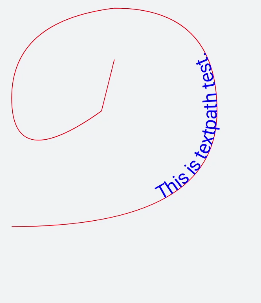

svg组件还可以绘制文本。

## 文本


* 文本的展示内容需要写在元素标签text内，可嵌套tspan子元素标签分段。
* 只支持被父元素标签svg嵌套。
* 只支持默认字体sans-serif。

通过设置x（x轴坐标）、y（y轴坐标）、dx（文本x轴偏移）、dy（文本y轴偏移）、fill（字体填充颜色）、stroke（文本边框颜色）、stroke-width（文本边框宽度）等属性实现文本的不同展示样式。

```
<!-- xxx.hml -->
<div class="container">
  <svg>
    <text x="200" y="300" font-size="80px" fill="blue" >Hello World</text>    <text x="200" y="300" dx="20" dy="80" font-size="80px" fill="blue" fill-opacity="0.5" stroke="red" stroke-width="2">Hello World</text>
    <text x="20" y="550" fill="#D2691E">
      <tspan dx="40" fill="red" font-size="80" fill-opacity="0.4">Hello World </tspan>
    </text>
  </svg>
</div>
```


## 沿路径绘制文本

textpath文本内容沿着属性path中的路径绘制文本。

```
<!-- xxx.hml -->
<div class="container">
  <svg fill="#00FF00" x="100" y="400">
    <path d="M40,360 Q360,360 360,180 Q360,20 200,20 Q40,40 40,160 Q40,280 180,180 Q180,180 200,100" stroke="red" fill="none"></path>
      <text>
        <textpath fill="blue" startOffset="20%" path="M40,360 Q360,360 360,180 Q360,20 200,20 Q40,40 40,160 Q40,280 180,180 Q180,180 200,100" font-size="30px">
          This is textpath test.
        </textpath>
      </text>
  </svg>
</div>
```


