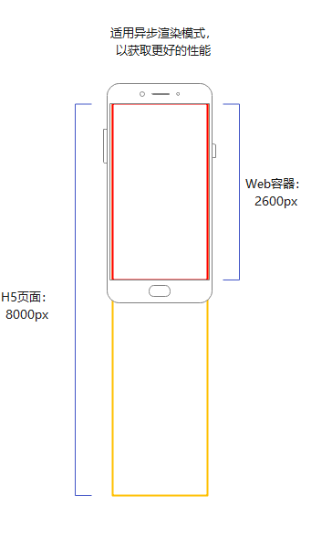
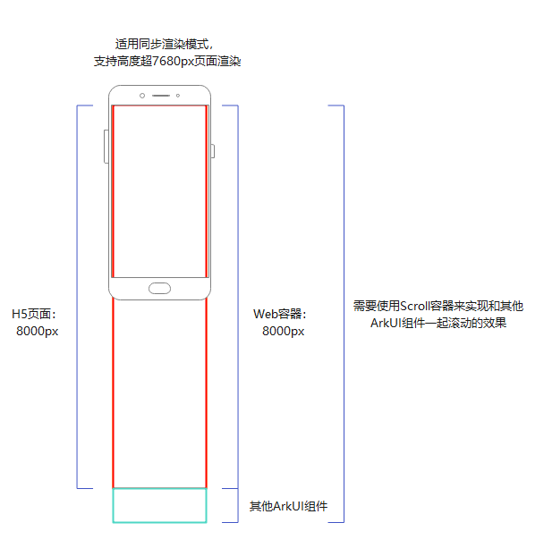

Web组件提供了两种可配置的渲染模式，能够根据不同的容器大小进行适配，从而满足使用场景中对容器尺寸的需求。

## 异步渲染模式（默认）

异步渲染模式下（renderMode: [RenderMode](https://developer.huawei.com/consumer/cn/doc/harmonyos-references/arkts-basic-components-web-e#rendermode12).ASYNC\_RENDER），Web组件作为图形surface节点，独立送显。建议在仅由Web组件构成的应用页面中使用此模式，以提高性能并降低功耗。

* Web组件的宽高不能超过7,680px（物理像素），超过会导致白屏。
* 不支持动态切换模式。

开发者预期Web组件作为主体显示应用页面，如图一所示，在此场景下，Web组件高度正好为一屏或接近一屏（内嵌在Navigation中）。加载的H5页面高度大于Web组件高度，Web内部将产生滚动条，用户可以通过在Web内部滑动来浏览H5页面的信息。只需使用Web组件即可实现应用业务主体内容，建议采用异步渲染模式以提升性能。

**图一 异步渲染模式场景**



## 同步渲染模式

同步渲染模式下（renderMode: [RenderMode](https://developer.huawei.com/consumer/cn/doc/harmonyos-references/arkts-basic-components-web-e#rendermode12).SYNC\_RENDER），Web组件作为图形canvas节点，Web渲染跟随系统组件一起送显，可以渲染更长Web组件内容，但会增加性能消耗。

* 不支持DSS（显示子系统）合成。
* 不支持动态切换模式。

开发者预期Web组件作为富文本显示的载体，成为应用页面的一部分，与其他ArkUI组件共同滑动交互。如图二所示，H5页面与Web组件高度一致，Web内部不生成滚动条，作为一个超长组件展示，通过[Scroll](https://developer.huawei.com/consumer/cn/doc/harmonyos-references/ts-container-scroll)组件实现应用内部的滚动，确保用户能够平滑浏览Web内容及其他ArkUI组件的内容。需要Web作为业务内容的一部分渲染超长组件，不允许Web内部生成滚动条，与其余ArkUI组件协同完成页面布局，建议采用同步渲染模式，支持超长页面的渲染。

**图二 同步渲染模式场景**



## 示例代码

```
import { webview } from '@kit.ArkWeb';

@Entry
@Component
struct WebHeightPage {
  private webviewController: WebviewController = new webview.WebviewController()

  build() {
    Column() {
      Web({
        src: 'www.example.com',
        controller: this.webviewController,
        renderMode: RenderMode.ASYNC_RENDER // 设置渲染模式
      })
    }
  }
}
```


<div class="source-link-wrapper"><a href="https://gitcode.com/HarmonyOS_Samples/guide-snippets/blob/HarmonyOS-feature-20260402/ArkWeb/WebRenderLayout/entry/src/main/ets/pages/RenderMode.ets#L16-L34" target="_blank" rel="noopener noreferrer" class="source-link"><svg class="source-link-icon" width="14" height="14" viewBox="0 0 24 24" fill="none" stroke="currentColor" strokeWidth="2" strokeLinecap="round" strokeLinejoin="round">\<path d="M18 13v6a2 2 0 0 1-2 2H5a2 2 0 0 1-2-2V8a2 2 0 0 1 2-2h6" /\>\<polyline points="15 3 21 3 21 9" /\>\<line x1="10" y1="14" x2="21" y2="3" /\></svg> 查看源码：RenderMode.ets</a></div>
