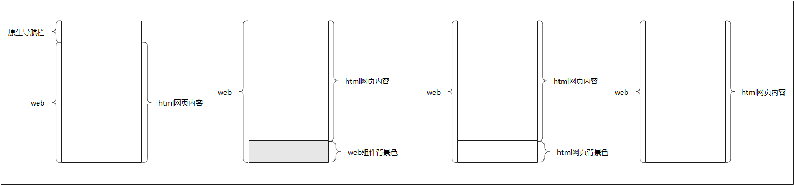

应用使用[Navigation](https://developer.huawei.com/consumer/cn/doc/harmonyos-references/ts-basic-components-navigation)等路由策略导航至Web组件页面时，在网页加载过程中，页面底部可能出现闪烁现象，这会影响用户体验。

## 闪烁原因

使用Navigation等路由策略导航至Web组件页面时，通常根据网页的回调通知判断是否隐藏系统导航栏。若决定隐藏，Web组件布局会进行调整。这一布局调整过程可简化为如下四个阶段：



图中四个状态的说明（从左至右）：

1. 将应用路由至Web页面，页面顶部为系统导航栏，底部是Web组件。在此情况下，网页能够正常加载。
2. 在网页加载过程中，系统会回调通知应用侧隐藏系统导航栏，以便切换至网页端的导航栏。此时系统导航栏被隐藏，Web组件的布局随即进行调整，页面底部最初会显露出Web组件的背景色（假设为灰色）。
3. 网页继续根据新的尺寸加载并显示，首先呈现的是HTML网页的背景色（假设为白色）。
4. 最后，网页内容完全加载，展现出完整的HTML网页内容。

在上述流程中，如果Web组件的背景色与网页背景色不同，跳转时可能会出现闪烁。闪烁的概率取决于网页的复杂度和网络状况。

## 优化方法

应用可以通过设置与网页背景色相同的Web组件的背景色，避免视觉闪烁，提升用户体验。例如，将Web组件的背景色设置为白色。

在类似情况下，如果Web组件的默认背景色为白色，而网页背景色为灰色，导航到新的Web页面时可能会出现白色闪烁。同理，将Web组件的背景色设置为灰色可以解决此问题。

以下为设置Web组件背景色的接口示例（示例中将Web组件背景色设置为灰色，若不设置，Web组件背景色默认为白色）：

```
Web({ src: $rawfile('xxx.html'),  controller: this.webController})
  .backgroundColor(Color.Gray)
```


<div class="source-link-wrapper"><a href="https://gitcode.com/HarmonyOS_Samples/guide-snippets/blob/HarmonyOS-feature-20260402/ArkWeb/ProcessWeb/entry/src/main/ets/pages/FixingPageFlickering.ets#L22-L25" target="_blank" rel="noopener noreferrer" class="source-link"><svg class="source-link-icon" width="14" height="14" viewBox="0 0 24 24" fill="none" stroke="currentColor" strokeWidth="2" strokeLinecap="round" strokeLinejoin="round">\<path d="M18 13v6a2 2 0 0 1-2 2H5a2 2 0 0 1-2-2V8a2 2 0 0 1 2-2h6" /\>\<polyline points="15 3 21 3 21 9" /\>\<line x1="10" y1="14" x2="21" y2="3" /\></svg> 查看源码：FixingPageFlickering.ets</a></div>
