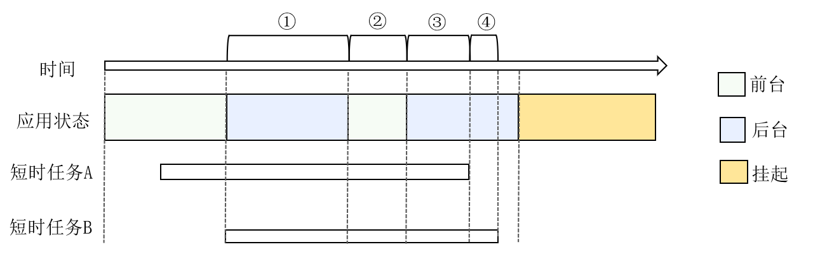

## 概述

应用退至后台一小段时间后，应用进程会被挂起，无法执行对应的任务。如果应用需在被挂起前，执行一些耗时不长的任务，如状态保存、消息发送等，可以通过本文申请短时任务，扩展应用在后台的运行时间。

## 约束与限制

* **申请时机**：应用需要在前台或[onBackground](https://developer.huawei.com/consumer/cn/doc/harmonyos-references/js-apis-app-ability-uiability#onbackground)回调内，申请短时任务，否则会申请失败。
* **数量限制**：一个应用同一时刻最多申请3个短时任务。以图1为例，在①②③时间段内的任意时刻，应用申请了2个短时任务；在④时间段内的任意时刻，应用申请了1个短时任务。
* **配额机制**：一个应用会有一定的短时任务配额（根据系统状态和用户习惯调整），单日（24小时内）配额默认为10分钟，单次配额最大为3分钟，低电量（[BatteryCapacityLevel](https://developer.huawei.com/consumer/cn/doc/harmonyos-references/js-apis-battery-info#batterycapacitylevel9)为LEVEL\_LOW）时单次配额默认为1分钟，配额消耗完后不允许再申请短时任务。同时，系统提供获取对应短时任务剩余时间的查询接口[backgroundTaskManager.getRemainingDelayTime](https://developer.huawei.com/consumer/cn/doc/harmonyos-references/js-apis-resourceschedule-backgroundtaskmanager#backgroundtaskmanagergetremainingdelaytime-1)，用以查询本次短时任务剩余时间，以确认是否继续运行其他业务。
* **配额计算**：仅当应用在后台时，对应用下的短时任务计时；同一个应用下的同一个时间段的短时任务，不重复计时。以下图为例：应用有两个短时任务A和B，在前台时申请短时任务A，应用退至后台后开始计时为①，应用进入前台②后不计时，再次进入后台③后开始计时，短时任务A结束后，由于阶段④仍然有短时任务B，所以该阶段继续计时。因此，在这个过程中，该应用短时任务总耗时为①+③+④。

  **图1** 短时任务配额计算原理图

  

  

  任务完成后，应用需主动取消短时任务，否则会影响应用当日短时任务的剩余配额。
* **超时**：短时任务即将超时时，系统会回调应用，应用需要取消短时任务。如果超时不取消，系统会对应用进行管控，包括进程挂起和进程终止。

## 接口说明

**表1** 主要接口

以下是短时任务开发使用的主要接口，更多接口及使用方式请见[后台任务管理](https://developer.huawei.com/consumer/cn/doc/harmonyos-references/js-apis-resourceschedule-backgroundtaskmanager)。

| 接口名 | 描述 |
| --- | --- |
| [requestSuspendDelay(reason: string, callback: Callback\<void\>): DelaySuspendInfo](https://developer.huawei.com/consumer/cn/doc/harmonyos-references/js-apis-resourceschedule-backgroundtaskmanager#backgroundtaskmanagerrequestsuspenddelay) | 申请短时任务。 |
| [getRemainingDelayTime(requestId: number): Promise\<number\>](https://developer.huawei.com/consumer/cn/doc/harmonyos-references/js-apis-resourceschedule-backgroundtaskmanager#backgroundtaskmanagergetremainingdelaytime-1) | 获取对应短时任务的剩余时间。 |
| [cancelSuspendDelay(requestId: number): void](https://developer.huawei.com/consumer/cn/doc/harmonyos-references/js-apis-resourceschedule-backgroundtaskmanager#backgroundtaskmanagercancelsuspenddelay) | 取消短时任务。 |

## 开发步骤

1. 导入模块。

   ```
   import { backgroundTaskManager } from '@kit.BackgroundTasksKit';
   import { BusinessError } from '@kit.BasicServicesKit';
   ```

   

<div class="source-link-wrapper"><a href="https://gitcode.com/HarmonyOS_Samples/guide-snippets/blob/HarmonyOS-feature-20260402/BackGroundTasksKit/TransientTask/entry/src/main/ets/pages/TransientTaskDialog.ets#L16-L19" target="_blank" rel="noopener noreferrer" class="source-link"><svg class="source-link-icon" width="14" height="14" viewBox="0 0 24 24" fill="none" stroke="currentColor" strokeWidth="2" strokeLinecap="round" strokeLinejoin="round">\<path d="M18 13v6a2 2 0 0 1-2 2H5a2 2 0 0 1-2-2V8a2 2 0 0 1 2-2h6" /\>\<polyline points="15 3 21 3 21 9" /\>\<line x1="10" y1="14" x2="21" y2="3" /\></svg> 查看源码：TransientTaskDialog.ets</a></div>

2. 申请短时任务并实现回调。此处回调在短时任务即将结束时触发，与应用的业务功能不耦合，短时任务申请成功后，正常执行应用本身的任务。

   ```
   let id: number = -1;         // 申请短时任务ID
   let delayTime: number;  // 本次申请短时任务的剩余时间

   // 申请短时任务
   function requestSuspendDelay() {
     let myReason = 'test requestSuspendDelay';   // 申请原因
     try {
       let delayInfo = backgroundTaskManager.requestSuspendDelay(myReason, () => {
         // 回调函数。应用申请的短时任务即将超时，通过此函数回调应用，执行一些清理和标注工作，并取消短时任务
         console.info('suspend delay task will timeout');
         try {
           backgroundTaskManager.cancelSuspendDelay(id);
         } catch (error) {
           console.error(`Operation requestSuspendDelay failed. code is ${(error as BusinessError).code} message is ${(error as BusinessError).message}`);
         }
       })
       id = delayInfo.requestId;
       delayTime = delayInfo.actualDelayTime;
       console.info(`Operation requestSuspendDelay success. id is ${id} delayTime is ${delayTime}`);
     } catch (error) {
       console.error(`Operation requestSuspendDelay failed. code is ${(error as BusinessError).code} message is ${(error as BusinessError).message}`);
     }
   }
   ```

   

<div class="source-link-wrapper"><a href="https://gitcode.com/HarmonyOS_Samples/guide-snippets/blob/HarmonyOS-feature-20260402/BackGroundTasksKit/TransientTask/entry/src/main/ets/pages/TransientTaskDialog.ets#L21-L45" target="_blank" rel="noopener noreferrer" class="source-link"><svg class="source-link-icon" width="14" height="14" viewBox="0 0 24 24" fill="none" stroke="currentColor" strokeWidth="2" strokeLinecap="round" strokeLinejoin="round">\<path d="M18 13v6a2 2 0 0 1-2 2H5a2 2 0 0 1-2-2V8a2 2 0 0 1 2-2h6" /\>\<polyline points="15 3 21 3 21 9" /\>\<line x1="10" y1="14" x2="21" y2="3" /\></svg> 查看源码：TransientTaskDialog.ets</a></div>

3. 获取短时任务剩余时间。查询本次短时任务的剩余时间，用以判断是否继续运行其他业务，例如应用有两个小任务，在执行完第一个小任务后，可以判断本次短时任务是否还有剩余时间从而决定是否执行第二个小任务。

   ```
   async function getRemainingDelayTime() {
     backgroundTaskManager.getRemainingDelayTime(id).then((res: number) => {
       console.info(`Succeeded in getting remaining delay time. time is ${res}`);
     }).catch((err: BusinessError) => {
       console.error(`Failed to get remaining delay time. Code: ${err.code}, message: ${err.message}`);
     })
   }
   ```

   

<div class="source-link-wrapper"><a href="https://gitcode.com/HarmonyOS_Samples/guide-snippets/blob/HarmonyOS-feature-20260402/BackGroundTasksKit/TransientTask/entry/src/main/ets/pages/TransientTaskDialog.ets#L47-L55" target="_blank" rel="noopener noreferrer" class="source-link"><svg class="source-link-icon" width="14" height="14" viewBox="0 0 24 24" fill="none" stroke="currentColor" strokeWidth="2" strokeLinecap="round" strokeLinejoin="round">\<path d="M18 13v6a2 2 0 0 1-2 2H5a2 2 0 0 1-2-2V8a2 2 0 0 1 2-2h6" /\>\<polyline points="15 3 21 3 21 9" /\>\<line x1="10" y1="14" x2="21" y2="3" /\></svg> 查看源码：TransientTaskDialog.ets</a></div>

4. 取消短时任务。

   ```
   function cancelSuspendDelay() {
     try {
       backgroundTaskManager.cancelSuspendDelay(id);
       console.info('Operation cancelSuspendDelay Succeeded.');
     } catch (error) {
       console.error(`Operation cancelSuspendDelay failed. code is ${(error as BusinessError).code} message is ${(error as BusinessError).message}`);
     }
   }
   ```

   

<div class="source-link-wrapper"><a href="https://gitcode.com/HarmonyOS_Samples/guide-snippets/blob/HarmonyOS-feature-20260402/BackGroundTasksKit/TransientTask/entry/src/main/ets/pages/TransientTaskDialog.ets#L57-L66" target="_blank" rel="noopener noreferrer" class="source-link"><svg class="source-link-icon" width="14" height="14" viewBox="0 0 24 24" fill="none" stroke="currentColor" strokeWidth="2" strokeLinecap="round" strokeLinejoin="round">\<path d="M18 13v6a2 2 0 0 1-2 2H5a2 2 0 0 1-2-2V8a2 2 0 0 1 2-2h6" /\>\<polyline points="15 3 21 3 21 9" /\>\<line x1="10" y1="14" x2="21" y2="3" /\></svg> 查看源码：TransientTaskDialog.ets</a></div>
