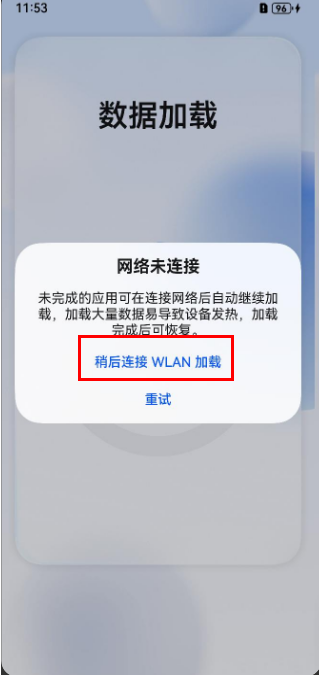
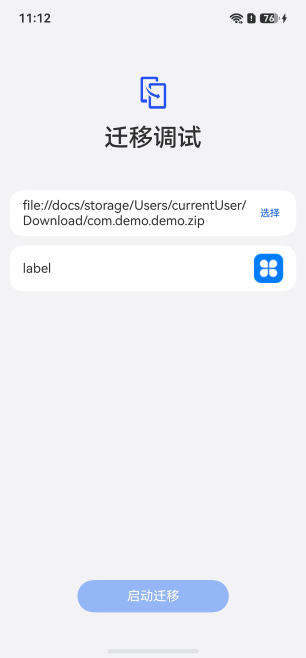

## 应用数据迁移暂停

**问题现象1**

在数据加载界面，应用数据迁移暂停。

**可能原因**

应用数据迁移的过程中需要使用到网络，当前终端设备网络不可用，导致数据迁移暂停。

**解决方法**

单击“稍后连接WLAN加载”按钮，进入桌面后连接网络，终端设备网络可用后，恢复应用数据迁移。

**问题现象2**

进入桌面之后，若应用数据迁移还未结束，可通过通知栏进入应用加载界面查看加载进度

在应用加载界面，应用数据迁移暂停。

**可能原因**

应用数据迁移的过程中需要使用到网络，当前终端设备网络不可用，导致数据迁移暂停。

**解决方法**

单击“稍后连接WLAN加载”按钮，进入桌面后连接网络，终端设备网络可用后，恢复应用数据迁移。

## 应用数据迁移执行十五分钟后失败

**问题现象**

应用数据迁移执行十五分钟后显示失败。

**可能原因**

单个应用数据迁移执行超过十五分钟，超过设定的单个应用最长数据迁移时间，任务执行失败。

**解决方法**

请优化应用BackupExtensionAbility的代码实现，在十五分钟内完成应用数据迁移。

已接入“数据迁移框架”的应用完成数据迁移后，才可以被消费者使用。尽可能快的完成应用数据迁移，可以带给消费者更好的体验。

## 启动迁移按钮无法点击

**问题现象**

在迁移调试界面，输入应用包名后启动迁移按钮无法点亮。

**可能原因**

迁移调试工具版本过低（版本号低于6.0.0.190）。

**解决方法**

请参考[开发者自验证](/docs/dev/app-dev/application-framework/core-file-kit/app-file/app-file-backup-restore/app-data-migration-guidelines/adaptation-process#开发者自验证)下“迁移调试”工具获取方式，申请最新版迁移调试工具。
