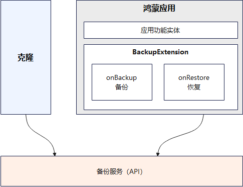

## 简介

用户在日常换机过程中，需要将一台设备的数据备份并发送到另一台设备上进行恢复，以完成跨设备的数据迁移，此时需要使用克隆工具（"数据克隆"应用）。接入克隆工具时，应用需实现备份恢复接口[BackupExtensionAbility](https://developer.huawei.com/consumer/cn/doc/harmonyos-references/js-apis-application-backupextensionability#backupextensionability)，在onBackup中实现数据备份，在onRestore中实现数据恢复。若应用未实现BackupExtensionAbility，克隆过程将仅迁移旧设备上的应用，而不迁移应用数据。

## 适配指导

API version 12开始，三方应用接入克隆只需要接入备份恢复能力即可，接入指导： **[应用接入数据备份恢复](/docs/dev/app-dev/application-framework/core-file-kit/app-file/app-file-backup-restore/app-file-backup-extension)**。
