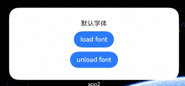

API version 22开始新增了[ohos.graphics.text.FontCollection.getLocalInstance](https://developer.huawei.com/consumer/cn/doc/harmonyos-references/js-apis-graphics-text#getlocalinstance22)接口获取本地字体集实例，应用可以通过这个本地实例为卡片加载自定义字体。

## 开发步骤

1. 创建动态卡片：按照[创建ArkTS卡片](/docs/dev/app-dev/application-framework/form-kit/arkts-ui/arkts-ui-widget-creation)里的描述创建动态卡片。
2. 在项目entry\src\main\resources\rawfile目录下添加自定义字体文件xxx.ttf。
3. 页面布局代码实现entry/src/main/ets/widget/pages/WidgetCard.ets。

   在卡片页面中布局两个按钮，点击按钮load font或按钮unload font，调用本地字体集实例的loadFontSync、unloadFontSync进行字体的加载、卸载。

```
// entry/src/main/ets/widget/pages/WidgetCard.ets
import { text } from '@kit.ArkGraphics2D';

@Entry
@Component
struct loadFontSyncCard {
  // 在这里使用getLocalInstance访问本地字体集实例
  private fc: text.FontCollection = text.FontCollection.getLocalInstance();
  @State content: string = '默认字体';

  build() {
    Column({ space: 10 }) {
      Text(this.content)
        .fontFamily('custom') // 在此处声明组件使用自定义字体
      Button('load font')
        .onClick(() => {
          // 在此处加载自定义字体文件
          this.fc.loadFontSync('custom', $rawfile('xxx.ttf'));
          this.content = '自定义字体';
        })
      Button('unload font')
        .onClick(() => {
          this.fc.unloadFontSync('custom');
          this.content = '默认字体';
        })
    }.width('100%')
    .height('100%')
    .justifyContent(FlexAlign.Center)
  }
}
```


<div class="source-link-wrapper"><a href="https://gitcode.com/HarmonyOS_Samples/guide-snippets/blob/HarmonyOS-feature-20260402/Form/CustomFontWidgetCards/entry/src/main/ets/widget/pages/WidgetCard.ets#L16-L47" target="_blank" rel="noopener noreferrer" class="source-link"><svg class="source-link-icon" width="14" height="14" viewBox="0 0 24 24" fill="none" stroke="currentColor" strokeWidth="2" strokeLinecap="round" strokeLinejoin="round">\<path d="M18 13v6a2 2 0 0 1-2 2H5a2 2 0 0 1-2-2V8a2 2 0 0 1 2-2h6" /\>\<polyline points="15 3 21 3 21 9" /\>\<line x1="10" y1="14" x2="21" y2="3" /\></svg> 查看源码：WidgetCard.ets</a></div>


* 本地字体集可加载多个自定义字体，所有字体合计最大内存限制加载20MB。
* 同一应用的所有卡片共用一个本地字体集实例。加载或卸载自定义字体后，所有卡片的字体显示会同步更新。

### 运行结果


