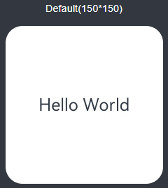
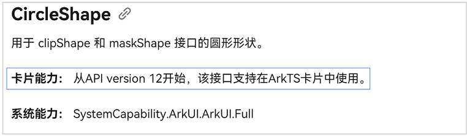

ArkTS卡片开发采用通用[ArkTS语言](https://developer.huawei.com/consumer/cn/doc/harmonyos-guides/learning-arkts)，开发者可以使用[ArkTS声明式开发范式](/docs/dev/app-dev/application-framework/arkui/arkts-ui-development/arkts-ui-development-overview)开发ArkTS卡片页面。

如下卡片页面由DevEco Studio模板自动生成，开发者可以根据自身的业务场景进行调整。

## ArkTS卡片支持的页面能力

ArkTS卡片具备JS卡片的全量能力，并且新增了动效能力和自定义绘制的能力，支持[ArkTS声明式开发范式](/docs/dev/app-dev/application-framework/arkui/arkts-ui-development/arkts-ui-development-overview)的部分组件、事件、动效、数据管理、状态管理能力。

对于支持在ArkTS卡片UI界面中使用的接口，会添加“卡片能力”的标记，如：从API version 12开始，该接口支持在ArkTS卡片中使用。同时请留意卡片场景下的能力差异说明。

例如：以下说明表示CircleShape可在ArkTS卡片中使用。

