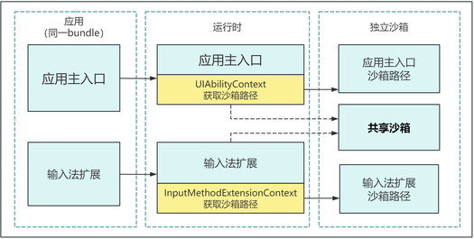
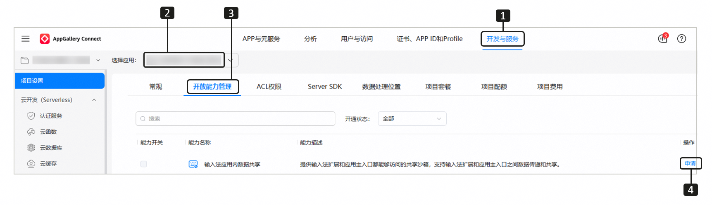
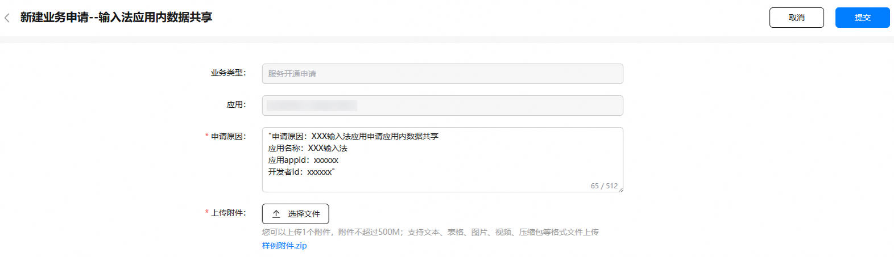
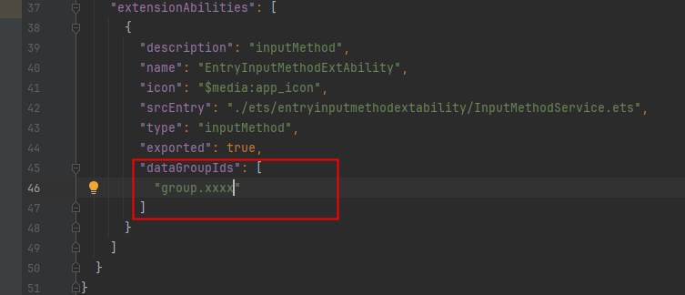

为了保护用户数据安全，系统增加了输入法安全模式功能，包括基础模式和完整体验模式。在基础模式下，输入法扩展无法调用任何可能涉及访问或泄漏用户隐私数据的系统能力；而在完整体验模式下，则没有该限制。

用户可以在设置应用中切换基础模式和完整体验模式。

## 基础模式介绍

1. 基础模式下，输入法扩展（InputMethodExtensionAbility）进程无法拉起其他UIAbility或ExtensionAbility。
2. 基础模式下，输入法扩展会受到系统管控，不能使用涉及访问或泄漏用户个人数据的各种接口，同时无法将数据传递出进程。管控功能包括但不限于：网络、短信、电话、麦克风、定位、相机、蓝牙、壁纸、支付、日历、游戏、扬声器、Wi-Fi、剪切板、多媒体、联系人、公共事件、系统账号、健康数据、地图服务、推送服务、融合搜索、共享内存、分布式特性、广告设备标识、振动等。
3. 基础模式下，输入法扩展可以使用基础输入功能必要的系统能力，例如，IME Kit、ArkUI、窗口、图形、屏幕管理等。
4. 基础模式下，输入法扩展对[共享沙箱](#共享沙箱介绍)只读，对输入法扩展独立沙箱可读写；应用主入口可以对[共享沙箱](#共享沙箱介绍)及其独立沙箱读写。

## 完整体验模式介绍

1. 完整体验模式下，输入法扩展不受基础模式相关限制，例如可以拉起其他UIAbility或ExtensionAbility、以调用访问用户数据的接口等。
2. 完整体验模式下，输入法扩展可以对[共享沙箱](#共享沙箱介绍)读写。

## 开发指导

[onCreate](https://developer.huawei.com/consumer/cn/doc/harmonyos-references/js-apis-inputmethod-extension-ability#oncreate)在输入法扩展的 [onCreate](https://developer.huawei.com/consumer/cn/doc/harmonyos-references/js-apis-inputmethod-extension-ability#oncreate)生命周期回调函数中通过[getSecurityMode](https://developer.huawei.com/consumer/cn/doc/harmonyos-references/js-apis-inputmethodengine#getsecuritymode11)接口查询当前输入法应用的安全模式。

* 如果当前处于基础模式，开发者需要调整内部功能的呈现情况，以避免出现功能不可用的情况。
* 当处于完整体验模式时，开发者可以使用访问用户数据的接口，但这些接口的使用仅限于提升输入法的用户体验。

为了确保输入法功能的稳定性，开发者应当在基础模式下仅使用与基础输入功能相关的能力，并且不得试图绕过系统机制将数据传递到输入法扩展之外。

## 共享沙箱介绍

1. 输入法扩展使用独立沙箱，与应用主入口不可互相访问对方的独立沙箱。
2. 为方便输入法扩展和应用主入口之间数据传递和共享，提供了共享沙箱机制。输入法扩展和应用主入口都能够访问共享沙箱。

   **图1** 共享沙箱

   
3. 共享沙箱的配置流程。

   当应用主入口的[profile](https://developer.huawei.com/consumer/cn/doc/app/agc-help-add-releaseprofile-0000001914714796)和输入法扩展的[dataGroupIds](https://developer.huawei.com/consumer/cn/doc/harmonyos-guides/module-configuration-file#extensionabilities标签)中包含相同的data-group-id时，他们就可以使用这个data-group-id对应的共享沙箱。

   为了使用共享沙箱，需要先申请一个data-group-id，并将其分别配置到应用主入口的[profile](https://developer.huawei.com/consumer/cn/doc/app/agc-help-add-releaseprofile-0000001914714796)和输入法扩展的[dataGroupIds](https://developer.huawei.com/consumer/cn/doc/harmonyos-guides/module-configuration-file#extensionabilities标签)中。申请与配置流程如下：

   1. 审核规则。

      1. 输入法应用安装至系统后，在系统“设置 > 系统 > 输入法”的输入法列表中可以显示该应用。
      2. InputMethodExtensionAbility所在的module.json5配置信息中，该ability在[extensionAbilities标签](https://developer.huawei.com/consumer/cn/doc/harmonyos-guides/module-configuration-file#extensionabilities标签)下配置的type字段应为inputMethod。
   2. 申请步骤。

      1. 登录[AppGallery Connect](https://developer.huawei.com/consumer/cn/service/josp/agc/index.html)，选择“开发与服务”。
      2. 在项目列表选择项目，并在应用列表下选择需要申请共享沙箱的应用。
      3. 进入“项目设置 > 开放能力管理”页面，点击“输入法应用内数据共享”对应的“申请”。

         
      4. 参考“申请原因”中的模板，提供申请必需的相关信息，包括应用名称、应用appId、开发者Id，并参考样例提供附件材料，然后点击“提交”按钮。

         

         返回“开放能力管理”页面，原“申请”变为“申请中”，1~3个工作日内反馈申请结果，请留意互动中心的“服务开通申请”信息。

         

         申请通过后，互动中心会发送通知给您，“申请中”会变为置灰显示的“申请”，同时，您将收到一个data-group-id。

         
   3. 待您收到data-group-id申请成功的回复后，重新生成[应用的profile](https://developer.huawei.com/consumer/cn/doc/app/agc-help-add-releaseprofile-0000001914714796)，新生成的profile里面包含本次申请到的data-group-id；并使用DevEco Studio[配置工程的签名信息](https://developer.huawei.com/consumer/cn/doc/harmonyos-guides/ide-publish-app#section280162182818)，将新的profile配置到工程中。
   4. 将您本次申请获取到的data-group-id，配置到InputMethodExtensionAbility所在的module.json5中的[dataGroupIds](https://developer.huawei.com/consumer/cn/doc/harmonyos-guides/module-configuration-file#extensionabilities标签)中。

   
4. 共享沙箱使用流程。

   a. 分别在输入法扩展和应用主入口通过[getGroupDir](https://developer.huawei.com/consumer/cn/doc/harmonyos-references/js-apis-inner-application-context#getgroupdir10)获取共享沙箱路径。

   

   接口入参dataGroupID应该填写您本次申请到的data-group-id。

   b. 如果接口调用成功，且能够返回共享沙箱路径，说明您申请并配置的data-group-id已生效，此时您可通过共享沙箱在应用主入口和输入法扩展之间进行数据共享。

   

   基础模式下输入法扩展对共享沙箱是只读权限，不可写入数据；完整体验模式下可读写。
