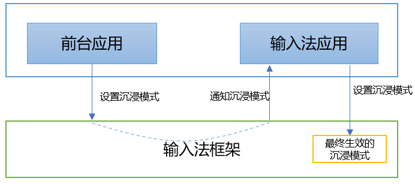

## 场景介绍

为了让应用能够提供一致的沉浸式体验，我们提供了前台应用和输入法应用之间的通信机制。通过该机制，输入法应用根据前台应用设置的沉浸模式来决定最终沉浸模式。

## 框架原理



* 前台应用根据应用场景，设置应用期望的沉浸模式。
* 输入法框架在拉起输入法应用时会将前台应用期望的沉浸模式传递给输入法应用。
* 输入法应用根据前台应用的沉浸模式决定最终的沉浸模式，并设置最终沉浸模式给输入法框架。

## 接入指导

1. 前台应用[设置编辑框沉浸模式](https://developer.huawei.com/consumer/cn/doc/harmonyos-references/ts-basic-components-textarea#keyboardappearance15)。示例代码如下。

   ```
   TextArea({placeholder: '沉浸模式'})
     .keyboardAppearance(KeyboardAppearance.IMMERSIVE)

   TextArea({placeholder: '非沉浸模式'})
     .keyboardAppearance(KeyboardAppearance.NONE_IMMERSIVE)
   ```

   

<div class="source-link-wrapper"><a href="https://gitcode.com/HarmonyOS_Samples/guide-snippets/blob/HarmonyOS-feature-20260402/InputMethod/KikaInputMethod/entry/src/main/ets/pages/PrivatePreview.ets#L125-L131" target="_blank" rel="noopener noreferrer" class="source-link"><svg class="source-link-icon" width="14" height="14" viewBox="0 0 24 24" fill="none" stroke="currentColor" strokeWidth="2" strokeLinecap="round" strokeLinejoin="round">\<path d="M18 13v6a2 2 0 0 1-2 2H5a2 2 0 0 1-2-2V8a2 2 0 0 1 2-2h6" /\>\<polyline points="15 3 21 3 21 9" /\>\<line x1="10" y1="14" x2="21" y2="3" /\></svg> 查看源码：PrivatePreview.ets</a></div>

2. 输入法应用[订阅编辑框属性变化事件](https://developer.huawei.com/consumer/cn/doc/harmonyos-references/js-apis-inputmethodengine#oneditorattributechanged10)，通过回调参数EditorAttribute中的immersiveMode字段感知前台应用期望的沉浸模式。示例代码如下。

   ```
   // 感知是否设置沉浸模式，如果是沉浸模式选择沉浸模式类型
   inputMethodEngine.getKeyboardDelegate().on("editorAttributeChanged", (attr : inputMethodEngine.EditorAttribute) => {
     console.info('recv editorAttributeChanged, immersiveMode: ', attr.immersiveMode);
     if (attr.immersiveMode == 1) {
       this.panel?.setImmersiveMode(inputMethodEngine.ImmersiveMode.DARK_IMMERSIVE);
       console.info('recv editorAttributeChanged, panel:', this.panel?.getImmersiveMode());
     }
   })
   ```

   

<div class="source-link-wrapper"><a href="https://gitcode.com/HarmonyOS_Samples/guide-snippets/blob/HarmonyOS-feature-20260402/InputMethod/KikaInputMethod/entry/src/main/ets/InputMethodExtensionAbility/pages/Index.ets#L51-L62" target="_blank" rel="noopener noreferrer" class="source-link"><svg class="source-link-icon" width="14" height="14" viewBox="0 0 24 24" fill="none" stroke="currentColor" strokeWidth="2" strokeLinecap="round" strokeLinejoin="round">\<path d="M18 13v6a2 2 0 0 1-2 2H5a2 2 0 0 1-2-2V8a2 2 0 0 1 2-2h6" /\>\<polyline points="15 3 21 3 21 9" /\>\<line x1="10" y1="14" x2="21" y2="3" /\></svg> 查看源码：Index.ets</a></div>

3. 输入法应用[设置沉浸模式](https://developer.huawei.com/consumer/cn/doc/harmonyos-references/js-apis-inputmethodengine#setimmersivemode15)。

   * IMMERSIVE表示沉浸模式由输入法应用决定。
   * 输入法应用不能设置IMMERSIVE模式给输入法框架。
   * 如果输入法应用收到前台应用期望的沉浸模式为IMMERSIVE，建议输入法应用根据当前系统所处颜色模式，将最终沉浸模式设置为浅色沉浸模式（LIGHT\_IMMERSIVE）或深色沉浸模式（DARK\_IMMERSIVE）。

   设置沉浸模式，示例代码如下。setImmersiveMode接口需使用[createPanel](https://developer.huawei.com/consumer/cn/doc/harmonyos-references/js-apis-inputmethodengine#createpanel10)获取到Panel实例后，通过实例调用。

   ```
   // 感知是否设置沉浸模式，如果是沉浸模式选择沉浸模式类型
   inputMethodEngine.getKeyboardDelegate().on("editorAttributeChanged", (attr : inputMethodEngine.EditorAttribute) => {
     console.info('recv editorAttributeChanged, immersiveMode: ', attr.immersiveMode);
     if (attr.immersiveMode == 1) {
       this.panel?.setImmersiveMode(inputMethodEngine.ImmersiveMode.DARK_IMMERSIVE);
       console.info('recv editorAttributeChanged, panel:', this.panel?.getImmersiveMode());
     }
   })
   ```

   

<div class="source-link-wrapper"><a href="https://gitcode.com/HarmonyOS_Samples/guide-snippets/blob/HarmonyOS-feature-20260402/InputMethod/KikaInputMethod/entry/src/main/ets/InputMethodExtensionAbility/pages/Index.ets#L51-L62" target="_blank" rel="noopener noreferrer" class="source-link"><svg class="source-link-icon" width="14" height="14" viewBox="0 0 24 24" fill="none" stroke="currentColor" strokeWidth="2" strokeLinecap="round" strokeLinejoin="round">\<path d="M18 13v6a2 2 0 0 1-2 2H5a2 2 0 0 1-2-2V8a2 2 0 0 1 2-2h6" /\>\<polyline points="15 3 21 3 21 9" /\>\<line x1="10" y1="14" x2="21" y2="3" /\></svg> 查看源码：Index.ets</a></div>
