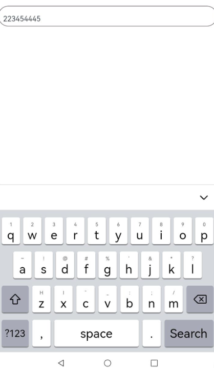

在输入法框架中，可以通过[getController](https://developer.huawei.com/consumer/cn/doc/harmonyos-references/js-apis-inputmethod#inputmethodgetcontroller9)方法获取到[InputMethodController](https://developer.huawei.com/consumer/cn/doc/harmonyos-references/js-apis-inputmethod#inputmethodcontroller)实例来绑定输入法并监听输入法应用的各种操作，比如插入、删除、选择、光标移动等。这样就可以在自绘编辑框中使用输入法，并实现更加灵活和自由的编辑操作。

## 开发步骤

1. 开发者在自绘编辑框中使用输入法时，首先需要在DevEco Studio工程中新建一个ets文件，命名为自定义控件的名称，本示例中命名为CustomInput，在文件中定义一个自定义控件，并从@kit.IMEKit中导入inputMethod。

   ```
   import { inputMethod } from '@kit.IMEKit';

   @Component
   export struct CustomInput {
     build() {
     }
   }
   ```
2. 在控件中，使用Text组件作为自绘编辑框的文本显示组件，使用状态变量inputText作为Text组件要显示的内容。

   ```
   import { BusinessError } from '@kit.BasicServicesKit';
   import { inputMethod } from '@kit.IMEKit';
   import Log from '../model/Log';

   const TAG = '[Submenu]';

   @Component
   export struct CustomInput {
     @State inputText: string = ''; // inputText作为Text组件要显示的内容
     private isAttach: boolean = false;
     private inputController: inputMethod.InputMethodController = inputMethod.getController();

     build() {
       Text(this.inputText) // Text组件作为自绘编辑框的文本显示组件。
         .fontSize(16)
         .width('100%')
         .lineHeight(40)
         .id('customInput')
         .height(45)
         .border({ color: '#554455', radius: 30, width: 1 })
         .maxLines(1)
         .onBlur(() => {
           this.off();
         })
         .onClick(() => {
           this.attachAndListener(); // 点击控件
         })
     }
   ```

   

<div class="source-link-wrapper"><a href="https://gitcode.com/HarmonyOS_Samples/guide-snippets/blob/HarmonyOS-feature-20260402/InputMethod/KikaInputMethod/entry/src/main/ets/components/CustomInput.ets#L17-L46" target="_blank" rel="noopener noreferrer" class="source-link"><svg class="source-link-icon" width="14" height="14" viewBox="0 0 24 24" fill="none" stroke="currentColor" strokeWidth="2" strokeLinecap="round" strokeLinejoin="round"><path d="M18 13v6a2 2 0 0 1-2 2H5a2 2 0 0 1-2-2V8a2 2 0 0 1 2-2h6" /><polyline points="15 3 21 3 21 9" /><line x1="10" y1="14" x2="21" y2="3" /></svg> 查看源码：CustomInput.ets</a></div>

3. 在控件中获取inputMethodController实例，先在文本点击时调用controller实例的attach方法绑定和拉起软键盘，再注册监听输入法插入文本、删除等方法。本示例仅展示插入、删除。

   ```
   import { BusinessError } from '@kit.BasicServicesKit';
   import { inputMethod } from '@kit.IMEKit';
   import Log from '../model/Log';

   const TAG = '[Submenu]';

   @Component
   export struct CustomInput {
     @State inputText: string = ''; // inputText作为Text组件要显示的内容
     private isAttach: boolean = false;
     private inputController: inputMethod.InputMethodController = inputMethod.getController();

     build() {
       Text(this.inputText) // Text组件作为自绘编辑框的文本显示组件。
         .fontSize(16)
         .width('100%')
         .lineHeight(40)
         .id('customInput')
         .height(45)
         .border({ color: '#554455', radius: 30, width: 1 })
         .maxLines(1)
         .onBlur(() => {
           this.off();
         })
         .onClick(() => {
           this.attachAndListener(); // 点击控件
         })
     }
     async attachAndListener() { // 绑定和设置监听
       focusControl.requestFocus('customInput');
       try {
         await this.inputController.attach(true, {
           inputAttribute: {
             textInputType: inputMethod.TextInputType.TEXT,
             enterKeyType: inputMethod.EnterKeyType.SEARCH
           }
         });
         if (!this.isAttach) {
           this.inputController.on('insertText', (text) => {
             this.inputText += text;
           })
           this.inputController.on('deleteLeft', (length) => {
             this.inputText = this.inputText.substring(0, this.inputText.length - length);
           })
           this.isAttach = true;
         }
       } catch (err) {
         let error = err as BusinessError;
         Log.showError(TAG, `attach catch error: ${error.code} ${error.message}`);
       }
     }

     off() {
       this.isAttach = false;
       this.inputController.off('insertText');
       this.inputController.off('deleteLeft');
     }
   }
   ```

   

<div class="source-link-wrapper"><a href="https://gitcode.com/HarmonyOS_Samples/guide-snippets/blob/HarmonyOS-feature-20260402/InputMethod/KikaInputMethod/entry/src/main/ets/components/CustomInput.ets#L16-L77" target="_blank" rel="noopener noreferrer" class="source-link"><svg class="source-link-icon" width="14" height="14" viewBox="0 0 24 24" fill="none" stroke="currentColor" strokeWidth="2" strokeLinecap="round" strokeLinejoin="round"><path d="M18 13v6a2 2 0 0 1-2 2H5a2 2 0 0 1-2-2V8a2 2 0 0 1 2-2h6" /><polyline points="15 3 21 3 21 9" /><line x1="10" y1="14" x2="21" y2="3" /></svg> 查看源码：CustomInput.ets</a></div>

4. 在应用界面布局中引入该控件即可，此处假设使用界面为Index.ets和控件CustomInput.ets在同一目录下。

   ```
   CustomInput()
   ```

   

<div class="source-link-wrapper"><a href="https://gitcode.com/HarmonyOS_Samples/guide-snippets/blob/HarmonyOS-feature-20260402/InputMethod/KikaInputMethod/entry/src/main/ets/pages/PrivatePreview.ets#L121-L123" target="_blank" rel="noopener noreferrer" class="source-link"><svg class="source-link-icon" width="14" height="14" viewBox="0 0 24 24" fill="none" stroke="currentColor" strokeWidth="2" strokeLinecap="round" strokeLinejoin="round"><path d="M18 13v6a2 2 0 0 1-2 2H5a2 2 0 0 1-2-2V8a2 2 0 0 1 2-2h6" /><polyline points="15 3 21 3 21 9" /><line x1="10" y1="14" x2="21" y2="3" /></svg> 查看源码：PrivatePreview.ets</a></div>


## 示例效果图


