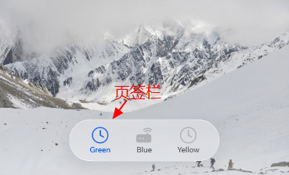
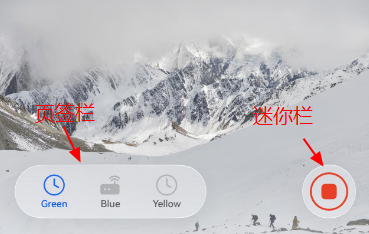
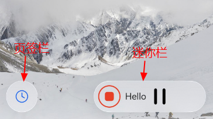

## 场景介绍

从6.1.0(23) 版本开始，新增支持设置页签栏的悬浮样式以及迷你栏。

## 页签栏

页签栏悬浮样式如下图所示：



## 迷你栏

迷你栏是新增的自定义区域，跟页签栏高度相等且水平对齐，支持展开和折叠两种样式。

迷你栏的折叠样式如下图所示：



迷你栏的展开样式如下图所示：



## 约束条件

1. 布局位置：设置[barPosition](https://developer.huawei.com/consumer/cn/doc/harmonyos-references/ui-design-hdstabs#barposition)为BarPosition.End且[vertical](https://developer.huawei.com/consumer/cn/doc/harmonyos-references/ui-design-hdstabs#vertical)为false，使页签栏置于容器底部。
2. 层级叠加：设置[barOverlap](https://developer.huawei.com/consumer/cn/doc/harmonyos-references/ui-design-hdstabs#baroverlap)为true，使TabBar悬浮于TabContent。
3. 样式限制，当前仅支持以下样式配置：
   * [BottomTabBarStyle](https://developer.huawei.com/consumer/cn/doc/harmonyos-references/ts-container-tabcontent#bottomtabbarstyle9)（底部标签栏样式）
   * [CustomBuilder](https://developer.huawei.com/consumer/cn/doc/harmonyos-references/ts-types#custombuilder8)（自定义构建器）

## 开发步骤

1. 导入相关模块。

   ```
    // 从6.0.2(22)版本开始，无需手动导入HdsTabsAttribute。具体请参考HdsTabs的导入模块说明。
    import { HdsTabs, HdsTabsAttribute, HdsTabsController, hdsMaterial } from '@kit.UIDesignKit';
   ```
2. 创建Hds一级容器组件，设置HdsTabs组件的barFloatingStyle样式，并设置barOverlap为true，vertical为false，barPosition为BarPosition.End，可实现页签栏的悬浮样式。若在barFloatingStyle中设置miniBar，则可实现迷你栏。

   ```
   @Entry
   @Component
   struct Index {
     // 初始化HdsTabs控制器。
     private controller: HdsTabsController = new HdsTabsController();

     @Builder
     miniBarBuilder() {
       Row() {
         Column() {
           Image($r('app.media.alarm_stop'))
             .width(40)
             .height(40)
             .borderRadius(40)
         }.width(48).height(48).justifyContent(FlexAlign.Center).margin({left: 4, right: 4})

         Text('Hello')

         Column() {
           Image($r('sys.media.ohos_ic_public_pause'))
             .width(40)
             .height(40)
             .borderRadius(40)
         }.width(48).height(48).justifyContent(FlexAlign.Center)
       }
     }

     build() {
       Column() {
         HdsTabs({ controller: this.controller }) {
           TabContent() {
             Scroll() {
               Column(){
                 Image($r('app.media.ocean'))
                 Image($r('app.media.desert'))
                 Image($r('app.media.mountain'))
                 Image($r('app.media.sunset'))
               }
             }
           }
           .tabBar(new BottomTabBarStyle($r('sys.media.ohos_ic_public_clock'), 'Green'))

           TabContent() {
             Image($r('app.media.ocean'))
           }
           .tabBar(new BottomTabBarStyle($r('sys.media.wifi_router_fill'), 'Blue'))

           TabContent() {
             Image($r('app.media.ocean'))
           }
           .tabBar(new BottomTabBarStyle($r('sys.media.ohos_ic_public_clock'), 'Yellow'))
         }
         // 设置barOverlap为true，vertical为false，barPosition为BarPosition.End
         .barOverlap(true)
         .barPosition(BarPosition.End)
         .vertical(false)
         // 设置页签栏悬浮样式。
         .barFloatingStyle({
           barWidth: { smallWidth: 200, mediumWidth: 300, largeWidth: 400 },
           barBottomMargin: 28,
           gradientMask: { maskColor: '#66F1F3F5', maskHeight: 92 },
           systemMaterialEffect: {
             materialType: hdsMaterial.MaterialType.IMMERSIVE,
             materialLevel: hdsMaterial.MaterialLevel.ADAPTIVE
           },
           // 设置迷你栏，若不设置，则仅有页签栏。
           miniBar: {
             miniBarBuilder: () => this.miniBarBuilder()
           }
         })
       }
     }
   }
   ```
