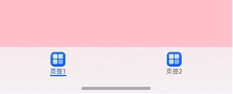
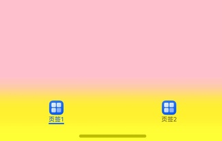

## 场景介绍

从6.0.0(20)版本开始，新增支持设置页签栏的模糊样式。

[HdsTabs](https://developer.huawei.com/consumer/cn/doc/harmonyos-references/ui-design-hdstabs)容器组件扩展支持页签栏设置直接模糊和渐变模糊效果。

* 直接模糊

  
* 渐变模糊

  

## 约束条件

1. 依赖页签栏位于容器底部，barPosition设置为BarPosition.End，vertical设置为false。
2. TabBar叠加在TabContent之上，barOverlap设置为true。
3. 去掉TabBar节点，barBackgroundBlurStyle默认设置的模糊的属性值为BlurStyle.NONE。

## 开发步骤

1. 导入相关模块。

   ```
   // 从6.0.2(22)版本开始，无需手动导入HdsTabsAttribute。具体请参考HdsTabs的导入模块说明。
   import { HdsTabs, HdsTabsAttribute, HdsTabsController } from '@kit.UIDesignKit';
   ```
2. 创建Hds一级容器组件，设置HdsTabs组件的barBackgroundStyle样式，可以自定义模糊的颜色和高度，实现渐变模糊。

   

   1. 当开发者通过Tabs组件属性barBackgroundBlurStyle设置模糊时，HdsTabs的默认模糊效果失效。
   2. 当开发者通过Tabs组件属性barBackgroundEffect设置模糊时，HdsTabs的默认模糊效果失效。
   3. 当开发者通过Tabs组件属性barBackgroundColor设置背景色时，HdsTabs的默认模糊效果只有模糊半径生效，模糊半径为80vp。

   ```
   @Entry
   @Component
   struct Index {
     private controller: HdsTabsController = new HdsTabsController();

     build() {
       Column() {
         HdsTabs({ controller: this.controller }) {
           TabContent() {
             Column().width('100%').height('100%').backgroundColor(Color.Pink)
           }
           .tabBar({ icon: $r('app.media.startIcon'), text: '页签1' })

           TabContent() {
             Column().width('100%').height('100%').backgroundColor(Color.Blue)
           }
           .tabBar({ icon: $r('app.media.startIcon'), text: '页签2' })
         }
         .barOverlap(true)
         .barPosition(BarPosition.End)
         .vertical(false)
         .barBackgroundStyle({
           maskColor: Color.Yellow,
           maskHeight: 80
         })
       }
     }
   }
   ```
