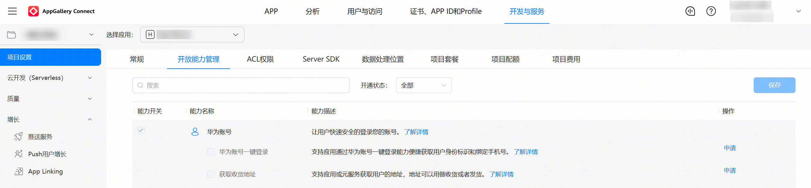

**问题现象**

调用接口报错1001502014 应用未申请scopes或permissions权限。

**可能原因**

1. 没有申请对应的账号权限。
2. 权限申请成功后，最迟会在25小时后生效。
3. 使用[获取风险等级](/docs/dev/app-dev/application-services/account-get-risklevel-introduction)能力，但未申请获取风险等级权限。

**解决措施**

1. 申请对应权限，请见[申请账号权限](/docs/dev/app-dev/application-services/account-kit-guide/account-preparations/account-config-permissions)章节。

   
2. 权限申请通过后，您可通过修改应用工程 > app.json5中的versionCode触发权限生效。

   **图1** 修改前

   

   **图2** 修改后

   
3. 确认是否需要使用获取风险等级能力，如需使用，请参考[获取风险等级](/docs/dev/app-dev/application-services/account-get-risklevel-introduction)申请对应权限。
