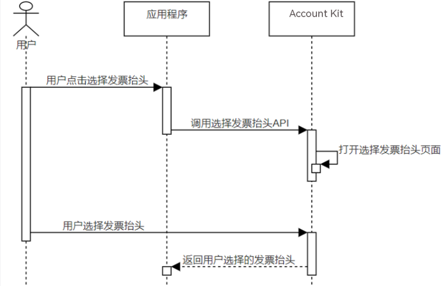

## 场景介绍

当应用需要获取用户发票抬头时，可使用Account Kit提供的发票助手能力，打开发票抬头选择页面，帮助用户快速选择或管理发票抬头。以下对Account Kit提供的发票助手能力进行介绍，获取发票抬头功能还可使用场景化控件[选择发票抬头Button](/docs/dev/app-dev/application-services/scenario-fusion-kit-guide/scenario-fusion-button/scenario-fusion-button-invoice-title)进行实现。


## 约束与限制

Wearable、TV设备暂不支持使用获取发票抬头功能。

## 业务流程



流程说明：

1. 用户需要使用发票抬头时，应用程序调用选择发票抬头API，打开华为账号发票抬头选择页。
2. 用户可以在发票抬头选择页选择已有发票抬头或者跳转到发票抬头管理页进行增加，点击确认后可将选择的发票抬头返回给应用。

## 接口说明

获取发票抬头关键接口如下表所示，具体API说明详见[API参考](https://developer.huawei.com/consumer/cn/doc/harmonyos-references/account-api-invoiceassistant)。

| 接口名 | 描述 |
| --- | --- |
| [selectInvoiceTitle](https://developer.huawei.com/consumer/cn/doc/harmonyos-references/account-api-invoiceassistant#selectinvoicetitle)(context: [common.Context](https://developer.huawei.com/consumer/cn/doc/harmonyos-references/js-apis-app-ability-common#context)): Promise[InvoiceTitle](https://developer.huawei.com/consumer/cn/doc/harmonyos-references/account-api-invoiceassistant#invoicetitle) | 调用该方法打开发票抬头选择页面，使用Promise异步回调返回选择的发票抬头。 |


上述接口需在页面或自定义组件生命周期内调用。

## 开发前提

在进行代码开发前，请确保已按照“开发准备”章节中的指导完成[配置签名和指纹](/docs/dev/app-dev/application-services/account-kit-guide/account-preparations/account-sign-fingerprints)、[配置Client ID](/docs/dev/app-dev/application-services/account-client-id)。此场景无需申请账号权限。

## 开发步骤

1. 导入[invoiceAssistant](https://developer.huawei.com/consumer/cn/doc/harmonyos-references/account-api-invoiceassistant)模块及相关公共模块。

   ```
   import { invoiceAssistant } from '@kit.AccountKit';
   import { hilog } from '@kit.PerformanceAnalysisKit';
   import { BusinessError } from '@kit.BasicServicesKit';
   ```
2. 调用[selectInvoiceTitle](https://developer.huawei.com/consumer/cn/doc/harmonyos-references/account-api-invoiceassistant#selectinvoicetitle)方法选择发票抬头页面。

   ```
   // 执行请求
   if (canIUse('SystemCapability.HuaweiID.InvoiceAssistant')) {
     try {
       // 此示例为代码片段，实际需在自定义组件实例中使用，并传入有效的Context上下文对象
       invoiceAssistant.selectInvoiceTitle(this.getUIContext().getHostContext())
         .then((data: invoiceAssistant.InvoiceTitle) => {
           hilog.info(0x0000, 'testTag', 'Succeeded in selecting invoice title');
           const type: string = data.type;
           const title: string = data.title;
           const taxNumber: string = data.taxNumber;
           const companyAddress: string = data.companyAddress;
           const telephone: string = data.telephone;
           const bankName: string = data.bankName;
           const bankAccount: string = data.bankAccount;

           // 开发者处理type, title, taxNumber, companyAddress, telephone, bankName, bankAccount
           // ...

         })
         .catch((error: BusinessError<Object>) => {
           dealAllError(error);
         });
     } catch (error) {
       dealAllError(error);
     }
   } else {
     hilog.info(0x0000, 'testTag',
       'The current device does not support the invoking of the selectInvoiceTitle interface.');
   }
   ```

   ```
   // 错误处理
   function dealAllError(error: BusinessError<Object>): void {
     hilog.error(0x0000, 'testTag', `Failed to selectInvoiceTitle. Code: ${error.code}, message: ${error.message}`);
   }
   ```
