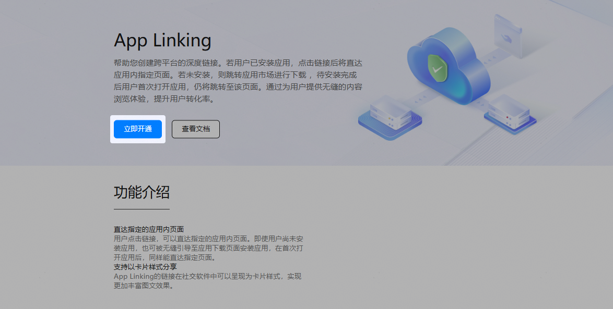
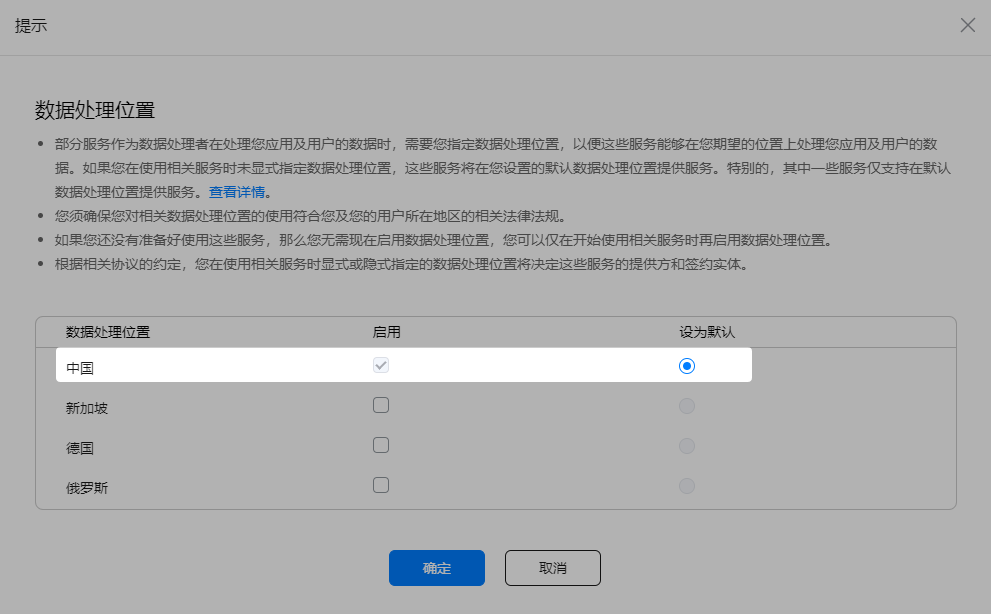

首次使用App Linking服务前，需要先开通此服务。如果已经开通，可跳过本章节。

1. 登录[AppGallery Connect](https://developer.huawei.com/consumer/cn/service/josp/agc/index.html)，点击“开发与服务”。
2. 在项目列表中点击HarmonyOS应用所在的项目。
3. 在左侧导航栏中选择“增长 > App Linking > 应用链接”或者“增长 > App Linking > 聚合链接”，进入App Linking页面，点击“立即开通”。

   
4. 如果项目此时未设置数据处理位置，请在提示框内启用数据处理位置和设置默认数据处理位置，点击“确定”。

   
