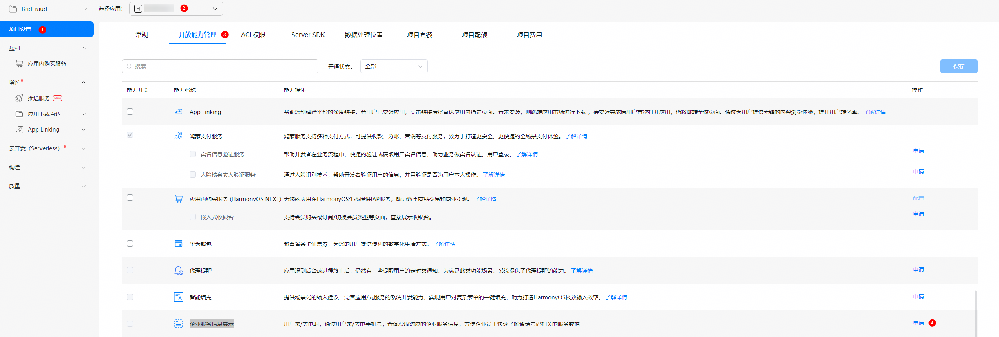

从6.1.1(24)版本开始，新增支持企业服务信息来去电页面显示。

本功能仅供企业应用开发者接入。

## 场景介绍

来去电时，通过对端手机号，查询获取对应的企业服务信息，方便企业员工快速了解通话号码相关的服务数据，例如快递员在给客户打电话或者接电话时可以显示客户的快递信息，包括单号，地址等。


来去电页面仅展示第一条企业服务信息数据，对于多个应用里同时存在数据时，按照应用包名的字典序排序，展示首个查询结果。

## 接口说明

| 接口名 | 描述 |
| --- | --- |
| [queryNumberIdentifySwitchState](https://developer.huawei.com/consumer/cn/doc/harmonyos-references/callservicekit-numberldentify#querynumberidentifyswitchstate) (context: Context):SwitchState | 查询陌生号码与信息识别总开关状态以及调用该接口的应用号码识别开关状态。 |
| [onQueryBusinessServiceData](https://developer.huawei.com/consumer/cn/doc/harmonyos-references/callservicekit-callerinfoquery-extension-ability#onquerybusinessservicedata)(phoneNumber: string): Promise\<Array<BusinessServiceData\>> | 查询企业服务信息。 |

## 申请接入

企业服务信息展示能力使用受限，如需接入，需要在AGC网站申请对应权限。

1.登录[AGC网站](https://developer.huawei.com/consumer/cn/service/josp/agc/index.html#/)，选择“开发与服务”。

2.在项目列表选择项目，并在应用列表下选择需要申请企业服务信息展示的应用。

3.进入“项目设置 > 开放能力管理”页面，点击“企业服务信息展示”对应的“申请”。



4.请根据实际业务需求在弹框中填写对应信息，完成后，点击右上角“提交”，提交后将在3个工作日内完成审核，审核结果请在[互动中心](https://developer.huawei.com/consumer/cn/service/josp/agc/index.html#/interactive)查看。


## 替换调试Profile

当企业服务信息展示能力申请成功后，需要重新[申请Profile](/docs/distribute/agc/agc-help-profile-0000002270709473/agc-help-debug-profile-0000002248181278)。并且在DevEco Studio中替换新申请的调试Profile。


在应用正式发布前，需要替换成[发布Profile](/docs/distribute/agc/agc-help-profile-0000002270709473/agc-help-release-profile-0000002248341090)。

## 开发步骤

1. 在工程内创建一个ExtensionAbility类型的自定义组件并继承[CallerInfoQueryExtensionAbility](https://developer.huawei.com/consumer/cn/doc/harmonyos-references/callservicekit-callerinfoquery-extension-ability#callerinfoqueryextensionability)，完成[onQueryBusinessServiceData](https://developer.huawei.com/consumer/cn/doc/harmonyos-references/callservicekit-callerinfoquery-extension-ability#onquerybusinessservicedata)方法的复写。

   

   由于调用[onQueryBusinessServiceData](https://developer.huawei.com/consumer/cn/doc/harmonyos-references/callservicekit-callerinfoquery-extension-ability#onquerybusinessservicedata)方法时，系统先创建应用的AbilityStage实例，请勿在AbilityStage中添加过于复杂耗时的逻辑，避免调用超时。

   代码示例：

   ```
   import { CallerInfoQueryExtensionAbility, numberIdentify } from '@kit.CallServiceKit';

   export default class EntryBusinessServiceDataQueryExtAbility extends CallerInfoQueryExtensionAbility {
     // 来去电时由系统通话应用主动调用该接口查询企业联系人信息
     async onQueryBusinessServiceData(phoneNumber: string): Promise<Array<numberIdentify.BusinessServiceData>> {
       return new Promise<Array<numberIdentify.BusinessServiceData>>((resolve, reject) => {
         let isSuccess = true;
         // 在此处实现根据号码查询企业服务信息的业务逻辑
         if (isSuccess) {
           // 查询成功，返回结果
           resolve([{
             type: numberIdentify.BusinessServiceType.DELIVERY,
             delivery: {
               customerName: "xxxx",
               deliveryNumber: "xxxx",
               deliveryStatus: "xxxx",
               deliveryAddress: "xxxx",
               deliveryTimeout: "xxxx",
               deliveryStatusColor: numberIdentify.DeliveryStatusColor.GREEN
             }
           }]);
         } else {
           // 查询失败，返回错误原因
           reject("error reason");
         }
       });
     }
   }
   ```
2. 在应用配置文件module.json5中注册extensionAbilities，具体详见[module.json5配置](/docs/dev/app-dev/getting-started/dev-fundamentals/module-configuration-file)。

   配置文件示例：

   ```
   {
       "extensionAbilities": [
         {
           "name": "EntryBusinessServiceDataQueryExtAbility",
           "srcEntry": "./ets/businessservicedataquery/EntryBusinessServiceDataQueryExtAbility.ets",
           "type": "callerInfoQuery"
         }
       ]
   }
   ```

   * type标签需设为"callerInfoQuery"，表示该拓展类型为CallerInfoQueryExtensionAbility。
   * srcEntry标签表示上述ExtensionAbility组件所对应的代码路径。
3. 在调试设备上，前往“电话”，点击右上角的“更多”图标，前往“设置”>“陌生号码和信息识别”，或者通过[应用跳转陌生号码和信息识别页面](/docs/dev/app-dev/application-services/callservice-enterprise-app-redirection)，打开对应陌生号码信息识别功能开关，再根据需要打开企业服务信息展示对应企业的开关，进行调试。
