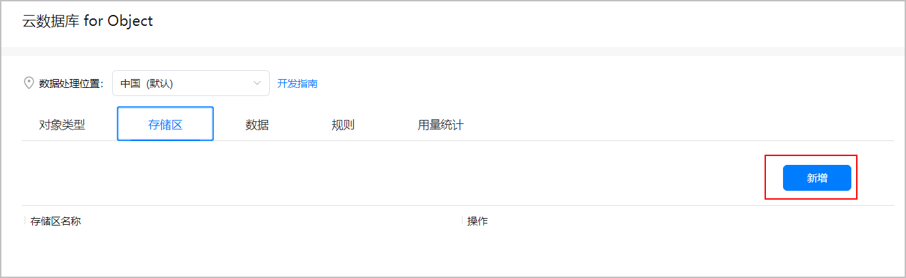
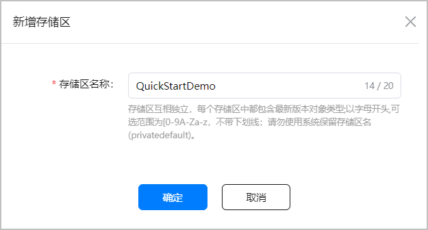

此章节以建立一个“存储区名称”为“QuickStartDemo”的存储区举例说明。

## 前提条件

已[开通云数据库服务](/docs/dev/app-dev/application-services/cloud-foundation-kit-guide/cloudfoundation-preparations/cloudfoundation-enable-database)。

## 操作步骤

1. 登录[AppGallery Connect](https://developer.huawei.com/consumer/cn/service/josp/agc/index.html)，点击“开发与服务”。
2. 在项目列表中点击需要创建存储区的项目。
3. 在左侧导航栏选择“云开发（Serverless）> 云数据库”，进入云数据库页面。
4. 点击“存储区”页签，点击“新增”。

   
5. 在“新增存储区”弹框中填写“存储区名称”为“QuickStartDemo”，点击“确定”。

   
