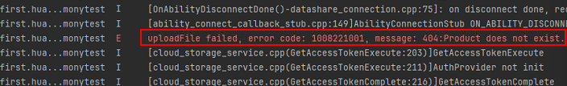

**问题现象**

使用云存储上传文件失败，HiLog提示“404:Product does not exist”。

**解决措施**

此错误由云存储服务端返回，原因是云存储服务未开通。请[开通云存储服务](https://developer.huawei.com/consumer/cn/doc/harmonyos-guides/cloudfoundation-enable-storage)。
