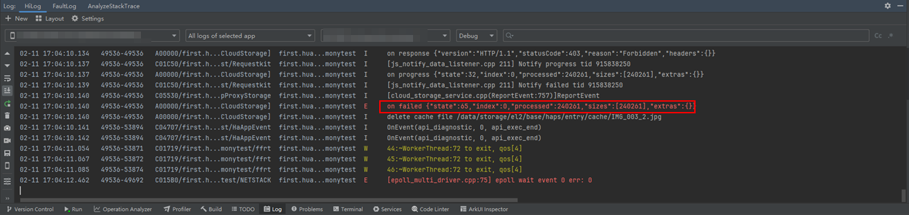
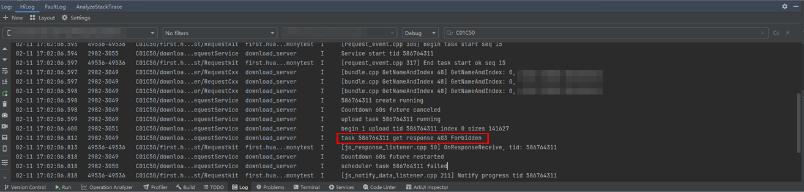

**问题现象**

使用云存储上传文件失败，出现如下错误提示：

* app日志提示“"state":65”

  
* upload进程的日志提示“403 Forbidden”（通过设置“No filters”模式、过滤“C01C50”关键字查找）

  

**解决措施**

出现此问题，可按照如下步骤排查和解决：

1. 请确认应用的签名方式正确。当前Cloud Foundation Kit支持[关联注册应用进行自动签名](/docs/tools/coding-debug/ide-signing#section20943184413328)和[手动签名](/docs/tools/coding-debug/ide-signing#section297715173233)两种方式。
2. 请确认已通过[AuthProvider](https://developer.huawei.com/consumer/cn/doc/harmonyos-references/cloudfoundation-cloudcommon#authprovider)获取用户凭据。未配置用户凭据的情况下，服务端会返回“403 Forbidden”错误。
