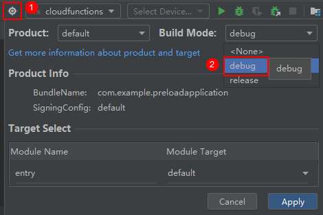
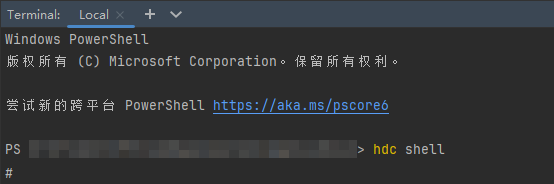
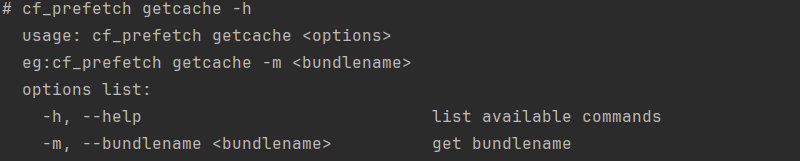
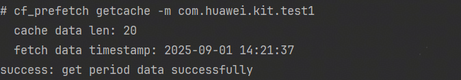
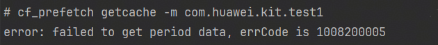
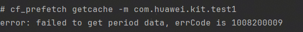
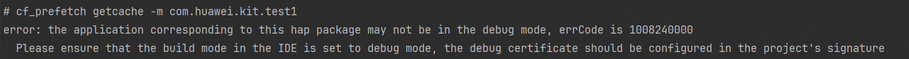

prefetch\_test\_tool是为周期性预加载功能提供的一种命令行工具，开发者集成预加载服务后，使用该工具可以更方便、更高效地进行周期性预加载功能测试和调试，提高开发效率，同时确保预加载服务的平稳运行。

当前命令行工具支持的命令集如下：

| 命令名 | 描述 |
| --- | --- |
| [getcache](#调试命令) | 提供获取周期性预加载数据的能力。 |

## 调试准备

使用命令行工具调试周期性预加载之前，需要完成以下准备工作：

* 您已在开发者联盟官网注册账号并通过实名认证，详情请参见[账号注册认证](https://developer.huawei.com/consumer/cn/doc/start/registration-and-verification-0000001053628148)。
* 您已在本地安装DevEco Studio 5.0.3 Release及以上版本。
* 手机/平板终端设备的ROM版本已升级至HarmonyOS 6.0.0 Beta5及以上版本。
* 设置HAP包的“Build Mode”为“debug”，且已[申请调试证书](https://developer.huawei.com/consumer/cn/doc/app/agc-help-debug-cert-0000002283256797)。

  

## 切换shell环境

prefetch\_test\_tool命令行工具基于hdc shell调试，需要切换到hdc shell命令环境。

1. PC连接调试设备。连接方式请根据实际情况选择，详情请参见[设备连接管理](https://developer.huawei.com/consumer/cn/doc/harmonyos-guides/hdc#设备连接管理)。
2. 打开DevEco Studio，菜单栏选择“View > Tool Windows > Terminal”进入Terminal窗口。

   
3. 输入hdc shell，切换到hdc shell命令环境。切换过程中如果出现报错，请参见[常见问题](https://developer.huawei.com/consumer/cn/doc/harmonyos-guides/hdc#常见问题)排查解决。

   

## 调试命令

命令名“getcache”，提供获取周期性预加载数据的能力。

### 命令格式

```
cf_prefetch getcache -m <bundlename>
```

### 命令选项

| 命令选项 | 必填(M)/选填(O) | 描述 | 示例 |
| --- | --- | --- | --- |
| -m | M | 应用包名。此处的包名需要与您在AppGallery Connect中创建应用时配置的包名保持一致。 | cf\_prefetch getcache -m com.huawei.hms.xs.test |

## 调用示例

### 正常场景

* 输入cf\_prefetch help，获取命令行工具的使用说明。

  
* 输入cf\_prefetch getcache -h，获取getcache命令支持的参数信息。

  
* 输入cf\_prefetch getcache -m \<bundlename\>，立即向云侧请求获取一次周期性预加载数据。

  

  

  如果返回结果中的“fetch data timestamp”不是当前时间，则表示仍为上一次成功拉取数据的时间戳，此次数据拉取失败，请参见[异常场景](#异常场景)排查。

### 异常场景

* 链路不通，例如无网络情况；或周期性预加载配置不正确。

  
* 命令行工具内部错误。

  
* HAP包非debug调试模式。

  
* 应用包名输入错误。

  
