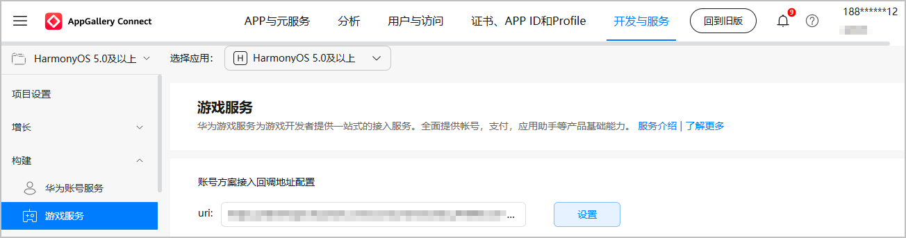

若在关键事件发生时，华为游戏服务器向开发者服务器发送事件通知，请前往AppGallery Connect配置开发者服务器的回调地址。发送通知的接口原型等信息请参见[解绑账号通知](https://developer.huawei.com/consumer/cn/doc/harmonyos-references/gameservice-unbindplayer-notification)接口。涉及的关键事件及对应的处理逻辑如下：

| 关键事件 | 游戏自行实现的处理逻辑 |
| --- | --- |
| 玩家注销华为账号。 | 清理账号数据。 |

在AppGallery Connect配置服务器的回调地址步骤如下：

1. 登录[AppGallery Connect](https://developer.huawei.com/consumer/cn/service/josp/agc/index.html)，在“开发与服务”下选择项目及项目下的游戏。
2. 左侧菜单选择“构建 > 游戏服务”，在“账号方案接入回调地址配置”配置开发者服务器地址，用于华为游戏服务器在发生关键事件时向该地址发送事件通知。

   

   

   回调地址要求支持HTTPS协议，且具有合法商用证书。
