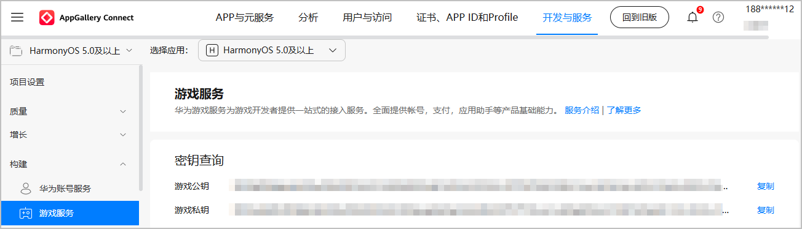

在开发者服务器加签或验签时，请开发者前往AppGallery Connect获取游戏私钥或游戏公钥。

1. 登录[AppGallery Connect](https://developer.huawei.com/consumer/cn/service/josp/agc/index.html)，在“开发与服务”下选择项目及项目下的游戏。
2. 选择“构建 > 游戏服务”，记录下游戏密钥信息。若需要刷新密钥信息，请通过[在线提单](https://developer.huawei.com/consumer/cn/support/feedback/#/add/101704353566310877?level2=101704353626565886&level3=101704354579010004&keyWord=Game Service Kit)方式联系华为工作人员。

   
