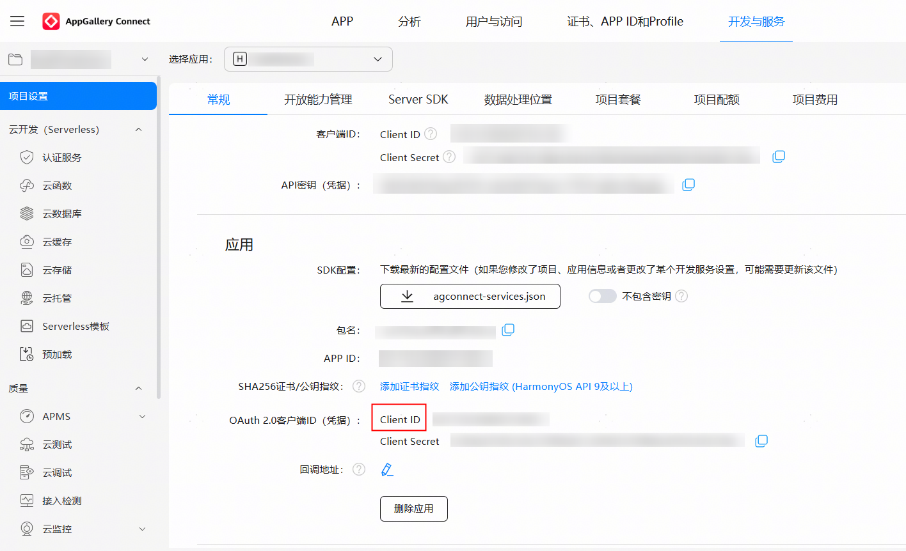

1. 登录[AppGallery Connect](https://developer.huawei.com/consumer/cn/service/josp/agc/index.html)平台，在“开发与服务”中选择目标应用，获取“项目设置 > 常规 > 应用”的Client ID。

   
2. 在工程中entry模块的module.json5文件中，新增metadata，配置name为client\_id，value为上一步获取的Client ID的值，如下所示：

   ```
   "module": {
     "name": "xxxx",
     "type": "entry",
     "description": "xxxx",
     "mainElement": "xxxx",
     "deviceTypes": [],
     "pages": "xxxx",
     "abilities": [],
     "metadata": [ // 配置如下信息
       {
         "name": "client_id",
         "value": "xxxxxx"
       }
     ]
   }
   ```
