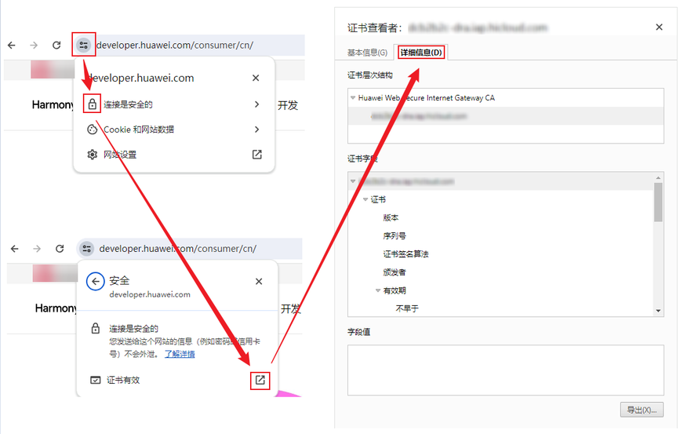
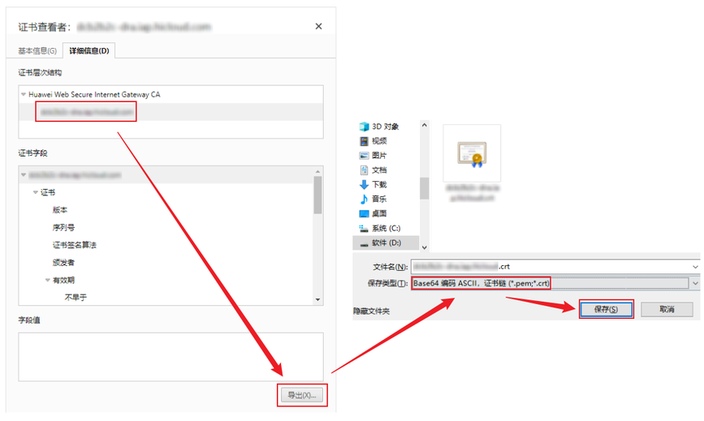
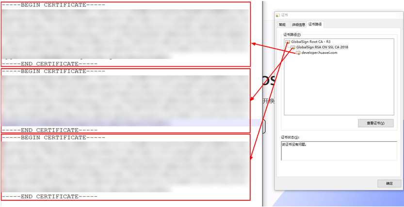

如果开发者提供的证书在IAP服务内置信任库中查询不到，则该证书不被IAP信任，需要构造完整的信任链以被IAP信任。

此处以Chrome浏览器最新版本（一般是支持自动验证证书链）为工具，以华为的证书为例，手工构造完整的证书链步骤如下：

开发者也可以选择其他证书链工具构造完整的证书链。

1. 查看服务器证书。

   访问[华为开发者网站](https://developer.huawei.com/consumer/cn/)，依次点击“查看网站信息 > 显示连接详情 > 显示证书 > 详细信息”，可查看证书状况，如下图所示：

   
2. 导出服务器证书链至文件中。

   依次点击“服务器证书 > 导出 > Base64 编码 ASCII，证书链（\*.pem;\*.crt） > 保存”，如下图所示：

   
3. 导出的证书链文件，使用文本编辑器打开.crt文件，可以看到与下图格式相似的PEM格式的证书内容，从上到下依次为“服务器证书 > 中间证书 > 根证书”，将已经拼接好的证书链返回给IAP服务器。

   
