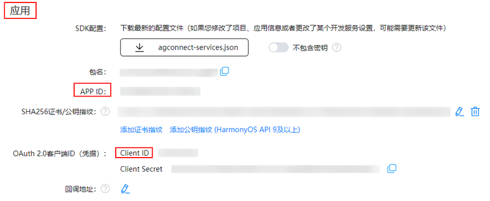

## bundleName配置

在工程“AppScope/app.json5”下的**bundleName**需要与开发者在应用开发准备中[创建应用](https://developer.huawei.com/consumer/cn/doc/harmonyos-guides/application-dev-overview#创建应用)时的包名保持一致。

配置内容示例如下：

```
{
  "app": {
    "bundleName": "com.huawei.***.***.demo",
  }
}
```

## 配置应用身份信息

1. 登录[AppGallery Connect](https://developer.huawei.com/consumer/cn/service/josp/agc/index.html)平台，在“开发与服务”中选择目标项目，通过“项目设置 > 常规 > 应用”获取目标应用的**Client ID**。

   

   * 下图中的APP ID可用于服务器API接口请求。
   * 如果开发者应用的compatibleSdkVersion>=14，则接入IAP Kit不要求开发者[添加公钥指纹](https://developer.huawei.com/consumer/cn/doc/harmonyos-guides/application-dev-overview#条件必选添加公钥指纹) 以及配置应用身份信息。

   
2. 在工程“entry/src/main/module.json5”的**module**节点增加如下**client\_id**属性配置，用于IAP Kit接口的应用身份鉴权。

   ```
   {
     "module":{
       "type": "***",
       "name": "***",
       "description": "***",
       "mainElement": "***",
       "deviceTypes": [***],
       "metadata": [
         {
           "name": "client_id",
           "value": "***"
         }
       ]
     }
   }
   ```
