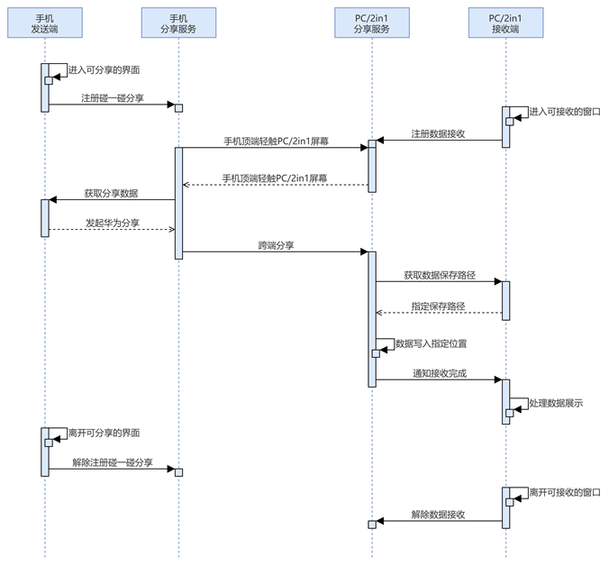
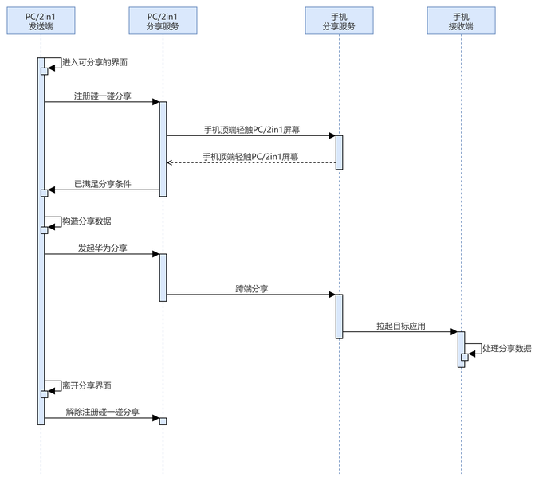
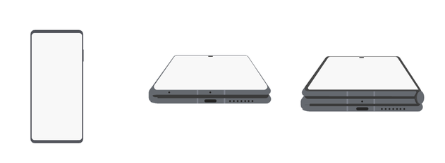
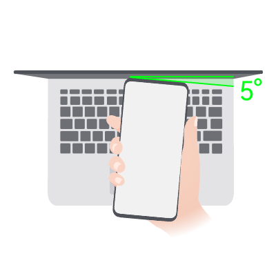
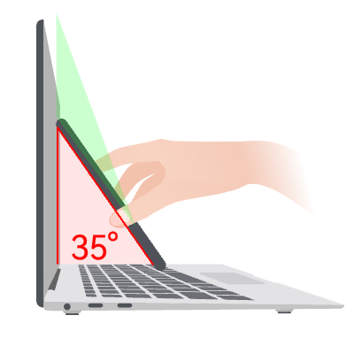
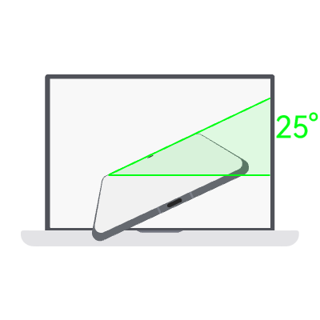
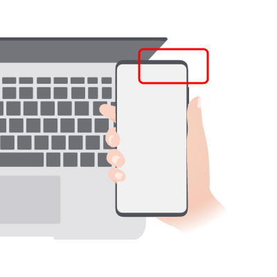

## 场景介绍

Share Kit支持Phone和PC/2in1之间的碰一碰分享。利用PC/2in1设备的屏幕感知能力，识别Phone轻碰屏幕的动作及位置，实现PC/2in1窗口级的交互。

**从6.1.0(23)版本开始，支持Phone与Tablet设备之间的碰一碰分享。**

## 业务流程

* PC/2in1设备作为数据接收端

  
* PC/2in1设备作为数据发送端

  

## 双向分享限制

从6.0.0(20) Beta5版本开始，手机与PC/2in1设备之间不支持双向分享。遵循以下机制：

* 当手机前台有可分享内容时，无论PC/2in1设备前台窗口是否有可分享内容，优先将手机作为发送端，PC/2in1设备作为接收端。
* 当手机前台无可分享内容且PC/2in1设备前台窗口有可分享内容时，PC/2in1设备作为发送端，手机作为接收端。
* 当手机前台和PC/2in1设备前台窗口均无可分享内容时，遵循无内容分享逻辑。

对于6.0.0(20) Beta3及之前的版本，当手机前台和PC/2in1设备前台窗口均有可分享内容时，支持双向分享（发送分享内容的同时也可接收到分享内容）。

## 使用约束

* 手机与PC/2in1设备间碰一碰分享需登录相同的华为账号。
* 仅支持直板手机或折叠手机直板态与PC/2in1屏幕碰一碰分享。

  
* 轻碰屏幕交互约束：

  + 手机与PC/2in1屏幕俯视夹角应≤5°。

    
  + 手机与PC/2in1屏幕侧视夹角应＞35°。

    
  + 手机与PC/2in1屏幕正视夹角应≤25°。

    
  + 手机不能超出PC/2in1设备屏幕。

    
* 支持官方手机保护壳，不支持过厚的手机外壳。

## 环境要求

* 支持的PC/2in1系统：[HarmonyOS 6.0.0 Beta1](/docs/dev/release-notes/overview-600#section1836613212578)及以上版本。
* 集成开发环境：[DevEco Studio 6.0.0 Beta1](/docs/dev/release-notes/overview-600#section1836613212578)及以上版本。

## 代码示例

* PC/2in1作为发送端接入参考：[发送分享数据](/docs/dev/app-dev/application-services/share-kit-guide/knock-share/knock-share-between-phones/knock-share-between-phones-content#发送分享数据)
* PC/2in1作为接收端接入参考：[分享内容直达应用界面](/docs/dev/app-dev/application-services/share-kit-guide/knock-share/knock-share-pc-phones/knock-share-pc-phones-sandbox)
