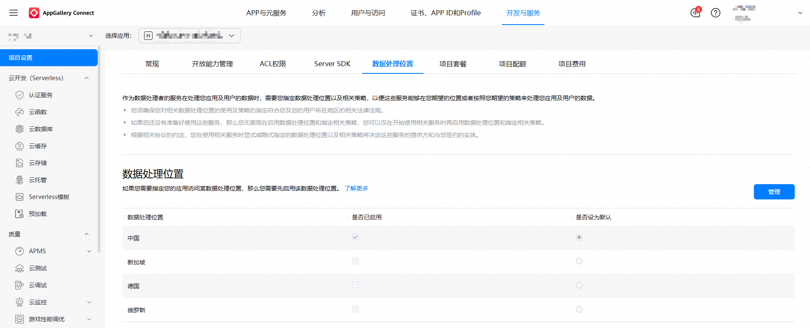

若开发者要[通过Push Kit更新实况窗](/docs/dev/app-dev/application-services/live-view-kit-guide/liveview-scenes/liveview-update-by-push)，需要设置默认数据处理位置为“中国”，否则可能导致推送消息无法正常下发，从而影响通过Push Kit更新实况窗的功能。

在“项目设置 > 数据处理位置”页面设置数据处理位置，设置步骤如下：

1. 登录[AppGallery Connect](https://developer.huawei.com/consumer/cn/service/josp/agc/index.html)，选择“开发与服务”。
2. 在项目列表中点击需要设置数据处理位置的项目。
3. 进入“项目设置 > 数据处理位置”页面，点击“管理”。
4. 在“是否已启用”栏勾选“中国”，并在“是否设为默认”栏将中国设置为默认数据处理位置。

   
5. 设置完成后，点击“保存”。

如果设置的数据处理位置与开发者的服务器位置不一致，或者设置的数据处理位置与应用所服务的用户所在地不一致，都会导致推送消息无法下发。
