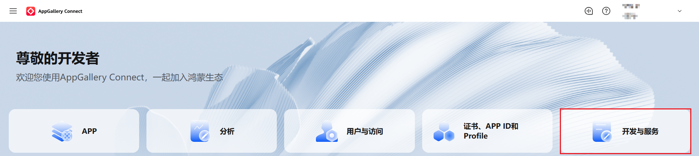
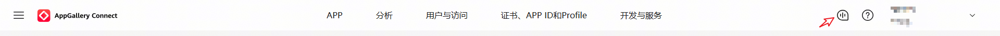
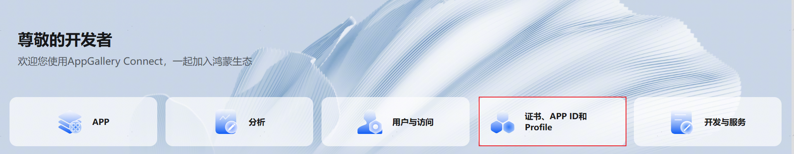
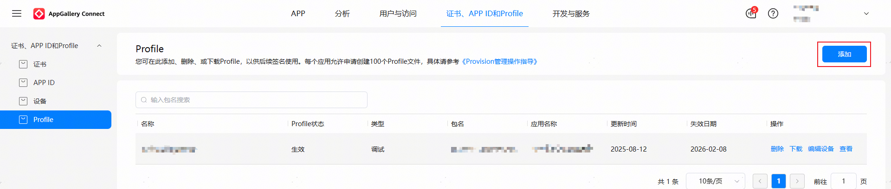
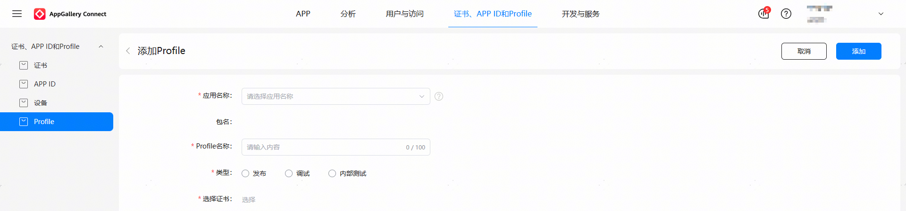

若需完成应用的实况窗接入与调测，开发者需预先开通实况窗服务权益，可依据以下操作步骤提交申请，完成服务权益开通。

## 操作步骤

1. 登录[AppGallery Connect](https://developer.huawei.com/consumer/cn/service/josp/agc/index.html)，选择“开发与服务”。

   
2. 在项目列表中找到您的项目，在项目下的应用列表中选择需要申请实况窗服务的应用。

   
3. 进入“项目设置 > 开放能力管理”页面，点击“实况窗服务”的“申请”。

   
4. 开发者可参考“申请原因”中的模板，提供申请必须的相关信息，包括场景类型、场景描述、附件，然后点击“提交”按钮。

   
5. 开发者将在5个工作日内收到实况窗服务权益申请结果，请留意互动中心的“服务开通申请”信息。

   

   
6. 实况窗服务权限通过后，开发者需在[AppGallery Connect](https://developer.huawei.com/consumer/cn/service/josp/agc/index.html)选择“证书、APP ID和Profile”，点击左侧树形菜单的“Profile”页签，在页面右上角点击“添加”按钮，重新生成Profile文件，并将其下载至本地。在“[发布应用](https://developer.huawei.com/consumer/cn/doc/harmonyos-guides/ide-publish-app)”时，将该Profile打包到应用包中。

   

   Profile文件生成请参考“[管理Profile](https://developer.huawei.com/consumer/cn/doc/app/agc-help-profile-0000002270709473)”章节，Profile文件打包到应用包中请参考“[配置签名信息](https://developer.huawei.com/consumer/cn/doc/harmonyos-guides/ide-publish-app#section280162182818)”。

   

   

   
