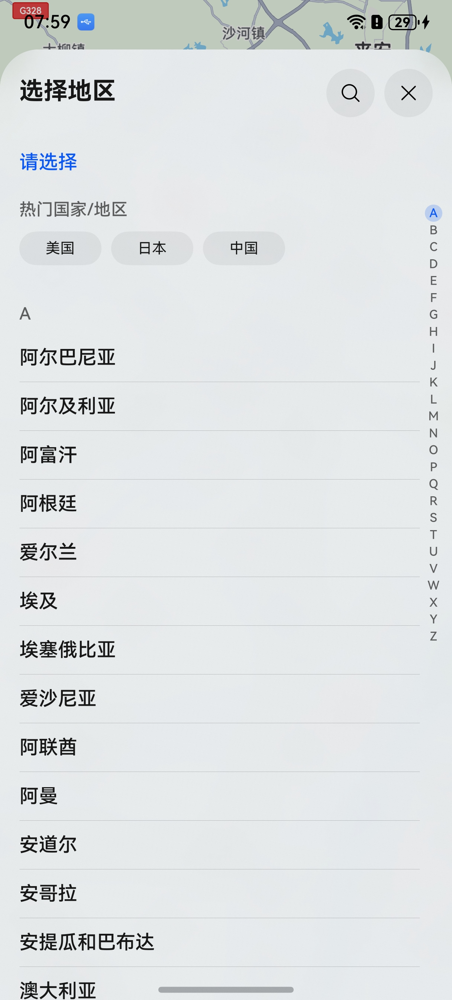
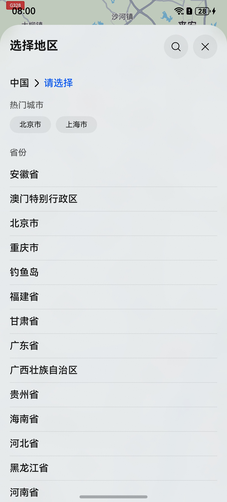
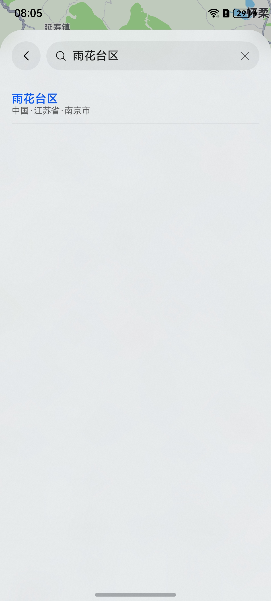
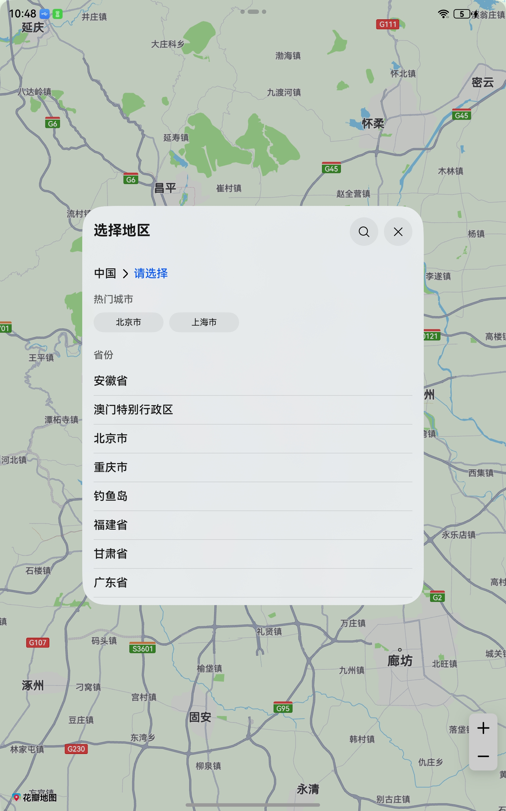

## 场景介绍

从6.1.1(24)开始，支持区划选择控件最大显示层级。

本章节将介绍如何集成区划选择控件。该控件不支持在Wearable设备中调用。

区划选择控件可加载全球或指定国家的区划信息，支持以树状结构化选择，支持功能：

* 支持查看选中区划的下级区划。
* 支持推荐热门区划。
* 支持子窗拉起区划控件，适合宽屏设备使用。

**图1** 选择国家



**图2** 选择省市



**图3** 搜索地区



**图4** 子窗拉起区划控件



## 约束与限制

使用该功能需满足以下条件：

* 仅支持手机、平板和2in1设备。

## 接口说明

区划选择控件功能主要由[sceneMap](https://developer.huawei.com/consumer/cn/doc/harmonyos-references/map-scenemap)命名空间下的[selectDistrict](https://developer.huawei.com/consumer/cn/doc/harmonyos-references/map-scenemap#selectdistrict)方法提供，更多接口及使用方法请参见[接口文档](https://developer.huawei.com/consumer/cn/doc/harmonyos-references/map-scenemap)。

| 接口名 | 描述 |
| --- | --- |
| [DistrictSelectOptions](https://developer.huawei.com/consumer/cn/doc/harmonyos-references/map-scenemap#districtselectoptions) | 区划选择页面初始选项。 |
| [selectDistrict](https://developer.huawei.com/consumer/cn/doc/harmonyos-references/map-scenemap#selectdistrict)(context: [common.Context](https://developer.huawei.com/consumer/cn/doc/harmonyos-references/js-apis-inner-application-context), options: [DistrictSelectOptions](https://developer.huawei.com/consumer/cn/doc/harmonyos-references/map-scenemap#districtselectoptions)): Promise[DistrictSelectResult](https://developer.huawei.com/consumer/cn/doc/harmonyos-references/map-scenemap#districtselectresult) | 调出区划选择页面。 |
| [DistrictSelectResult](https://developer.huawei.com/consumer/cn/doc/harmonyos-references/map-scenemap#districtselectresult) | 区划选择结果。 |

## 开发步骤

1. 导入相关模块。

   ```
   import { sceneMap } from '@kit.MapKit';
   import { BusinessError } from '@kit.BasicServicesKit';
   ```
2. 创建区划选择请求参数，调用[selectDistrict](https://developer.huawei.com/consumer/cn/doc/harmonyos-references/map-scenemap#selectdistrict)方法拉起区划选择页。

   ```
   let districtSelectOptions: sceneMap.DistrictSelectOptions = {
     countryCode: "CN",
     // 使用子窗拉起方式
     subWindowEnabled: true,
     // 区划选择控件的最大显示层级
     maxAdminLevel: 3
   };
   // 拉起区划选择页
   sceneMap.selectDistrict(this.getUIContext().getHostContext(), districtSelectOptions).then((data) => {
     console.info("SelectDistrict", "Succeeded in selecting district.");
   }).catch((err: BusinessError) => {
     console.error("SelectDistrict", `Failed to select district, code: ${err.code}, message: ${err.message}`);
   });
   ```
