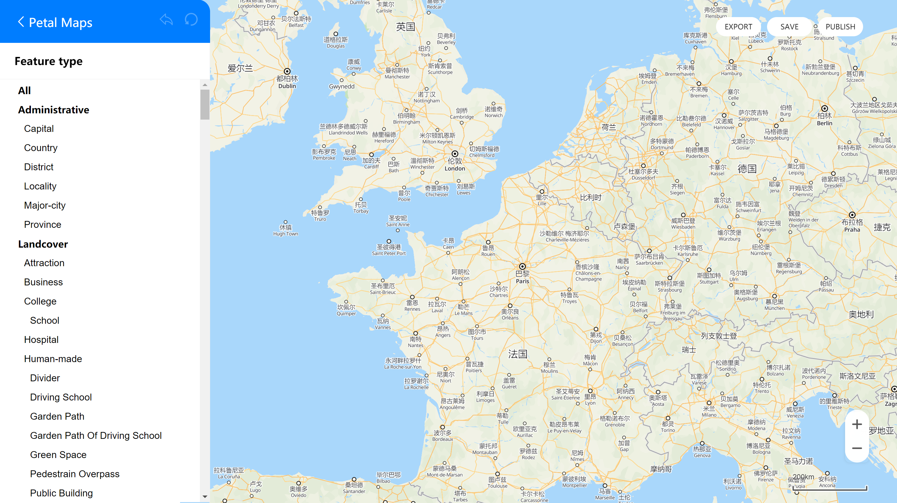
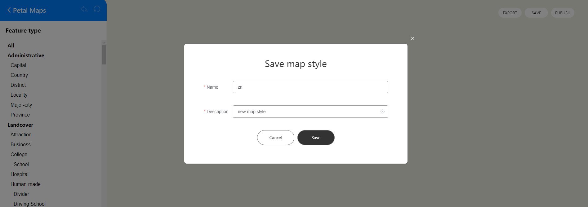
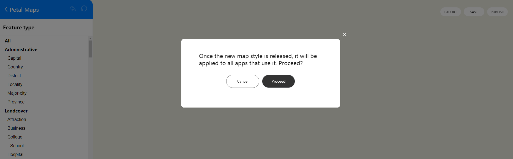

## 场景介绍

本章节将向您介绍如何在应用中添加自定义样式的地图。


## 接口说明

自定义样式功能主要由[CustomMapStyleOptions](https://developer.huawei.com/consumer/cn/doc/harmonyos-references/map-common#custommapstyleoptions)、[setCustomMapStyle](https://developer.huawei.com/consumer/cn/doc/harmonyos-references/map-map-mapcomponentcontroller#setcustommapstyle)提供，更多接口及使用方法请参见[接口文档](https://developer.huawei.com/consumer/cn/doc/harmonyos-references/map-map-mapcomponentcontroller#setcustommapstyle)。

| 接口名 | 描述 |
| --- | --- |
| [CustomMapStyleOptions](https://developer.huawei.com/consumer/cn/doc/harmonyos-references/map-common#custommapstyleoptions) | 自定义样式参数。 |
| [setCustomMapStyle](https://developer.huawei.com/consumer/cn/doc/harmonyos-references/map-map-mapcomponentcontroller#setcustommapstyle)(customMapStyleOptions: [mapCommon.CustomMapStyleOptions](https://developer.huawei.com/consumer/cn/doc/harmonyos-references/map-common#custommapstyleoptions)): Promise<void> | 将地图样式修改为自定义样式。 |

## 开发步骤

Map Kit提供两种方法设置自定义地图样式：

* 设置样式ID：使用[Petal Maps Studio](https://developer.petalmaps.com/console/studio/)管理地图样式，并使用样式ID将它们链接到您的地图上。您可以在[Petal Maps Studio](https://developer.petalmaps.com/console/studio/)上创建新样式，或导入现有样式定义。样式一旦发布，使用此样式的应用都会自动应用新样式。
* 设置样式内容：通过传入自定义JSON更改地图样式，JSON的定义参见[样式参考](#样式参考)。

### 设置样式ID

1. 导入相关模块。

   ```
   import { MapComponent, mapCommon, map } from '@kit.MapKit';
   import { AsyncCallback, BusinessError } from '@kit.BasicServicesKit';
   ```
2. 创建样式ID。

   a.登录[Petal Maps Studio](https://developer.petalmaps.com/console/studio/)。

   

   b.点击“Create map”创建自定义样式。

   

   c.导入JSON样式文件，点击“Import”。

   

   d.在编辑器里修改样式。

   

   e.点击“SAVE”生成预览ID，预览ID在编辑样式时会重新生成，您可以通过预览ID测试样式效果。点击“PUBLISH”发布生成样式ID，样式ID是唯一ID，一旦发布生效不会变化。

   

   
3. Map Kit提供两种方法设置样式ID：

   * 在创建地图后设置样式ID

     ```
     @Entry
     @Component
     struct CustomMapStyleDemo {
       private TAG = "CustomMapStyleDemo";
       private mapOptions?: mapCommon.MapOptions;
       private mapController?: map.MapComponentController;
       private callback?: AsyncCallback<map.MapComponentController>;

       aboutToAppear(): void {
         // 地图初始化参数
         this.mapOptions = {
           position: {
             target: {
               latitude: 31.984410259206815,
               longitude: 118.76625379397866
             },
             zoom: 15
           }
         };
         this.callback = async (err, mapController) => {
           if (!err) {
             this.mapController = mapController;
             // 自定义样式参数，styleId需要替换为您自己的样式ID或者预览ID，样式ID或者预览ID可在Petal Maps Studio平台上创建
             let param: mapCommon.CustomMapStyleOptions = {
                styleId: "XXX"
             };
             // 设置自定义样式
             await this.mapController.setCustomMapStyle(param).then(() => {
               console.info(this.TAG + `setCustomMapStyle OK`);
             }).catch((error: BusinessError) => {
               console.error(this.TAG + `Failed in getting CustomMapStyle, code is：${error.code},message is ${error.message}`);
             })
           } else {
             console.error(`Failed to initialize the map, code is：${err.code}, message is ${err.message}`);
           }
         };
       }

       build() {
         Stack() {
           Column() {
             MapComponent({ mapOptions: this.mapOptions, mapCallback: this.callback });
           }.width('100%')
         }.height('100%')
       }
     }
     ```
   * 在初始化地图时设置样式ID

     ```
     @Entry
     @Component
     struct CustomMapStyleDemo {
       private mapOptions?: mapCommon.MapOptions;
       private mapController?: map.MapComponentController;
       private callback?: AsyncCallback<map.MapComponentController>;

       aboutToAppear(): void {
         // 地图初始化参数
         this.mapOptions = {
           position: {
             target: {
               latitude: 31.984410259206815,
               longitude: 118.76625379397866
             },
             zoom: 15
           },
           // 自定义样式参数，styleId需要替换为您自己的样式ID或者预览ID，样式ID或者预览ID可在Petal Maps Studio平台上创建
           styleId: "XXX"
         };
         this.callback = async (err, mapController) => {
           if (!err) {
             this.mapController = mapController;
           } else {
             console.error(`Failed to initialize the map, code is：${err.code}, message is ${err.message}`);
           }
         };
       }

       build() {
         Stack() {
           Column() {
             MapComponent({ mapOptions: this.mapOptions, mapCallback: this.callback });
           }.width('100%')
         }.height('100%')
       }
     }
     ```

     设置样式ID之后效果如下：

     

### 设置样式内容

1. 导入相关模块。

   ```
   import { MapComponent, mapCommon, map } from '@kit.MapKit';
   import { AsyncCallback } from '@kit.BasicServicesKit';
   ```
2. 设置样式内容。

   ```
   @Entry
   @Component
   struct CustomMapStyleDemo {
     private mapOptions?: mapCommon.MapOptions;
     private mapController?: map.MapComponentController;
     private callback?: AsyncCallback<map.MapComponentController>;

     aboutToAppear(): void {
       // 地图初始化参数
       this.mapOptions = {
         position: {
           target: {
             latitude: 31.984410259206815,
             longitude: 118.76625379397866
           },
           zoom: 15
         }
       };
       this.callback = async (err, mapController) => {
         if (!err) {
           this.mapController = mapController;
           // 自定义样式参数
           let param: mapCommon.CustomMapStyleOptions = {
                  styleContent: `[{
                      "mapFeature": "landcover.natural",
                      "options": "geometry.fill",
                      "paint": {
                          "color": "#8FBC8F"
                      }},
                      {
                     "mapFeature": "water",
                     "options": "geometry.fill",
                     "paint": {
                         "color": "#4682B4"
                     }}]`
           };
           // 设置自定义样式
           await this.mapController.setCustomMapStyle(param);
         } else {
           console.error(`Failed to initialize the map, code is：${err.code}, message is ${err.message}`);
         }
       };
     }

     build() {
       Stack() {
         Column() {
           MapComponent({ mapOptions: this.mapOptions, mapCallback: this.callback });
         }.width('100%')
       }.height('100%')
     }
   }
   ```

   

### 样式参考

自定义地图样式JSON内容通过下列4个元素来定义地图样式：

* mapFeature：地图要素
* options：元素选项

  + geometry.fill：几何填充
  + geometry.stroke：几何描边
  + geometry.icon：几何图标
  + labels.text.fill：文本填充
  + labels.text.stroke：文本描边
* paint：绘制属性

  + color：颜色，16进制颜色，例如“#FFFF00”
  + weight：线条宽度。整型值，[1, 24]，默认为1，大于1表示加宽
  + icon-type：图标类型，目前支持night、simple、standard
* visibility：可见属性，默认为可见

  + true：可见
  + false：不可见

下列各表将向您展示支持修改的地图元素。


* 图标类型icon-type支持范围为：standard/night/simple。

1. All

   All代表全部，即所有类别的集合，支持能力范围同其他所有列表，All仅可调整visibility（可见属性）。
2. Administrative

   | **元素类型**  **Feature type** | **填充颜色**  **Geometry.**  **fill.**  **color** | **填充宽度**  **Geometry.**  **fill.**  **weight** | **描边颜色**  **Geometry.**  **stroke.**  **color** | **描边宽度**  **Geometry.**  **stroke.**  **weight** | **填充颜色**  **Labels.**  **fill.**  **color** | **文本大小**  **Labels.**  **fill.**  **weight** | **描边颜色**  **Labels.**  **stroke.**  **color** | **描边大小**  **Labels.**  **stroke.**  **weight** | **图标类型**  **Icon.**  **icon-type** |
   | --- | --- | --- | --- | --- | --- | --- | --- | --- | --- |
   | Capital  首都 | - | - | - | - |  |  |  |  |  |
   | Country  国家 |  |  |  |  |  |  |  |  | - |
   | District  区/县 | - | - | - | - |  |  |  |  |  |
   | Locality  乡村、城镇 | - | - | - | - |  |  |  |  |  |
   | Major-city  1-4级城市 | - | - | - | - |  |  |  |  |  |
   | Province  省 |  |  |  |  |  |  |  |  | - |
3. Landcover

   | 元素类型  Feature type | 填充颜色  Geometry.  fill.  color | 描边颜色  Geometry.  stroke.  color | 填充颜色  Labels.  fill.  color | 文本大小  Labels.  fill.  weight | 描边颜色  Labels.  stroke.  color | 描边大小  Labels.  stroke.  weight |
   | --- | --- | --- | --- | --- | --- | --- |
   | Attraction  游乐场、动植物园等 |  | - |  |  |  |  |
   | Business  购物中心、商业区等 |  | - |  |  |  |  |
   | College  学校 |  | - |  |  |  |  |
   | Hospital  医院 |  | - |  |  |  |  |
   | Human-made  聚集区、小区、工业区、监狱地面等 |  |  |  |  |  |  |
   | Human-made  建筑物 |  |  | - | - | - | - |
   | Natural  陆地、岛屿、海滩、冰川等 |  | - |  |  |  |  |
   | Parkland  森林、公园、荒地、高尔夫球场等 |  | - |  |  |  |  |
4. Poi

   | 元素类型  Feature type | 填充颜色  Labels.  fill.  color | 文本大小  Labels.  fill.  weight | 描边颜色  Labels.  stroke.  color | 描边大小  Labels.  stroke.  weight | 图标类型  Icon.  icon-type |
   | --- | --- | --- | --- | --- | --- |
   | Airport  飞机场 |  |  |  |  |  |
   | Automotive  汽修、充电桩、洗车等 |  |  |  |  |  |
   | Beauty  美容中心 |  |  |  |  |  |
   | Business  公司、商业楼等 |  |  |  |  |  |
   | Eating&drinking  饮食快餐 |  |  |  |  |  |
   | Health-care  医院、诊所、药店等 |  |  |  |  |  |
   | Leisure  休闲娱乐 |  |  |  |  |  |
   | Lodging  酒店、住宿点 |  |  |  |  |  |
   | Miscellaneous  自然地物 |  |  |  |  |  |
   | Natural  山峰、森林等 |  |  |  |  |  |
   | Public-service  医院、诊所、药店等 |  |  |  |  |  |
   | Railway  铁路 |  |  |  |  |  |
   | Shopping  购物中心、市场等 |  |  |  |  |  |
   | Sports-outdoor  户外运动、爬山、骑车等 |  |  |  |  |  |
   | Tourism  旅游景点、历史遗迹、教堂等 |  |  |  |  |  |
5. Road

   | 元素类型  Feature type | 填充颜色  Geometry.  fill.  color | 填充宽度  Geometry.  fill.  weight | 描边颜色  Geometry.  stroke.  color | 描边宽度  Geometry.  stroke.  weight | 填充颜色  Labels.  fill.  color | 文本大小  Labels.  fill.  weight | 描边颜色  Labels.  stroke.  color | 描边大小  Labels.  stroke.  weight | 图标类型  Icon.  icon-type |
   | --- | --- | --- | --- | --- | --- | --- | --- | --- | --- |
   | City-arterial  城市主干道 |  |  |  |  |  |  |  |  |  |
   | Highway  城市高速 |  |  |  |  |  |  |  |  |  |
   | Minor-road  市区内支线等 |  |  |  |  |  |  |  |  | - |
   | National  国道 |  |  |  |  |  |  |  |  |  |
   | Province  省道 |  |  |  |  |  |  |  |  |  |
   | Sidewalk  人行道 |  |  |  |  |  |  |  |  | - |
6. Trafficinfo

   | 元素类型  Feature type | 填充颜色  Geometry.  fill.  color | 填充颜色  Labels.  fill.  color | 文本大小  Labels.  fill.  weight |
   | --- | --- | --- | --- |
   | Closed  封路 |  |  |  |
7. Transit

   | 元素类型  Feature type | 填充颜色  Geometry.  fill.  color | 填充宽度  Geometry.  fill.  weight | 描边颜色  Geometry.  stroke.  color | 描边宽度  Geometry.  stroke.  weight | 填充颜色  Labels.  fill.  color | 文本大小  Labels.  fill.  weight | 描边颜色  Labels.  stroke.  color | 描边大小  Labels.  stroke.  weight | 图标类型  Icon.  icon-type |
   | --- | --- | --- | --- | --- | --- | --- | --- | --- | --- |
   | Airport  机场 |  | - | - | - |  |  |  |  |  |
   | Airport Runway  机场跑道 |  |  |  |  | - | - | - | - | - |
   | Airport Runway Taxiway  机场跑道滑行道 |  |  |  |  | - | - | - | - | - |
   | Bus  公交 | - | - | - | - |  |  |  |  |  |
   | Ferry-line  航线 |  | - | - | - |  |  |  |  | - |
   | Ferry-terminal  港口 |  | - | - | - |  |  |  |  |  |
   | Other  出租车、  出入口等 | - | - | - | - |  |  |  |  |  |
   | Rail-station  火车站、  高铁站 |  | - | - | - |  |  |  |  |  |
   | Railway  铁路线、  高铁线 |  |  |  |  | - | - | - | - | - |
   | Subway  地铁 |  |  |  |  |  |  |  |  |  |
   | Traffic\_light  交通灯 | - | - | - | - | - | - | - | - |  |
8. Water

   | 元素类型  Feature type | 填充颜色  Geometry.  fill.  color | 填充颜色  Labels.  fill.  color | 文本大小  Labels.  fill.  weight |
   | --- | --- | --- | --- |
   | Ocean  水系、海洋、湖泊、河流 |  |  |  |
