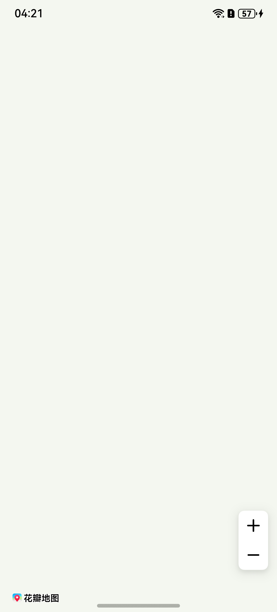
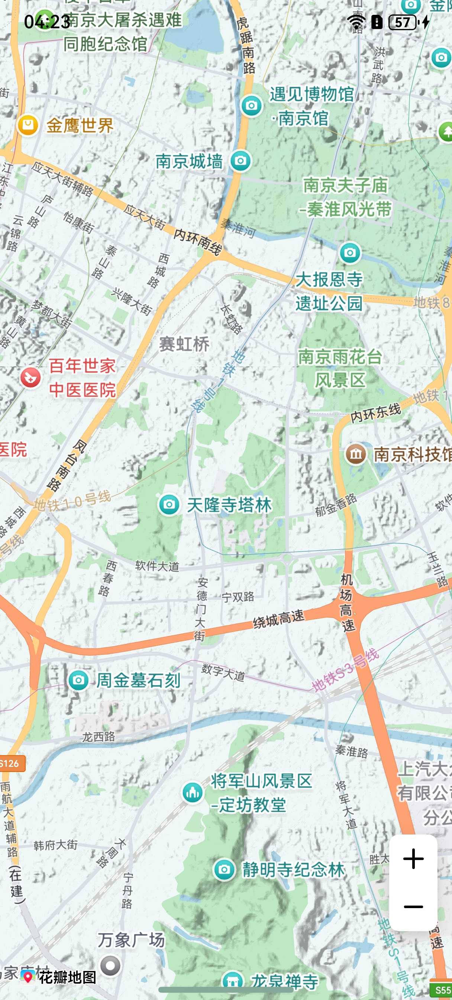
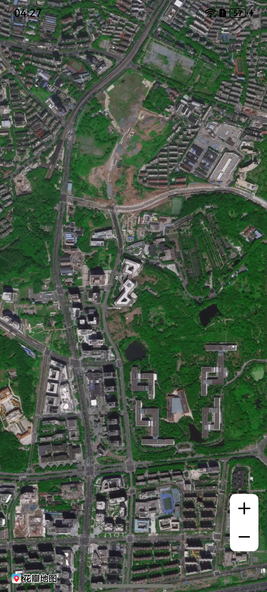
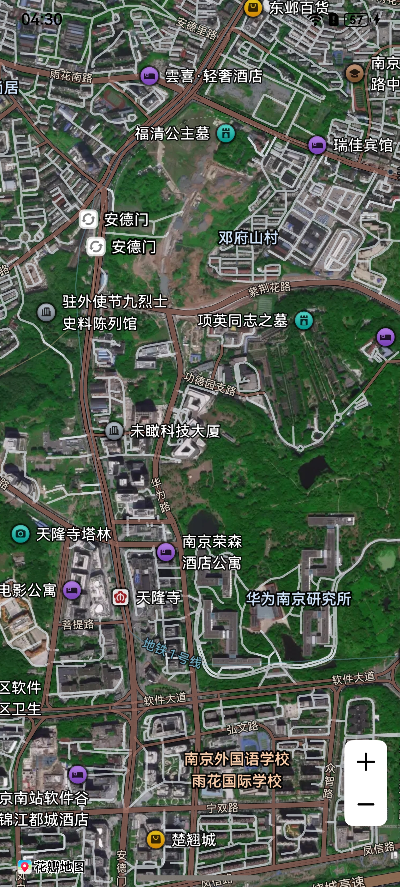
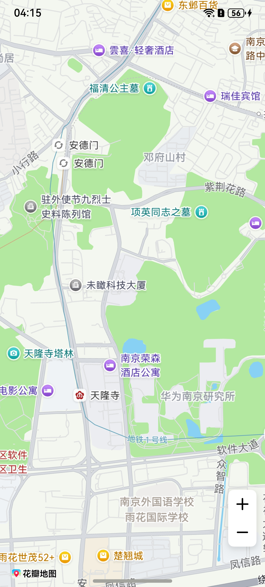

## 场景介绍

从6.0.0(20)开始，支持卫星图和混合地图功能。

Map Kit支持以下地图类型：

* STANDARD：标准地图，展示道路、建筑物以及河流等重要的自然特征。
* NONE：空地图，没有加载任何数据的地图。
* TERRAIN：地形图，在保留了行政区划边界、POI、楼块等地图要素的基础上，呈现完整清晰描绘地形走势的标准地图。
* SATELLITE：卫星图，显示卫星照片的地图，只支持中国。
* HYBRID：混合地图，在显示卫星照片的同时也显示路网信息。

**图1** 标准地图


**图2** 空地图



**图3** 地形图



**图4** 卫星图



**图5** 混合地图



## 接口说明

Map Kit提供2种方式设置地图类型：

方式一：在初始化的时候，通过设置[MapOptions](https://developer.huawei.com/consumer/cn/doc/harmonyos-references/map-common#mapoptions)中的mapType属性来控制展示不同地图类型。

| 属性名 | 描述 |
| --- | --- |
| mapCommon.MapOptions.mapType | 地图初始化参数中的MapType地图类型。 |

方式二：地图创建后，可通过[setMapType](https://developer.huawei.com/consumer/cn/doc/harmonyos-references/map-map-mapcomponentcontroller#setmaptype)方法动态设置地图类型。

| 方法名 | 描述 |
| --- | --- |
| [setMapType](https://developer.huawei.com/consumer/cn/doc/harmonyos-references/map-map-mapcomponentcontroller#setmaptype)(mapType: [mapCommon.MapType](https://developer.huawei.com/consumer/cn/doc/harmonyos-references/map-common#maptype)): void | 设置地图类型。 |

## 开发步骤

1. 导入相关模块。

   ```
   import { mapCommon } from '@kit.MapKit';
   ```
2. 设置地图类型。

   方式一：

   在地图初始化的时候，在mapOptions参数中新增mapType属性：[mapCommon.MapType](https://developer.huawei.com/consumer/cn/doc/harmonyos-references/map-common#maptype).STANDARD（标准地图）。

   ```
   this.mapOptions = {
     position: {
       target: {
         latitude: 31.984410259206815,
         longitude: 118.76625379397866
       },
       zoom: 15
     },
     mapType: mapCommon.MapType.STANDARD
   };
   ```

   显示效果如下：

   

   方式二：地图创建后，调用[setMapType](https://developer.huawei.com/consumer/cn/doc/harmonyos-references/map-map-mapcomponentcontroller#setmaptype)方法设置地图类型为地形图。设置为地形图时，为了获得最佳显示效果，推荐将地图缩放层级保持在5至14之间。

   ```
   this.mapController.setMapType(mapCommon.MapType.TERRAIN);
   ```

   显示效果如下：

   
