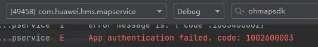

**现象描述**

无法加载地图。

**可能原因**

1. 无网络。
2. 应用身份校验失败或地图权限未开通。
3. 未完成基本准备工作。

**处理步骤**

1. 检查是否存在日志：get network status error, code: 201, message:Permission denied。日志存在，说明应用缺少获取网络状态的权限。

   

   请在应用的module.json5文件中配置获取网络状态的权限。

   ```
   {
     "module" : {
       // ...
       "requestPermissions": [
         {
           "name": "ohos.permission.INTERNET",
           "usedScene": {
             "when": "always"
           }
         },
         {
           "name": "ohos.permission.GET_NETWORK_INFO",
           "usedScene": {
             "when": "always"
           }
         }
       ]
     }
   }
   ```

   请检查应用日志中是否存在日志：The network is unavailable。日志存在，说明设备网络存在问题，请检查网络状态。

   
2. 请检查应用日志中是否存在日志：The app does not have map permission。日志存在，说明应用身份校验失败。

   

   查看com.huawei.hms.mapservice进程日志，检查是否存在该日志：App authentication failed. code: 1002600003。参考[1002600003](https://developer.huawei.com/consumer/cn/doc/harmonyos-references/errorcode-map#section1002600003-应用身份校验失败)完成应用身份校验。

   
3. 请参考“[应用开发准备](https://developer.huawei.com/consumer/cn/doc/harmonyos-guides/application-dev-overview)”检查是否完成基本准备工作。
