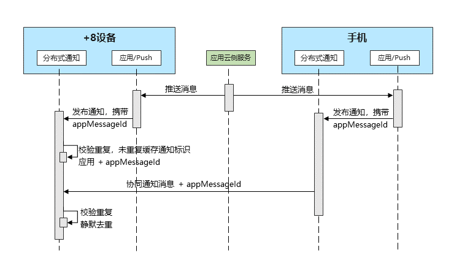

从API version 20开始，为了避免不同渠道发布的通知重复打扰用户（例如，手机协同到当前设备的通知与Push推送服务发布的通知重复），可以使用通知去重功能，清除跨设备场景下的重复通知。

## 实现原理

应用发送通知时携带唯一标识字段[appMessageId](https://developer.huawei.com/consumer/cn/doc/harmonyos-references/js-apis-inner-notification-notificationrequest#notificationrequest-1)，分布式通知接收到多渠道发布的通知后，会根据该字段进行判断，从而实现通知去重。

设备只会展示第一条通知，后续收到的重复通知会被静默去重，不展示、不提醒。

**图1** 全场景通知去重流程图



## 约束条件

* appMessageId的唯一性需由开发者保证，同一条通知在各个设备形态上需保证该字段相同。
* 该字段仅在发布通知的24小时内有效，超过24小时或者设备重启时都会失效。

## 接口说明

| **接口名** | **描述** | **说明** |
| --- | --- | --- |
| [publish](https://developer.huawei.com/consumer/cn/doc/harmonyos-references/js-apis-notificationmanager#notificationmanagerpublish-1)(request: NotificationRequest): Promise\<void\> | 发布通知。 | 使用方法见对象[NotificationRequest](https://developer.huawei.com/consumer/cn/doc/harmonyos-references/js-apis-inner-notification-notificationrequest)中**appMessageId**字段说明。 |

## 开发步骤

1. 导入模块。

   ```
   import { notificationManager } from '@kit.NotificationKit';
   import { BusinessError } from '@kit.BasicServicesKit';
   ```

   

<div class="source-link-wrapper"><a href="https://gitcode.com/HarmonyOS_Samples/guide-snippets/blob/HarmonyOS-feature-20260402/Notification-Kit/Notification/entry/src/main/ets/filemanager/ClearDuplicateNotifications.ets#L16-L19" target="_blank" rel="noopener noreferrer" class="source-link"><svg class="source-link-icon" width="14" height="14" viewBox="0 0 24 24" fill="none" stroke="currentColor" strokeWidth="2" strokeLinecap="round" strokeLinejoin="round">\<path d="M18 13v6a2 2 0 0 1-2 2H5a2 2 0 0 1-2-2V8a2 2 0 0 1 2-2h6" /\>\<polyline points="15 3 21 3 21 9" /\>\<line x1="10" y1="14" x2="21" y2="3" /\></svg> 查看源码：ClearDuplicateNotifications.ets</a></div>

2. 发布通知消息，通知消息中包含appMessageId字段。

   ```
   // publish回调
   let publishCallback = (err: BusinessError): void => {
     if (err) {
       console.error(`Failed to publish notification. Code is ${err.code}, message is ${err.message}`);
     } else {
       console.info(`Succeeded in publishing notification.`);
     }
   };
   // 通知Request对象
   let notificationRequest: notificationManager.NotificationRequest = {
     id: 1,
     content: {
       notificationContentType: notificationManager.ContentType.NOTIFICATION_CONTENT_BASIC_TEXT,
       normal: {
         title: 'test_title',
         text: 'test_text',
         additionalText: 'test_additionalText'
       }
     },
     appMessageId: 'test_appMessageId_1'
   };
   notificationManager.publish(notificationRequest, publishCallback);
   ```

   

<div class="source-link-wrapper"><a href="https://gitcode.com/HarmonyOS_Samples/guide-snippets/blob/HarmonyOS-feature-20260402/Notification-Kit/Notification/entry/src/main/ets/filemanager/ClearDuplicateNotifications.ets#L29-L52" target="_blank" rel="noopener noreferrer" class="source-link"><svg class="source-link-icon" width="14" height="14" viewBox="0 0 24 24" fill="none" stroke="currentColor" strokeWidth="2" strokeLinecap="round" strokeLinejoin="round">\<path d="M18 13v6a2 2 0 0 1-2 2H5a2 2 0 0 1-2-2V8a2 2 0 0 1 2-2h6" /\>\<polyline points="15 3 21 3 21 9" /\>\<line x1="10" y1="14" x2="21" y2="3" /\></svg> 查看源码：ClearDuplicateNotifications.ets</a></div>
